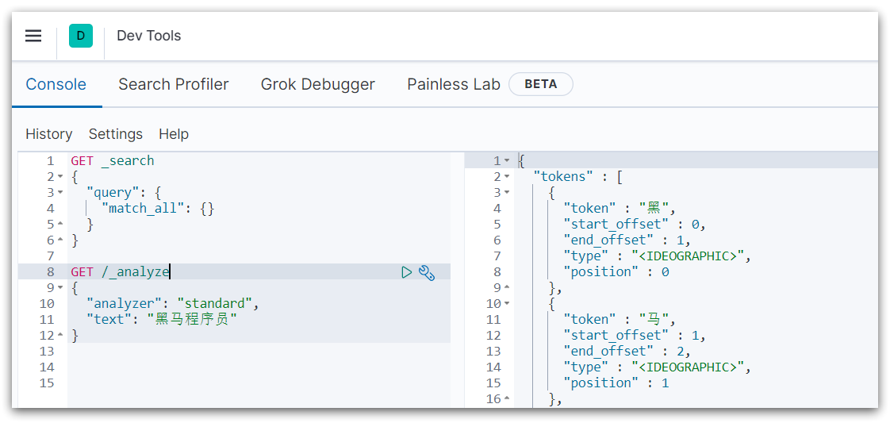
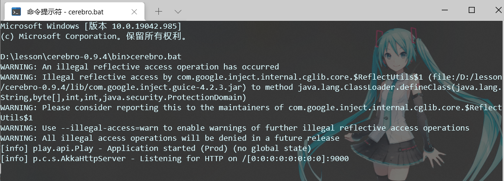

## 1.CentOS安装Docker
Docker 分为 CE 和 EE 两大版本。CE 即社区版（免费，支持周期 7 个月），EE 即企业版，强调安全，付费使用，支持周期 24 个月。

Docker CE 分为 `stable` `test` 和 `nightly` 三个更新频道。

官方网站上有各种环境下的 [安装指南](https://docs.docker.com/install/)，这里主要介绍 Docker CE 在 CentOS上的安装。


Docker CE 支持 64 位版本 CentOS 7，并且要求内核版本不低于 3.10， CentOS 7 满足最低内核的要求，所以我们在CentOS 7安装Docker。

### 1.1.卸载（可选）

如果之前安装过旧版本的Docker，可以使用下面命令卸载：

```
yum remove docker \
                  docker-client \
                  docker-client-latest \
                  docker-common \
                  docker-latest \
                  docker-latest-logrotate \
                  docker-logrotate \
                  docker-selinux \
                  docker-engine-selinux \
                  docker-engine \
                  docker-ce
```


### 1.2.安装docker

首先需要大家虚拟机联网，安装yum工具

```sh
yum install -y yum-utils \
           device-mapper-persistent-data \
           lvm2 --skip-broken
```


然后更新本地镜像源：

```shell
# 设置docker镜像源
yum-config-manager \
    --add-repo \
    https://mirrors.aliyun.com/docker-ce/linux/centos/docker-ce.repo
    
sed -i 's/download.docker.com/mirrors.aliyun.com\/docker-ce/g' /etc/yum.repos.d/docker-ce.repo

yum makecache fast
```


然后输入命令：

```shell
yum install -y docker-ce
```

docker-ce为社区免费版本。稍等片刻，docker即可安装成功。

### 1.3.启动docker

Docker应用需要用到各种端口，逐一去修改防火墙设置。非常麻烦，因此建议大家直接关闭防火墙！

启动docker前，一定要关闭防火墙后！！

启动docker前，一定要关闭防火墙后！！

启动docker前，一定要关闭防火墙后！！


```sh
# 关闭
systemctl stop firewalld
# 禁止开机启动防火墙
systemctl disable firewalld
```


通过命令启动docker：

```sh
systemctl start docker  # 启动docker服务

systemctl stop docker  # 停止docker服务

systemctl restart docker  # 重启docker服务
```


然后输入命令，可以查看docker版本：

```
docker -v
```

如图：

 


### 1.4.配置镜像加速

docker官方镜像仓库网速较差，我们需要设置国内镜像服务：

参考阿里云的镜像加速文档：https://cr.console.aliyun.com/cn-hangzhou/instances/mirrors

针对Docker客户端版本大于 1.10.0 的用户

您可以通过修改daemon配置文件/etc/docker/daemon.json来使用加速器

```bash
sudo mkdir -p /etc/docker
sudo tee /etc/docker/daemon.json <<-'EOF'
{
  "registry-mirrors": ["https://d6kkx5k7.mirror.aliyuncs.com"]
}
EOF
sudo systemctl daemon-reload
sudo systemctl restart docker
```


## 2.CentOS7安装DockerCompose


### 2.1.下载

Linux下需要通过命令下载：

```sh
# 安装
curl -L https://github.com/docker/compose/releases/download/1.23.1/docker-compose-`uname -s`-`uname -m` > /usr/local/bin/docker-compose
```

如果下载速度较慢，或者下载失败，可以使用课前资料提供的docker-compose文件：


上传到`/usr/local/bin/`目录也可以。


### 2.2.修改文件权限

修改文件权限：

```sh
# 修改权限
chmod +x /usr/local/bin/docker-compose
```


### 2.3.Base自动补全命令：

```sh
# 补全命令
curl -L https://raw.githubusercontent.com/docker/compose/1.29.1/contrib/completion/bash/docker-compose > /etc/bash_completion.d/docker-compose
```

如果这里出现错误，需要修改自己的hosts文件：

```sh
echo "199.232.68.133 raw.githubusercontent.com" >> /etc/hosts
```


## 3.Docker镜像仓库

搭建镜像仓库可以基于Docker官方提供的DockerRegistry来实现。

官网地址：https://hub.docker.com/_/registry


### 3.1.简化版镜像仓库

Docker官方的Docker Registry是一个基础版本的Docker镜像仓库，具备仓库管理的完整功能，但是没有图形化界面。

搭建方式比较简单，命令如下：

```sh
docker run -d \
    --restart=always \
    --name registry	\
    -p 5000:5000 \
    -v registry-data:/var/lib/registry \
    registry
```


命令中挂载了一个数据卷registry-data到容器内的/var/lib/registry 目录，这是私有镜像库存放数据的目录。

访问http://YourIp:5000/v2/_catalog 可以查看当前私有镜像服务中包含的镜像


### 3.2.带有图形化界面版本

使用DockerCompose部署带有图象界面的DockerRegistry，命令如下：

```yaml
version: '3.0'
services:
  registry:
    image: registry
    volumes:
      - ./registry-data:/var/lib/registry
  ui:
    image: joxit/docker-registry-ui:static
    ports:
      - 8080:80
    environment:
      - REGISTRY_TITLE=传智教育私有仓库
      - REGISTRY_URL=http://registry:5000
    depends_on:
      - registry
```


### 3.3.配置Docker信任地址

我们的私服采用的是http协议，默认不被Docker信任，所以需要做一个配置：

```sh
# 打开要修改的文件
vi /etc/docker/daemon.json
# 添加内容：
"insecure-registries":["http://192.168.150.101:8080"]
# 重加载
systemctl daemon-reload
# 重启docker
systemctl restart docker
```


#### 4.dibian安装

更新、安装必备软件

```
apt-get update && apt-get install -y wget vim
```

安装

```
wget -qO- get.docker.com | bash
```

开机自动启动

```
systemctl enable docker
```

卸载

```
sudo apt-get purge docker-ce docker-ce-cli containerd.io
sudo rm -rf /var/lib/docker
sudo rm -rf /var/lib/containerd
```

## 4.RabbitMQ部署指南


### 4.1.单机部署

我们在Centos7虚拟机中使用Docker来安装。

#### 4.1.1.下载镜像

方式一：在线拉取

``` sh
docker pull rabbitmq:3-management
```


方式二：从本地加载

在课前资料已经提供了镜像包：

 

上传到虚拟机中后，使用命令加载镜像即可：

```sh
docker load -i mq.tar
```


#### 4.1.2.安装MQ

执行下面的命令来运行MQ容器：

```sh
docker run \
 -e RABBITMQ_DEFAULT_USER=root \
 -e RABBITMQ_DEFAULT_PASS=666666 \
 --name mq \
 --hostname mq1 \
 -p 15672:15672 \
 -p 5672:5672 \
 -d \
 rabbitmq:3-management
```


### 4.2.集群部署

接下来，我们看看如何安装RabbitMQ的集群。

#### 4.2.1.集群分类

在RabbitMQ的官方文档中，讲述了两种集群的配置方式：

- 普通模式：普通模式集群不进行数据同步，每个MQ都有自己的队列、数据信息（其它元数据信息如交换机等会同步）。例如我们有2个MQ：mq1，和mq2，如果你的消息在mq1，而你连接到了mq2，那么mq2会去mq1拉取消息，然后返回给你。如果mq1宕机，消息就会丢失。
- 镜像模式：与普通模式不同，队列会在各个mq的镜像节点之间同步，因此你连接到任何一个镜像节点，均可获取到消息。而且如果一个节点宕机，并不会导致数据丢失。不过，这种方式增加了数据同步的带宽消耗。


我们先来看普通模式集群。

#### 4.2.2.设置网络

首先，我们需要让3台MQ互相知道对方的存在。

分别在3台机器中，设置 /etc/hosts文件，添加如下内容：

```
192.168.150.101 mq1
192.168.150.102 mq2
192.168.150.103 mq3
```

并在每台机器上测试，是否可以ping通对方：


## 5.Docker安装MySQL


### 5.1.上传

在将课前资料中的mysql.tar文件上传到虚拟机的/tmp目录：


通过load命令加载为镜像：

```sh
docker load -i mysql.tar
```

效果：


### 5.2.创建目录

创建两个目录，作为数据库的数据卷：

创建目录/tmp/mysql/data

创建目录/tmp/mysql/conf

```sh
# 创建目录
mkdir -p /tmp/mysql/data
mkdir -p /tmp/mysql/conf
```


将课前资料提供的my.cnf文件上传到/tmp/mysql/conf，如图：


### 5.3.运行docker命令

运行命令：


```bash
docker run \
--name mysql \
-d \
-p 3306:3306 \
--restart unless-stopped \
-v /tmp/mysql/log:/var/log/mysql \
-v /tmp/mysql/data:/var/lib/mysql \
-v /tmp/mysql/conf:/etc/mysql \
-e MYSQL_ROOT_PASSWORD=666666 \
 -d \
 mysql:5.7.25
```

参考

```bash
docker run \
--name mysql \
-d \
-p 3306:3306 \
--restart unless-stopped \
-v /mydata/mysql/log:/var/log/mysql \
-v /tmp/mysql/conf/my.cnf:/etc/mysql/conf.d/hmy.cnf \
-v /tmp/mysql/data:/var/lib/mysql \
-e MYSQL_ROOT_PASSWORD=666666 \
mysql:5.7
```

```ini
[mysqld]
skip-name-resolve
character_set_server=utf8
datadir=/var/lib/mysql
server-id=1000

bind-address=0.0.0.0
```

```bash
docker exec -it mysql bash

mysql -uroot -p 
```


<hr/>

拉取指定版本
```

sudo docker pull mysql:8.0.23 
```


```
sudo docker run -p 3306:3306 --name mysql8 \
--restart unless-stopped \
-v /tmp/mysql/mysql-files:/var/lib/mysql-files \
-v /tmp/mysql/conf:/etc/mysql \
-v /tmp/mysql/logs:/var/log/mysql \
-v /tmp/mysql/data:/var/lib/mysql \
-e MYSQL_ROOT_PASSWORD=root \
-d mysql:8.0.23
```

## 6.安装elasticsearch


### 1.部署单点es

#### 1.1.创建网络

因为我们还需要部署kibana容器，因此需要让es和kibana容器互联。这里先创建一个网络：

```sh
docker network create es-net
```


#### 1.2.加载镜像

这里我们采用elasticsearch的7.12.1版本的镜像，这个镜像体积非常大，接近1G。不建议大家自己pull。

课前资料提供了镜像的tar包：


大家将其上传到虚拟机中，然后运行命令加载即可：

```sh
# 导入数据
docker load -i es.tar
```

同理还有`kibana`的tar包也需要这样做。


### 1.3.运行

运行docker命令，部署单点es：

```sh
docker run -d \
	--name es \
    -e "ES_JAVA_OPTS=-Xms512m -Xmx512m" \
    -e "discovery.type=single-node" \
    -v es-data:/usr/share/elasticsearch/data \
    -v es-plugins:/usr/share/elasticsearch/plugins \
    --privileged \
    --network es-net \
    -p 9200:9200 \
    -p 9300:9300 \
elasticsearch:7.12.1
```

命令解释：

- `-e "cluster.name=es-docker-cluster"`：设置集群名称
- `-e "http.host=0.0.0.0"`：监听的地址，可以外网访问
- `-e "ES_JAVA_OPTS=-Xms512m -Xmx512m"`：内存大小
- `-e "discovery.type=single-node"`：非集群模式
- `-v es-data:/usr/share/elasticsearch/data`：挂载逻辑卷，绑定es的数据目录
- `-v es-logs:/usr/share/elasticsearch/logs`：挂载逻辑卷，绑定es的日志目录
- `-v es-plugins:/usr/share/elasticsearch/plugins`：挂载逻辑卷，绑定es的插件目录
- `--privileged`：授予逻辑卷访问权
- `--network es-net` ：加入一个名为es-net的网络中
- `-p 9200:9200`：端口映射配置


在浏览器中输入：http://192.168.150.101:9200 即可看到elasticsearch的响应结果：


### 2.部署kibana

kibana可以给我们提供一个elasticsearch的可视化界面，便于我们学习。

#### 2.1.部署

运行docker命令，部署kibana

```sh
docker run -d \
--name kibana \
-e ELASTICSEARCH_HOSTS=http://es:9200 \
--network=es-net \
-p 5601:5601  \
kibana:7.12.1
```

- `--network es-net` ：加入一个名为es-net的网络中，与elasticsearch在同一个网络中
- `-e ELASTICSEARCH_HOSTS=http://es:9200"`：设置elasticsearch的地址，因为kibana已经与elasticsearch在一个网络，因此可以用容器名直接访问elasticsearch
- `-p 5601:5601`：端口映射配置

kibana启动一般比较慢，需要多等待一会，可以通过命令：

```sh
docker logs -f kibana
```

查看运行日志，当查看到下面的日志，说明成功：


此时，在浏览器输入地址访问：http://192.168.150.101:5601，即可看到结果

#### 2.2.DevTools

kibana中提供了一个DevTools界面：



这个界面中可以编写DSL来操作elasticsearch。并且对DSL语句有自动补全功能。


## 3.安装IK分词器


### 3.1.在线安装ik插件（较慢）

```shell
# 进入容器内部
docker exec -it elasticsearch /bin/bash

# 在线下载并安装
./bin/elasticsearch-plugin  install https://github.com/medcl/elasticsearch-analysis-ik/releases/download/v7.12.1/elasticsearch-analysis-ik-7.12.1.zip

#退出
exit
#重启容器
docker restart elasticsearch
```

### 3.2.离线安装ik插件（推荐）

1）查看数据卷目录

安装插件需要知道elasticsearch的plugins目录位置，而我们用了数据卷挂载，因此需要查看elasticsearch的数据卷目录，通过下面命令查看:

```sh
docker volume inspect es-plugins
```

显示结果：

```json
[
    {
        "CreatedAt": "2022-05-06T10:06:34+08:00",
        "Driver": "local",
        "Labels": null,
        "Mountpoint": "/var/lib/docker/volumes/es-plugins/_data",
        "Name": "es-plugins",
        "Options": null,
        "Scope": "local"
    }
]
```

说明plugins目录被挂载到了：`/var/lib/docker/volumes/es-plugins/_data `这个目录中。


 2）解压缩分词器安装包

下面我们需要把课前资料中的ik分词器解压缩，重命名为ik


 3）上传到es容器的插件数据卷中

也就是`/var/lib/docker/volumes/es-plugins/_data `：


  4）重启容器

```shell
# 4、重启容器
docker restart es
```

```sh
# 查看es日志
docker logs -f es
```

5）测试：

IK分词器包含两种模式：

* `ik_smart`：最少切分

* `ik_max_word`：最细切分


```json
GET /_analyze
{
  "analyzer": "ik_max_word",
  "text": "黑马程序员学习java太棒了"
}
```

结果：

```json
{
  "tokens" : [
    {
      "token" : "黑马",
      "start_offset" : 0,
      "end_offset" : 2,
      "type" : "CN_WORD",
      "position" : 0
    },
    {
      "token" : "程序员",
      "start_offset" : 2,
      "end_offset" : 5,
      "type" : "CN_WORD",
      "position" : 1
    },
    {
      "token" : "程序",
      "start_offset" : 2,
      "end_offset" : 4,
      "type" : "CN_WORD",
      "position" : 2
    },
    {
      "token" : "员",
      "start_offset" : 4,
      "end_offset" : 5,
      "type" : "CN_CHAR",
      "position" : 3
    },
    {
      "token" : "学习",
      "start_offset" : 5,
      "end_offset" : 7,
      "type" : "CN_WORD",
      "position" : 4
    },
    {
      "token" : "java",
      "start_offset" : 7,
      "end_offset" : 11,
      "type" : "ENGLISH",
      "position" : 5
    },
    {
      "token" : "太棒了",
      "start_offset" : 11,
      "end_offset" : 14,
      "type" : "CN_WORD",
      "position" : 6
    },
    {
      "token" : "太棒",
      "start_offset" : 11,
      "end_offset" : 13,
      "type" : "CN_WORD",
      "position" : 7
    },
    {
      "token" : "了",
      "start_offset" : 13,
      "end_offset" : 14,
      "type" : "CN_CHAR",
      "position" : 8
    }
  ]
}
```


### 3.3 扩展词词典

随着互联网的发展，“造词运动”也越发的频繁。出现了很多新的词语，在原有的词汇列表中并不存在。比如：“奥力给”，“传智播客” 等。

所以我们的词汇也需要不断的更新，IK分词器提供了扩展词汇的功能。

1）打开IK分词器config目录：


2）在IKAnalyzer.cfg.xml配置文件内容添加：

```xml
<?xml version="1.0" encoding="UTF-8"?>
<!DOCTYPE properties SYSTEM "http://java.sun.com/dtd/properties.dtd">
<properties>
        <comment>IK Analyzer 扩展配置</comment>
        <!--用户可以在这里配置自己的扩展字典 *** 添加扩展词典-->
        <entry key="ext_dict">ext.dic</entry>
</properties>
```

3）新建一个 ext.dic，可以参考config目录下复制一个配置文件进行修改

```properties
传智播客
奥力给
```

4）重启elasticsearch 

```sh
docker restart es

# 查看 日志
docker logs -f elasticsearch
```


日志中已经成功加载ext.dic配置文件

5）测试效果：

```json
GET /_analyze
{
  "analyzer": "ik_max_word",
  "text": "传智播客Java就业超过90%,奥力给！"
}
```

> 注意当前文件的编码必须是 UTF-8 格式，严禁使用Windows记事本编辑

### 3.4 停用词词典

在互联网项目中，在网络间传输的速度很快，所以很多语言是不允许在网络上传递的，如：关于宗教、政治等敏感词语，那么我们在搜索时也应该忽略当前词汇。

IK分词器也提供了强大的停用词功能，让我们在索引时就直接忽略当前的停用词汇表中的内容。

1）IKAnalyzer.cfg.xml配置文件内容添加：

```xml
<?xml version="1.0" encoding="UTF-8"?>
<!DOCTYPE properties SYSTEM "http://java.sun.com/dtd/properties.dtd">
<properties>
        <comment>IK Analyzer 扩展配置</comment>
        <!--用户可以在这里配置自己的扩展字典-->
        <entry key="ext_dict">ext.dic</entry>
         <!--用户可以在这里配置自己的扩展停止词字典  *** 添加停用词词典-->
        <entry key="ext_stopwords">stopword.dic</entry>
</properties>
```

3）在 stopword.dic 添加停用词

```properties
习大大
```

4）重启elasticsearch 

```sh
# 重启服务
docker restart elasticsearch
docker restart kibana

# 查看 日志
docker logs -f elasticsearch
```

日志中已经成功加载stopword.dic配置文件

5）测试效果：

```json
GET /_analyze
{
  "analyzer": "ik_max_word",
  "text": "传智播客Java就业率超过95%,习大大都点赞,奥力给！"
}
```

> 注意当前文件的编码必须是 UTF-8 格式，严禁使用Windows记事本编辑


## 4.部署es集群

我们会在单机上利用docker容器运行多个es实例来模拟es集群。不过生产环境推荐大家每一台服务节点仅部署一个es的实例。

部署es集群可以直接使用docker-compose来完成，但这要求你的Linux虚拟机至少有**4G**的内存空间

### 4.1.创建es集群

首先编写一个docker-compose.ym文件，内容如下：

```sh
version: '2.2'
services:
  es01:
    image: elasticsearch:7.12.1
    container_name: es01
    environment:
      - node.name=es01
      - cluster.name=es-docker-cluster
      - discovery.seed_hosts=es02,es03
      - cluster.initial_master_nodes=es01,es02,es03
      - "ES_JAVA_OPTS=-Xms512m -Xmx512m"
    volumes:
      - data01:/usr/share/elasticsearch/data
    ports:
      - 9201:9201
    networks:
      - elastic
  es02:
    image: elasticsearch:7.12.1
    container_name: es02
    environment:
      - node.name=es02
      - cluster.name=es-docker-cluster
      - discovery.seed_hosts=es01,es03
      - cluster.initial_master_nodes=es01,es02,es03
      - "ES_JAVA_OPTS=-Xms512m -Xmx512m"
    volumes:
      - data02:/usr/share/elasticsearch/data
    ports:
      - 9202:9202
    networks:
      - elastic
  es03:
    image: elasticsearch:7.12.1
    container_name: es03
    environment:
      - node.name=es03
      - cluster.name=es-docker-cluster
      - discovery.seed_hosts=es01,es02
      - cluster.initial_master_nodes=es01,es02,es03
      - "ES_JAVA_OPTS=-Xms512m -Xmx512m"
    volumes:
      - data03:/usr/share/elasticsearch/data
    networks:
      - elastic
    ports:
      - 9203:9203
volumes:
  data01:
    driver: local
  data02:
    driver: local
  data03:
    driver: local

networks:
  elastic:
    driver: bridge
```


es运行需要修改一些linux系统权限，修改`/etc/sysctl.conf`文件

```sh
vi /etc/sysctl.conf
```

添加下面的内容：

```sh
vm.max_map_count=262144
```

然后执行命令，让配置生效：

```sh
sysctl -p
```


通过docker-compose启动集群：

```sh
docker-compose up -d
```


### 4.2.集群状态监控

kibana可以监控es集群，不过新版本需要依赖es的x-pack 功能，配置比较复杂。

这里推荐使用cerebro来监控es集群状态，官方网址：https://github.com/lmenezes/cerebro

课前资料已经提供了安装包：


解压即可使用，非常方便。

解压好的目录如下：


进入对应的bin目录：


双击其中的cerebro.bat文件即可启动服务。




访问http://localhost:9000 即可进入管理界面：


输入你的elasticsearch的任意节点的地址和端口，点击connect即可：


绿色的条，代表集群处于绿色（健康状态）。


### 4.3.创建索引库

 1）利用kibana的DevTools创建索引库

在DevTools中输入指令：

```json
PUT /itcast
{
  "settings": {
    "number_of_shards": 3, // 分片数量
    "number_of_replicas": 1 // 副本数量
  },
  "mappings": {
    "properties": {
      // mapping映射定义 ...
    }
  }
}
```


 2）利用cerebro创建索引库

利用cerebro还可以创建索引库：


填写索引库信息：


点击右下角的create按钮：


### 4.4.查看分片效果

回到首页，即可查看索引库分片效果：


## 7.Docker安装Minio


1.Docker 搜索镜像

```
docker search minio
```

2.拉取镜像

```
docker pull minio/minio
```

3.Docker 启动Minio镜像

```
docker run -d \
  -p 9000:9000 \
  -p 9001:9001 \
  --name minio \
  -v /home/minio/data:/data \
  -e "MINIO_ROOT_USER=admin" \
  -e "MINIO_ROOT_PASSWORD=adminadmin" \
  minio/minio:RELEASE.2023-03-24T21-41-23Z server --address ':9000' /data --console-address ":9001"
```

**解释：**

1.  [docker](https://cloud.tencent.com/product/tke?from_column=20065&from=20065) run :docker 启动[容器](https://cloud.tencent.com/product/tke?from_column=20065&from=20065)命令 
2.  -d ：后台启动 
3.  -p ：端口映射 
4.  –name 为这个容器取一个名字 
5.  -e ：设置环境变量 
6.  -v :文件挂载 
7.  minio/minio server /data ： minio的启动命令 （minio/minio 是镜像名字、 /data:数据存储位置）

密码长度要求至少8位


**使用docker-compose安装**

1、安装 docker-compose 并授权


2、创建编排yml文件

指定控制台路径 `--console-address "127.0.0.1:9000"`
指定API路径 `--address "127.0.0.1:9090"`

```yaml
version: '3'
services:
  minio:
    image: minio/minio
    hostname: "minio"
    ports:
      - 9000:9000 # api 端口
      - 9001:9001 # 控制台端口
    environment:
      MINIO_ACCESS_KEY: admin    #管理后台用户名
      MINIO_SECRET_KEY: admin123 #管理后台密码，最小8个字符
    volumes:
      - /docker/minio/data:/data               #映射当前目录下的data目录至容器内/data目录
      - /docker/minio/config:/root/.minio/     #映射配置目录
    command: server --console-address ':9001' /data  #指定容器中的目录 /data
    privileged: true
    restart: always
```

3、执行流程

在yml文件所在目录执行以下命令，等待执行完毕 `created...done`

```bash
docker-compose up -d
```

4.登录控制台 

控制台路径：`http://ip:9001/`


## 安装memos

```
docker run -d --name memos -p 5230:5230 -v /home/ehzyil/data/docker_data/memos/:/var/opt/memos ghcr.io/usememos/memos:latest
```


## 安装freshrss

```
docker run -d --restart unless-stopped --log-opt max-size=10m \
  -p 39954:80 \
  -e CRON_MIN='*/45' \
  -e TZ=Asia/Shanghai \
  -v /data/freshrss/data:/var/www/FreshRSS/data \
  -v /data/freshrss/extensions:/var/www/FreshRSS/extensions \
  --name freshrss-app \
  freshrss/freshrss
```

注意在数据库配置时

用户名、密码、数据库分别对应之前 Docker Compose 配置文件中的 `POSTGRES_USER`、`POSTGRES_PASSWORD`、`POSTGRES_DB`；表前缀任意填；主机名要稍微注意一下，既非 `127.0.0.1`/`localhost`，而要用容器的 IP，用下述命令可以得到。

```
# 获取 Container ID
docker ps

# 查看指定容器信息
docker inspect <container id> |grep IP

# 例如
root@iZj6caytd8hmoddao18kslZ:~# docker inspect 70705536578b|grep IP
            "LinkLocalIPv6Address": "",
            "LinkLocalIPv6PrefixLen": 0,
            "SecondaryIPAddresses": null,
            "SecondaryIPv6Addresses": null,
            "GlobalIPv6Address": "fd00:dead:beef:c0:0:242:ac12:3",
            "GlobalIPv6PrefixLen": 80,
            "IPAddress": "172.18.0.3",
            "IPPrefixLen": 16,
            "IPv6Gateway": "fd00:dead:beef:c0::1",
                    "IPAMConfig": null,
                    "IPAddress": "172.18.0.3",
                    "IPPrefixLen": 16,
                    "IPv6Gateway": "fd00:dead:beef:c0::1",
                    "GlobalIPv6Address": "fd00:dead:beef:c0:0:242:ac12:3",
                    "GlobalIPv6PrefixLen": 80,

```


解决因为docker重启造成docker内部ip变动造成的无法连接

> HTTP 500: Application problem
>
> Access to database is denied for `ehzyil`: SQLSTATE[08006] [7] connection to server at "172.18.0.3", port 5432 failed: Connection refused

 修改`/data/freshrss/data/config.php`下的host为postgresql的docker内部ip

```
 'db' => 
  array (
    'type' => 'pgsql',
    'host' => '172.18.0.3',
    'user' => 'ehzyil',
    'password' => 'postgresql',
    'base' => 'freshrss',
    'prefix' => '',
    'connection_uri_params' => '',
    'pdo_options' => 
    array (
    ),
  ),

```


## 安装青龙面板

```
docker run -dit \
   -v $PWD/ql/config:/ql/config \
   -v $PWD/ql/log:/ql/log \
   -v $PWD/ql/db:/ql/db \
   -p 5700:5700 \
   --privileged=true \
   --name qinglong \
   --hostname qinglong \
   --restart always \
   whyour/qinglong:latest
   
```

如果忘记账号密码，也可以在控制台执行一下命令查看

```
docker exec -it qinglong cat /ql/config/auth.json
```

## 将容器放在一个网络下

1. **创建网络**

```bash
docker network create freshrss-network
```

2. **将容器连接到网络**

```bash
docker network connect freshrss-network freshrss-app
docker network connect freshrss-network postgres_db
```

现在，`freshrss-app` 和 `postgres_db` 容器将位于同一个网络中。它们可以通过其容器名称或 IP 地址相互通信。

**验证**

要验证容器是否已连接到网络，可以使用以下命令：

```bash
docker network inspect freshrss-network
```

输出应显示已连接到网络的容器列表，包括 `freshrss-app` 和 `postgres_db`。

**其他提示**

* 可以使用 `docker network ls` 命令列出所有可用的网络。
* 可以使用 `docker network rm` 命令删除网络。
* 有关 Docker 网络的更多信息，请参阅 Docker 文档：https://docs.docker.com/network/


## 如何使容器重启后ip不改变


> freshrss-app和postgres_db已经在一个网络了  如何让 postgres_db在容器内的ip重启后不改变

**方法：创建的 Docker 网络中为容器分配静态 IP。**

1.首先，从网络中删除 `postgres_db` 容器。注意：您可能需要先停止容器，然后再将其从网络中删除。

```bash
docker network disconnect freshrss-network postgres_db
```

2.接下来，您需要检查网络以查找子网和网关来定义网络使用的 IP 范围。

```bash
docker network inspect freshrss-network
```

3.根据子网和网关信息，选择位于同一子网内但当前未被任何其他容器使用的 IP 地址。

4.将 `postgres_db` 容器重新连接到具有特定 IP 的网络：

```bash
docker network connect --ip <static_ip> freshrss-network postgres_db
#例如： docker network connect --ip 172.20.0.10 freshrss-network postgres_db
```

操作完成后可以看到该容器的静态ip

```text
docker inspect postgres_db |grep IP
            "LinkLocalIPv6Address": "",
            "LinkLocalIPv6PrefixLen": 0,
            "SecondaryIPAddresses": null,
            "SecondaryIPv6Addresses": null,
            "GlobalIPv6Address": "fd00:dead:beef:c0:0:242:ac12:5",
            "GlobalIPv6PrefixLen": 80,
            "IPAddress": "172.18.0.5",
            "IPPrefixLen": 16,
            "IPv6Gateway": "fd00:dead:beef:c0::1",
                    "IPAMConfig": null,
                    "IPAddress": "172.18.0.5",
                    "IPPrefixLen": 16,
                    "IPv6Gateway": "fd00:dead:beef:c0::1",
                    "GlobalIPv6Address": "fd00:dead:beef:c0:0:242:ac12:5",
                    "GlobalIPv6PrefixLen": 80,
                    "IPAMConfig": {
                        "IPv4Address": "172.20.0.10"
                    "IPAddress": "172.20.0.10",
                    "IPPrefixLen": 16,
                    "IPv6Gateway": "",
                    "GlobalIPv6Address": "",
                    "GlobalIPv6PrefixLen": 0,

```


### 设置 容器重启后自动启动

1.新建容器时配置

```
docker run --restart=unless-stopped [OPTIONS] IMAGE [COMMAND] [ARG...]
```

2.对于已经存在的容器，您可以使用 `docker update` 命令更新其重启策略：

```
docker update --restart=unless-stopped [CONTAINER ID or NAME]
```


移除重启策略

```
docker update --restart=unless-stopped [CONTAINER ID or NAME]
```

