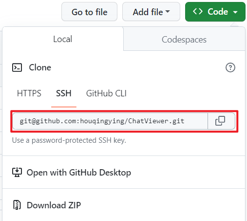
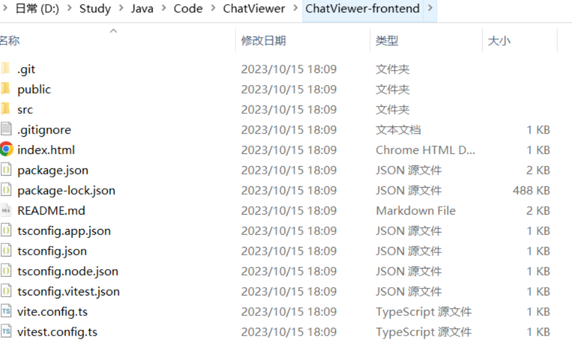

### Git拉取远程分支到本地

以`https://github.com/houqingying/ChatViewer/tree/main`该仓库为例，拉取`frontend`分支的代码到`ChatViewer-frontend`文件夹

步骤：

1、新建一个空文件，文件名为`ChatViewer-frontend`

2、初始化  **git init**

```bash
ehZyiL@DESKTOP-1H567GC MINGW64 /d/Study/Java/Code/ChatViewer/ChatViewer-frontend
$ git init
Initialized empty Git repository in D:/Study/Java/Code/ChatViewer/ChatViewer-frontend/.git/
```

3、自己要与origin master建立连接（下划线为远程仓库链接）

**git remote add origin git@github.com:XXXX/xxx.git**

远程仓库链接在这里，如下图红色框内所示的链接：



输入命令：

4、把远程分支拉到本地 git fetch origin frontend（frontend为远程仓库的分支名）

下图的Branches界面下的均为可使用的分支名


下面拉取远程的frontend分支，命令：

```bash
ehZyiL@DESKTOP-1H567GC MINGW64 /d/Study/Java/Code/ChatViewer/ChatViewer-frontend (master)
$ git remote add origin git@github.com:houqingying/ChatViewer.git

ehZyiL@DESKTOP-1H567GC MINGW64 /d/Study/Java/Code/ChatViewer/ChatViewer-frontend (master)
$ git fetch origin frontend
remote: Enumerating objects: 373, done.
remote: Counting objects: 100% (373/373), done.
remote: Compressing objects: 100% (331/331), done.
remote: Total 373 (delta 26), reused 358 (delta 21), pack-reused 0
Receiving objects: 100% (373/373), 2.66 MiB | 1.04 MiB/s, done.
Resolving deltas: 100% (26/26), done.
From github.com:houqingying/ChatViewer
 * branch            frontend   -> FETCH_HEAD
 * [new branch]      frontend   -> origin/frontend

```

5、切换到该分支 git checkout origin/frontend(远程分支名称)

命令：

```bash
ehZyiL@DESKTOP-1H567GC MINGW64 /d/Study/Java/Code/ChatViewer/ChatViewer-frontend (master)
$ git checkout  origin/frontend
Note: switching to 'origin/frontend'.

You are in 'detached HEAD' state. You can look around, make experimental
changes and commit them, and you can discard any commits you make in this
state without impacting any branches by switching back to a branch.

If you want to create a new branch to retain commits you create, you may
do so (now or later) by using -c with the switch command. Example:

  git switch -c <new-branch-name>

Or undo this operation with:

  git switch -

Turn off this advice by setting config variable advice.detachedHead to false

HEAD is now at f299acd Update README.md

ehZyiL@DESKTOP-1H567GC MINGW64 /d/Study/Java/Code/ChatViewer/ChatViewer-frontend ((f299acd...))
$

```

可以看到文件夹中已有frontend仓库的文件。



至此，git拉取远程分支到本地已完成。

若需要在本地创建分支并切换到该分支可以执行以下命令(以main分支为例)

**git checkout -b main(本地新建分支名称) origin/main(远程分支名称)**

```bash
ehZyiL@DESKTOP-1H567GC MINGW64 /d/Study/Java/Code/ChatViewer/ChatViewer-admin (master)
$ git fetch origin main
remote: Enumerating objects: 148, done.
remote: Counting objects: 100% (148/148), done.
remote: Compressing objects: 100% (121/121), done.
remote: Total 148 (delta 23), reused 132 (delta 17), pack-reused 0
Receiving objects: 100% (148/148), 91.02 KiB | 105.00 KiB/s, done.
Resolving deltas: 100% (23/23), done.
From github.com:houqingying/ChatViewer
 * branch            main       -> FETCH_HEAD
 * [new branch]      main       -> origin/main

ehZyiL@DESKTOP-1H567GC MINGW64 /d/Study/Java/Code/ChatViewer/ChatViewer-admin (master)
$ git checkout -b main origin/main
Switched to a new branch 'main'
branch 'main' set up to track 'origin/main'.

ehZyiL@DESKTOP-1H567GC MINGW64 /d/Study/Java/Code/ChatViewer/ChatViewer-admin (main)
$ git branch
* main

```


6、拉取远程分支上的最新内容到本地

从远程仓库（origin）的主分支（frontend）拉取最新的代码更新到本地仓库。

git pull origin frontend(远程分支名称)

命令：

``` 
git pull origin frontend
```


### Git提交全部代码

1. git add . 

   git add xx命令可以将xx文件添加到暂存区，如果有很多改动可以通过 git add -A .来一次添加所有改变的文件。注意 -A 选项后面还有一个句点。 git add -A表示添加所有内容， git add . 表示添加新文件和编辑过的文件不包括删除的文件; git add -u 表示添加编辑或者删除的文件，不包括新添加的文件

2. git commit -m "提交注释"

3. git push origin  分支名称，一般使用：git push origin master


### Git删除分支

```bash
// 删除本地分支
git branch -d localBranchName

// 删除远程分支
git push origin --delete remoteBranchName
```


[Git 操作——如何删除本地分支和远程分支](https://www.freecodecamp.org/chinese/news/how-to-delete-a-git-branch-both-locally-and-remotely/)


### Git 如何退出merging

如果你想在合并时退出，你可以使用 `git merge --abort` 来取消合并操作。这会使 Git 回到未合并之前的状态。如果您已经提交了合并，那么可以使用 `git reset --hard HEAD` 来撤销合并。这将丢弃合并的提交，并回滚到未合并之前的状态。

### 使用idea 把一个git分支的部分提交记录合并到另一个git分支上


###  Git cherry-pick合并特定的提交

```bash
git cherry-pick [<options>] <commit-ish>...
常用options:
    --quit                退出当前的chery-pick序列
    --continue            继续当前的chery-pick序列
    --abort               取消当前的chery-pick序列，恢复当前分支
    -n, --no-commit       不自动提交
    -e, --edit            编辑提交信息
    
```

[git cherry-pick的使用](https://blog.csdn.net/FightFightFight/article/details/81039050)

### Git stash 暂存代码

> 当我们在某分支开发功能的时候，功能开发到一半，业务方突然传来一个噩耗，有一个bug需要紧急处理一下，优先级为0，这时我们该怎么办呢？？？
>
> - 提交我们的修改--这样会产生一次无意义的提交
> - 放弃我们写的代码--我们并不傻
>
> 那我们该怎么办呢？
>
> 使用stash命令将修改还未提交的代码存储到缓存区
>
> 转载[git-命令行-使用 git stash 暂存代码](https://blog.csdn.net/WEB_CSDN_SHARE/article/details/98086421)


**解决方案：**

```bash
//使用stash命令将修改还未提交的代码存储到缓存区
git stash
 
//切换到需要解决bug的分支
git checkout <分支名>
 
//修改完bug后回到当前开发分支，取出缓存中的代码
git stash pop
```


**查看修改**
那么我们确定你操作成功了呢？

```
git stash show //查看刚才暂存的修改
```

**我们的修改存储到什么位置了?**
当我们使用 git init给项目添加版本控制的时候，会在项目路径下生成一个 .git 隐藏文件夹。.git 中存储着版本管理的所有信息。 

- .git/refs/stash 中，存储的是最后一个 stash 对应的节点指针
- 在 .git/log/refs/stash 中可以看到我们全部的 stash 记录信息

**多个 stash 的情况我们该怎么办？**
存储多个stash

```
//提交多个stash，我们需要区分每次提交的内容，这样我们可以给每次提交起一个名字来区分
git stash save <名称>
```

多个stash取出方式

```
git stash pop //取出最近一次暂存并删除记录列表中对应记录
 
因为 git stash pop 是弹出栈顶的一个 stash ，也就是最后一次存储的 stash。在存储多个stash 时，想取出非栈顶的一个的情况下，是不适用的。
 
这个时候要使用：
 
git stash list //查看暂存区的所有暂存修改
 
$>git stash list
stash@{0}: WIP on book: 51bea1d... fixed images
stash@{1}: WIP on master: 9705ae6... changed the browse code to the official repo
 
 
git stash apply stash@{X} //取出相应的暂存
git stash drop stash@{X} //将记录列表中取出的对应暂存记录删除
```

**清空stash栈**

```
git stash clear
```


