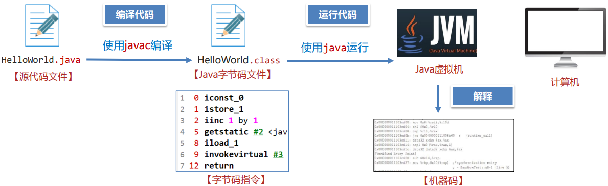
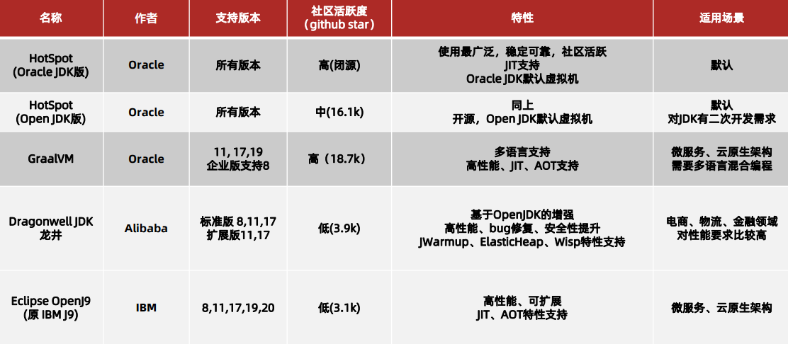

## 初始JVM

### 什么是JVM

JVM 全称是 Java Virtual Machine，中文译名 Java虚拟机。

JVM 本质上是一个运行在计算机上的程序，他的职责是运行Java字节码文件。

### JVM 的功能

**解释和运行**

- 对字节码文件中的指令实时的解释成机器码让计算机执行

**内存管理**

- 自动为对象、方法等分配内存
- 自动的垃圾回收机制，回收不再使用的对象

**即时编译** ——主要是为了支持跨平台特性。

- 对热点代码进行优化提升执行效率

  

  JVM提供了即时编译（Just-In-Time 简称JIT) 进行性能的优化，最终能达到接近C、C++语言的运行性能 甚至在特定场景下实现超越。

  

### 常见的JVM

常见的JVM有HotSpot、GraalVM、OpenJ9等，另外DragonWell龙井JDK也 提供了一款功能增强版的JVM。其中使用最广泛的是HotSpot虚拟机。

**常见的JVM: Java虚拟机规范**

-   《Java虚拟机规范》由Oracle制定，内容主要包含了Java虚拟机在设计和实现时需要遵守的规范，主 要包含class字节码文件的定义、类和接口的加载和初始化、指令集等内容。 
- 《Java虚拟机规范》是对虚拟机设计的要求，而不是对Java设计的要求，也就是说虚拟机可以运行在 其他的语言比如Groovy、Scala生成的class字节码文件之上。 
-  官网地址：https://docs.oracle.com/javase/specs/index.htm

## 详解字节码文件

## Java内存区域

## 垃圾回收

