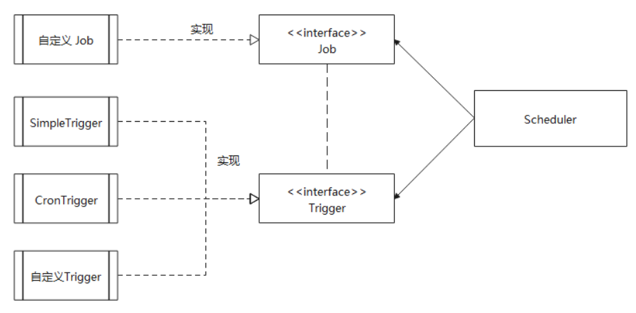
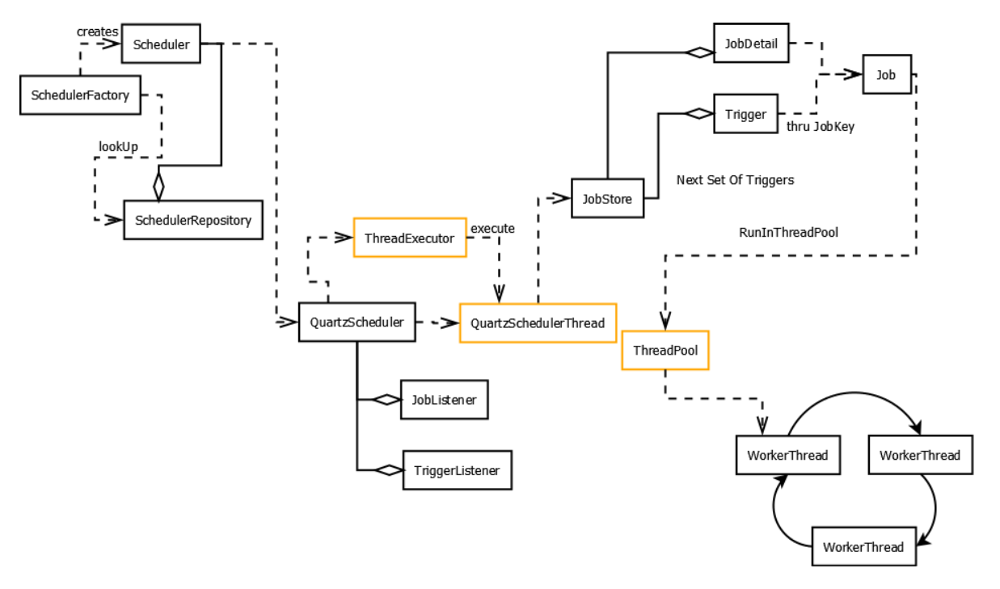

## Quartz 介绍

Quartz 是目前 Java 领域应用最为广泛的任务调度框架之一，目前很多流行的分布式调度框架，例如 xxl-job 都是基于它衍生出来的，所以了解和掌握 Quartz 的使用，对于平时完成一些需要定时调度的工作会有帮助。

Quartz类似于java.util.Timer。但是相较于Timer， Quartz增加了很多功能：

- 持久性作业 - 就是保持调度定时的状态;
- 作业管理 - 对调度作业进行有效的管理;

官方文档：

- http://www.quartz-scheduler.org/documentation/
- [http://www.quartz-scheduler.org/ap](http://www.quartz-scheduler.org/api/2.3.0/index.html)

## 快速开始

我们通过一个最简单的示例，先快速上手 Quartz 最基本的用法，然后再逐步讲解 Quartz 每个模块的功能点

### 第一步：添加依赖

在 `pom.xml` 文件添加 Quart 依赖：

```xml
<!-- 引入 quartz 基础依赖：可取当前最新版本 -->
<dependency>
    <groupId>org.quartz-scheduler</groupId>
    <artifactId>quartz</artifactId>
    <version>2.3.2</version>
</dependency>

<!-- 引入 quartz 所需的日志依赖：可取当前最新版本 -->
<dependency>
    <groupId>org.slf4j</groupId>
    <artifactId>slf4j-api</artifactId>
    <version>1.7.26</version>
    <scope>compile</scope>
</dependency>

<dependency>
    <groupId>org.slf4j</groupId>
    <artifactId>slf4j-simple</artifactId>
    <version>1.7.26</version>
    <scope>compile</scope>
</dependency>
```

在`SpringBoot`项目中只需引入`spring-boot-starter-quartz`即可

```xml
        <dependency>
            <groupId>org.springframework.boot</groupId>
            <artifactId>spring-boot-starter-quartz</artifactId>
        </dependency>
```

### 第二步：配置文件

在项目的 `classpath` 路径下创建 Quartz 默认的 `quartz.properties` 配置文件，它看起来像这样：

```properties
# 调度程序的名称
org.quartz.scheduler.instanceName = MyScheduler
# 线程数量
org.quartz.threadPool.threadCount = 3
# 内存数据库（推荐刚上手时使用）
org.quartz.jobStore.class = org.quartz.simpl.RAMJobStore
```

### 第三步：定义任务类

实现 `Job` 接口，然后在覆盖的 `execute` 函数内定义任务逻辑，如下：

```java
package com.ehzyil.quartzStudy.test;

import org.quartz.Job;
import org.quartz.JobExecutionContext;

public class HelloJob implements Job {

    @Override
    public void execute(JobExecutionContext context) {
        System.out.println("hello quartz!");
    }
}
```

### 第四步：任务调度

我们简单的使用 `main()` 方法即可运行 Quartz 任务调度示例：

```java
package com.ehzyil.quartzStudy.test;

import org.quartz.*;
import org.quartz.impl.StdSchedulerFactory;

public class QuartzTest {

    public static void main(String[] args) {
        try {
            // 获取默认的调度器实例
            Scheduler scheduler = StdSchedulerFactory.getDefaultScheduler();

            // 打开调度器
            scheduler.start();

            // 定义一个简单的任务
            JobDetail job = JobBuilder.newJob(HelloJob.class)
                    .withIdentity("job11", "group1")
                    .build();

            // 定义一个简单的触发器: 每隔 1 秒执行 1 次，任务永不停止
            SimpleTrigger trigger = TriggerBuilder.newTrigger()
                    .withIdentity("trigger1", "group1")
                    .startNow()
                    .withSchedule(SimpleScheduleBuilder
                            .simpleSchedule()
                            .withIntervalInSeconds(1)
                            .repeatForever()
                    ).build();

            // 开始调度任务
            scheduler.scheduleJob(job, trigger);

            // 等待任务执行一些时间
            Thread.sleep(3000);

            // 关闭调度器
            scheduler.shutdown();
        } catch (Exception se) {
            se.printStackTrace();
        }
    }
}
```

最后控制台会输出任务运行的全过程，然后关闭进程，如下：

```sh
21:54:58.178 [main] INFO org.quartz.impl.StdSchedulerFactory - Using default implementation for ThreadExecutor
21:54:58.182 [main] INFO org.quartz.simpl.SimpleThreadPool - Job execution threads will use class loader of thread: main
21:54:58.194 [main] INFO org.quartz.core.SchedulerSignalerImpl - Initialized Scheduler Signaller of type: class org.quartz.core.SchedulerSignalerImpl
21:54:58.194 [main] INFO org.quartz.core.QuartzScheduler - Quartz Scheduler v.2.3.2 created.
21:54:58.198 [main] INFO org.quartz.simpl.RAMJobStore - RAMJobStore initialized.
21:54:58.198 [main] INFO org.quartz.core.QuartzScheduler - Scheduler meta-data: Quartz Scheduler (v2.3.2) 'DefaultQuartzScheduler' with instanceId 'NON_CLUSTERED'
  Scheduler class: 'org.quartz.core.QuartzScheduler' - running locally.
  NOT STARTED.
  Currently in standby mode.
  Number of jobs executed: 0
  Using thread pool 'org.quartz.simpl.SimpleThreadPool' - with 10 threads.
  Using job-store 'org.quartz.simpl.RAMJobStore' - which does not support persistence. and is not clustered.

21:54:58.198 [main] INFO org.quartz.impl.StdSchedulerFactory - Quartz scheduler 'DefaultQuartzScheduler' initialized from default resource file in Quartz package: 'quartz.properties'
21:54:58.198 [main] INFO org.quartz.impl.StdSchedulerFactory - Quartz scheduler version: 2.3.2
21:54:58.198 [main] INFO org.quartz.core.QuartzScheduler - Scheduler DefaultQuartzScheduler_$_NON_CLUSTERED started.
21:54:58.198 [DefaultQuartzScheduler_QuartzSchedulerThread] DEBUG org.quartz.core.QuartzSchedulerThread - batch acquisition of 0 triggers
21:54:58.238 [DefaultQuartzScheduler_QuartzSchedulerThread] DEBUG org.quartz.core.QuartzSchedulerThread - batch acquisition of 1 triggers
21:54:58.238 [DefaultQuartzScheduler_QuartzSchedulerThread] DEBUG org.quartz.simpl.PropertySettingJobFactory - Producing instance of Job 'group1.job11', class=com.ehzyil.quartzStudy.test.HelloJob
21:54:58.242 [DefaultQuartzScheduler_QuartzSchedulerThread] DEBUG org.quartz.core.QuartzSchedulerThread - batch acquisition of 1 triggers
21:54:58.242 [DefaultQuartzScheduler_Worker-1] DEBUG org.quartz.core.JobRunShell - Calling execute on job group1.job11
hello phoenix
21:54:59.203 [DefaultQuartzScheduler_QuartzSchedulerThread] DEBUG org.quartz.simpl.PropertySettingJobFactory - Producing instance of Job 'group1.job11', class=com.ehzyil.quartzStudy.test.HelloJob
21:54:59.204 [DefaultQuartzScheduler_QuartzSchedulerThread] DEBUG org.quartz.core.QuartzSchedulerThread - batch acquisition of 1 triggers
21:54:59.204 [DefaultQuartzScheduler_Worker-2] DEBUG org.quartz.core.JobRunShell - Calling execute on job group1.job11
hello phoenix
21:55:00.209 [DefaultQuartzScheduler_QuartzSchedulerThread] DEBUG org.quartz.simpl.PropertySettingJobFactory - Producing instance of Job 'group1.job11', class=com.ehzyil.quartzStudy.test.HelloJob
21:55:00.209 [DefaultQuartzScheduler_QuartzSchedulerThread] DEBUG org.quartz.core.QuartzSchedulerThread - batch acquisition of 1 triggers
21:55:00.209 [DefaultQuartzScheduler_Worker-3] DEBUG org.quartz.core.JobRunShell - Calling execute on job group1.job11
hello phoenix
21:55:01.213 [DefaultQuartzScheduler_QuartzSchedulerThread] DEBUG org.quartz.simpl.PropertySettingJobFactory - Producing instance of Job 'group1.job11', class=com.ehzyil.quartzStudy.test.HelloJob
21:55:01.213 [DefaultQuartzScheduler_QuartzSchedulerThread] DEBUG org.quartz.core.QuartzSchedulerThread - batch acquisition of 1 triggers
21:55:01.213 [DefaultQuartzScheduler_Worker-4] DEBUG org.quartz.core.JobRunShell - Calling execute on job group1.job11
hello phoenix
21:55:01.243 [main] INFO org.quartz.core.QuartzScheduler - Scheduler DefaultQuartzScheduler_$_NON_CLUSTERED shutting down.
21:55:01.243 [main] INFO org.quartz.core.QuartzScheduler - Scheduler DefaultQuartzScheduler_$_NON_CLUSTERED paused.
21:55:01.243 [main] DEBUG org.quartz.simpl.SimpleThreadPool - Shutting down threadpool...
21:55:01.243 [main] DEBUG org.quartz.simpl.SimpleThreadPool - Shutdown of threadpool complete.
21:55:01.243 [main] INFO org.quartz.core.QuartzScheduler - Scheduler DefaultQuartzScheduler_$_NON_CLUSTERED shutdown complete.

```

可以看到，到这里一个最基本简单的 Quartz 使用示例基本就 OK 了，接下来介绍更多核心概念和深入使用的场景。

## 核心概念

### 触发器和作业

#### 基本概念

掌握 Quartz 之前，先来了解它框架的 3 个核心组件和概念，如下：

- Schduler：调度器，主要用于管理作业（JobDetail），触发器（Trigger）
- JobDetail：作业实例，内部包含作业运行的具体逻辑
- Trigger：触发器实例，内部包含作业执行的实践计划

主要关系如下：



#### 工作流程

如上所示，使用 Quartz 的工作流程也很简单，大致如下：

1. 首先基于 `Job` 接口定义你的作业 `JobDetail` 实例和触发器 `Trigger` 实例对象
2. 将定义的作业和触发器实例对象通过调度器 `scheduleJob`，开始调度执行
3. 调度器启动工作线程开始执行 `JobDetail` 实例的 `execute` 方法内容
4. 任务运行时所需信息通过，`JobExecutionContext` 对象传递到工作线程，也可以在多个工作线程中跨线程传递

示意图：



#### 唯一标识

关于创建 JobDetail 作业实例和 Trigger 触发器的几个注意事项：

1. 创建作业和触发器都需要通过（JobKey 和 TriggerKey + Group）组合创建唯一标识
2. 你可以通过唯一标识在 Schduler 中获取作业对象，并且管理和维护他们
3. 引入 Group 标识的目的也是了更好的让你管理作业环境：例如：通过不同的 Group 来区分：【测试作业，生产作业】等

### JobDetail 的更多细节

通过示例可以看到，定义和使用 Job 都非常简单，但是如果要深入使用，你可能需要了解关于 Job 的更多细节

先看看 Quartz 对于 JobDetail 的处理策略：

1. 每次执行任务都会创建一个新的 JobDetail 实例对象，意味每次执行的 JobDetail 都是新对象，JobDetail 对象也是无状态的
2. JobDetail 实例对象任务完成后 （execute 方法），调度器 Schduler 会将作业实例对象删除，然后进行垃圾回收
3. JobDetail 实例之间的状态数据，只能通过 `JobExecutionContext`（实际上是 JobDataMap） 进行跨作业传递


**为什么设计成JobDetail + Job，不直接使用Job？**

JobDetail 定义的是任务数据，而真正的执行逻辑是在Job中。

这是因为任务是有可能并发执行，如果Scheduler直接使用Job，就会存在对同一个Job实例并发访问的问题。

而JobDetail & Job 方式，Sheduler每次执行，都会根据JobDetail创建一个新的Job实例，这样就可以 规避并发访问 的问题。


#### JobDataMap

jobDataMap 的使用主要分 2 步：

1：在 `execute()` 函数内，使用 jobDataMap 获取数据

```java
public class HelloJob implements Job {

    @Override
    public void execute(JobExecutionContext context) {
        // 通过 JobDataMap 对象，可以在作业的执行逻辑中，获取参数
        JobDataMap jobDataMap = context.getJobDetail().getJobDataMap();
        String name = jobDataMap.getString("name");
        
        System.out.println("hello " + name);
    }
}
```

2：jobDataMao 添加参数

```java
// 定义作业时，通过 usingJobData 将参数放入 JobDataMap
JobDetail job = JobBuilder.newJob(HelloJob.class)
    .withIdentity("job11", "group1")
    .usingJobData("name", "phoenix")
    .build();
```

最后运行效果如下：

```sh
[main] INFO org.quartz.core.QuartzScheduler - Scheduler MyScheduler_$_NON_CLUSTERED started.
hello phoenix
[main] INFO org.quartz.core.QuartzScheduler - Scheduler MyScheduler_$_NON_CLUSTERED shutting down.
# ....
```

关于 JobDataMap 的使用，需要关注以下的注意事项：

1. 虽然 JobDataMap 可以传递任意类型的数据，对象的反序列化在版本迭代中容易遇到类版本控制的问题
2. 如果从长远的安全性考虑，尽可能的将 jobDataMap 设置为只允许存放基本类型和字符串（通过 `jobStore.useProperties` 设置）
3. Quartz 会自动通过 Job 类的 setter 方法和 JobDataMap 主键匹配，帮助你自动注入属性到 Job 类中


#### 并发性和持久化

Quartz定时任务默认都是并发执行的，不会等待上一次任务执行完毕，只要间隔时间到就会执行, 如果定时任执行太长，会长时间占用资源，导致其它任务堵塞。

Quartz 对于 Job 提供几个注释，合理的使用可以更好的控制 Quartz 的调度行为，具体如下：

- @DisallowConcurrentExecution：添加到 Job 类中，告诉 Job 防止相同定义的任务并发执行，例如：任务 A 实例未完成任务，则任务 B 实例不会开始执行（Quartz 默认策略是不会等待，启用新线程并发调度）
- @PersistJobDataAfterExecution：添加到 Job 类中，默认情况下 Job 作业运行逻辑不会影响到 JobDataMap （既每个 JobDetail 拿到的都是初始化的 JobDataMap 内容），开启该注解后，Job 的 `execute()` 方法完成后，对于 JobDataMap 的更新，将会被持久化到 JobDataMap 中，从而供其他的 JobDetail 使用，这对于任务 B 依赖任务 A 的运行结果的场景下，非常有用，所以强烈建议和 `@DisallowConcurrentExecution` 注解一起使用，会让任务运行结果更加符合预期

### Trigger 的更多细节


和 Job 类似，触发器的定义和使用也非常简单，但是如果想充分的利用它来工作，你还需要了解关于触发器的更多细节

在 Quartz 中 Trigger 触发器有很多种类型，但是他们都有几个共同的属性，如下：

- startTime：触发器首次生效的时间
- endTime：触发器失效时间

以上共同属性的值都是 `java.util.Date` 对象

关于 Trigger 的其他几个概念：

- Priority 优先权：当调度器遇到多个同时执行的 Trigger 时候，会根据优先权大小排序，然后先后调度
- Misfire 错过触发：Trigger 达到触发时间，但因为外部原因无法执行，Trigger 开始计算 Misfire 时间
  - 常见的外部原因有哪些？例如：调度程序被关闭，线程池无可用工作线程等
- Calendar 日历（不是 java.util.calendar 对象）：用于排除执行日期非常有用
  - 例如：定义一个每天 9 点执行 Trigger ，但是排除所有法定节假日

示例:

```java
Calendar instance = Calendar.getInstance();
Date startTime = instance.getTime();
instance.add(Calendar.MINUTE, 1);
Date endTime = instance.getTime();

// 3.构建Trigger实例
Trigger trigger = TriggerBuilder.newTrigger()
    .withIdentity("trigger1", "group1")
    // 开始时间
    .startAt(startTime)
    // 结束时间
    .endAt(endTime)
    .build();
```


#### SimpleTrigger

SimpleTrigger 是适用于大多数场景的触发器，它可以指定特定时间，重复间隔，重复次数等简单场景，它主要设定参数如下：

1. 开始时间
2. 结束时间
3. 重复次数
4. 间隔时间


具体的 API 可以参考 Quartz 的 Java Doc 文档，这里就不赘述了


misfire 处理策略：

我们上面说过 Quartz Misfire 的概念，从源码 `SimpleScheduleBuilder` 类中可以看到 `MISFIRE_INSTRUCTION_SMART_POLICY` 是默认的触发策略，但是也我们也可以在创建 Trigger 时候设置我们期望的错过触发策略，如下：

```java
SimpleTrigger trigger = TriggerBuilder.newTrigger()
                    .withIdentity("trigger1", "group1")
                    .withSchedule(SimpleScheduleBuilder
                            .simpleSchedule()
                            .withIntervalInSeconds(1)
                            .repeatForever()
                            // misfireInstruction = SimpleTrigger.MISFIRE_INSTRUCTION_FIRE_NOW;
                            .withMisfireHandlingInstructionFireNow()
                    ).build();
```

在 `SimpleTrigger` 类中的常量可以看到所有错过触发（misfire）处理逻辑：

```sh
MISFIRE_INSTRUCTION_FIRE_NOW
MISFIRE_INSTRUCTION_RESCHEDULE_NOW_WITH_EXISTING_REPEAT_COUNT
MISFIRE_INSTRUCTION_RESCHEDULE_NOW_WITH_REMAINING_REPEAT_COUNT
MISFIRE_INSTRUCTION_RESCHEDULE_NEXT_WITH_REMAINING_COUNT
MISFIRE_INSTRUCTION_RESCHEDULE_NEXT_WITH_EXISTING_COUNT
```

关于 misfire 的具体的行为，可以查阅 Quartz 的 Java Doc 文档

#### CronTrigger

相比 SimpleTrigger 可以指定更为复杂的执行计划，CRON 是来自 `UNIX` 基于时间的任务管理系统，相关内容就不再展开，可以参阅 [Cron - (wikipedia.org)](https://zh.wikipedia.org/wiki/Cron) 文档进一步了解，

Cron 也有类似 SimpleTrigger 的相同属性，设置效果如下：

- startTime：触发器首次生效的时间
- endTime：触发器失效时间

看看 CronTrigger 的使用示例：

```java
CronTrigger cronTrigger = TriggerBuilder.newTrigger()
    .withIdentity("trigger1", "group1")
    .withSchedule(CronScheduleBuilder
                  .cronSchedule("0 0/2 8-17 * * ?")
                  .withMisfireHandlingInstructionFireAndProceed()
                 )
    .build();

scheduler.scheduleJob(job, cronTrigger);
```

上述代码完成以下几件事情：

1. 创建 Cron 表达式：每天上午 8 点到下午 5 点之间每隔一分钟触发一次
2. 指定 MISFIRE_INSTRUCTION_FIRE_NOW 为 CronTrigger 的处理策略
3. 通过 Schduler 对任务开始进行调度

CronTrigger Misfire 策略定义在 `CronTrigger` 常量中，可以在 Java Doc 文档中查看其具体的行为

Cron 表达式在线生成，反解析的工具：http://www.matools.com/cron 

## Linstener 监听器


### JobStore 作业存储


## 集群模式


### 配置集群

### 注意事项


## SpringBoot集成Quartz 

Quartz 整合 Springboot 非常普遍的场景，整合 Spring 可以带来好处：

- 更加简洁的配置，开箱即用
- 和 Spring 的 IOC 容器融合，使用更便捷

### 添加依赖

可以在现有项目上添加 springboot 官方提供的 starter-quartz 依赖，如下：

```xml
<dependency>
    <groupId>org.springframework.boot</groupId>
    <artifactId>spring-boot-starter-quartz</artifactId>
</dependency>
```

因为后面需要写接口测试，因此还需添加 SpringBoot关于web的依赖

```xml
<dependency>
    <groupId>org.springframework.boot</groupId>
    <artifactId>spring-boot-starter-web</artifactId>
</dependency>
```


启动 Springboot 会发现，无需任何配置就已经整合 Quartz 模块了：

```JAVA
2023-10-15 22:02:04.654  INFO 20840 --- [           main] org.quartz.impl.StdSchedulerFactory      : Quartz scheduler 'quartzScheduler' initialized from an externally provided properties instance.
2023-10-15 22:02:04.654  INFO 20840 --- [           main] org.quartz.impl.StdSchedulerFactory      : Quartz scheduler version: 2.3.2
2023-10-15 22:02:04.654  INFO 20840 --- [           main] org.quartz.core.QuartzScheduler          : JobFactory set to: org.springframework.scheduling.quartz.SpringBeanJobFactory@4dc8caa7
2023-10-15 22:02:04.686  INFO 20840 --- [           main] o.s.s.quartz.SchedulerFactoryBean        : Starting Quartz Scheduler now
2023-10-15 22:02:04.686  INFO 20840 --- [           main] org.quartz.core.QuartzScheduler          : Scheduler quartzScheduler_$_NON_CLUSTERED started.
2023-10-15 22:02:04.694  INFO 20840 --- [           main] c.e.quartzStudy.QuartzStudyApplication   : Started QuartzStudyApplication in 0.768 seconds (JVM running for 1.504)

```

### 使用示例

现在基于整合模式实现刚才的 Demo 示例，首先定义任务，这里不再是实现 Job 类：

```java
public class HelloJob extends QuartzJobBean {

    @Override
    protected void executeInternal(JobExecutionContext context) throws JobExecutionException {
        JobDataMap jobDataMap = context.getJobDetail().getJobDataMap();
        String name = jobDataMap.getString("name");
        System.out.println("Hello :" + name);
    }
}
```

这里实现由 Springboot 提供的 QuartzJobBean，实现 `executerInternal()` 方法，这是一个经过 Spring 容器包装后的任务类，可以在任务类使用 Spring 容器的实例

在 Demo 示例里面，我们调度启动都是在 Main 方法启动，在本地测试没有问题，但在生产环境就不建议了，和 springboot 整合后关于任务执行，现在可以有 2 中选项：

1. 在控制层 Controller 提供接口，手动接收任务指定
2. 监听 Spring 容器，在容器启动后，自动加载任务，并且注册为 Bean

#### 手动执行

我们先看看第一种实现方式，我们创建控制器，然后接收参数，创建任务，如下：

```java
@RestController
public class HelloController {
    
    @Autowired
    private Scheduler scheduler;

    @GetMapping("/hello")
    public void helloJob(String name) throws SchedulerException {
        // 定义一个的任务
        JobDetail job = JobBuilder.newJob(HelloJob.class)
                .withIdentity("job11", "group1")
                .usingJobData("name", name)
                .build();

        // 定义一个简单的触发器: 每隔 1 秒执行 1 次，任务永不停止
        SimpleTrigger trigger = TriggerBuilder.newTrigger()
                .withIdentity("trigger1", "group1")
                .withSchedule(SimpleScheduleBuilder
                        .simpleSchedule()
                        .withIntervalInSeconds(1)
                        .repeatForever()
                ).build();

        // 开始调度
        scheduler.scheduleJob(job, trigger);
    }
}
```

然后启动服务器，使用http-request访问接口传入参数：

```sh
GET http://localhost:8080/hello?name=phoenix
```

然后控制台会输出：

```sh
2023-10-15 22:15:38.623  INFO 8060 --- [nio-8080-exec-1] o.a.c.c.C.[Tomcat].[localhost].[/]       : Initializing Spring DispatcherServlet 'dispatcherServlet'
2023-10-15 22:15:38.623  INFO 8060 --- [nio-8080-exec-1] o.s.web.servlet.DispatcherServlet        : Initializing Servlet 'dispatcherServlet'
2023-10-15 22:15:38.623  INFO 8060 --- [nio-8080-exec-1] o.s.web.servlet.DispatcherServlet        : Completed initialization in 0 ms
Hello :phoenix
Hello :phoenix
Hello :phoenix
Hello :phoenix
....
```

#### 自动执行

将 JobDetail 注册 Bean，任务就会随 Spring 启动自动触发执行，这对于需要随程序启动执行的作业非常有效，配置如下：

先创建一个配置类：

```java
@Configuration
public class QuartzConfig {

    @Bean
    public JobDetail jobDetail() {
        JobDetail job = JobBuilder.newJob(HelloJob.class)
                .withIdentity("job11", "group1")
                .usingJobData("name", "springboot")
                .storeDurably()
                .build();

        return job;
    }

    @Bean
    public Trigger trigger() {
        SimpleTrigger trigger = TriggerBuilder.newTrigger()
                .forJob(jobDetail())
                .withIdentity("trigger1", "group1")
                .withSchedule(SimpleScheduleBuilder
                        .simpleSchedule()
                        .withIntervalInSeconds(1)
                        .repeatForever()
                ).build();

        return trigger;
    }
}
```

然后在 springboot 启动后，任务就自动执行：

```sh
2023-10-15 22:16:50.481  INFO 21208 --- [           main] c.e.quartzStudy.QuartzStudyApplication   : Started QuartzStudyApplication in 1.349 seconds (JVM running for 2.11)
Hello :springboot
Hello :springboot
Hello :springboot
...
```

### 工具类


 

```java
public class ScheduleUtils {
    /**
     * 得到quartz任务类
     *
     * @param job 执行计划
     * @return 具体执行任务类
     */
    private static Class<? extends Job> getQuartzJobClass(QuartzJob job) {
        boolean isConcurrent = "0".equals(job.getConcurrent());
        return isConcurrent ? QuartzJobExecution.class : QuartzDisallowConcurrentExecution.class;
    }

    /**
     * 构建任务触发对象
     */
    public static TriggerKey getTriggerKey(Long jobId, String jobGroup) {
        return TriggerKey.triggerKey(ScheduleConstants.TASK_CLASS_NAME + jobId, jobGroup);
    }

    /**
     * 构建任务键对象
     */
    public static JobKey getJobKey(Long jobId, String jobGroup) {
        return JobKey.jobKey(ScheduleConstants.TASK_CLASS_NAME + jobId, jobGroup);
    }

    /**
     * 创建定时任务
     */
    public static void createScheduleJob(Scheduler scheduler, QuartzJob job) throws Exception {
        Class<? extends Job> jobClass = getQuartzJobClass(job);
        // 构建job信息
        Long jobId = job.getJobId();
        String jobGroup = job.getJobGroup();
        JobDetail jobDetail = JobBuilder.newJob(jobClass).withIdentity(getJobKey(jobId, jobGroup)).build();

        // 表达式调度构建器
        CronScheduleBuilder cronScheduleBuilder = CronScheduleBuilder.cronSchedule(job.getCronExpression());
        cronScheduleBuilder = handleCronScheduleMisfirePolicy(job, cronScheduleBuilder);

        // 按新的cronExpression表达式构建一个新的trigger
        CronTrigger trigger = TriggerBuilder.newTrigger().withIdentity(getTriggerKey(jobId, jobGroup))
                .withSchedule(cronScheduleBuilder).build();

        // 放入参数，运行时的方法可以获取
        jobDetail.getJobDataMap().put(ScheduleConstants.TASK_PROPERTIES, job);

        // 判断是否存在
        if (scheduler.checkExists(getJobKey(jobId, jobGroup))) {
            // 防止创建时存在数据问题 先移除，然后在执行创建操作
            scheduler.deleteJob(getJobKey(jobId, jobGroup));
        }

        scheduler.scheduleJob(jobDetail, trigger);

        // 暂停任务
        if (job.getStatus().equals(ScheduleConstants.Status.PAUSE.getValue())) {
            scheduler.pauseJob(ScheduleUtils.getJobKey(jobId, jobGroup));
        }
    }

    /**
     * 设置定时任务策略
     */
    public static CronScheduleBuilder handleCronScheduleMisfirePolicy(QuartzJob job, CronScheduleBuilder cb)
            throws Exception {
        switch (job.getMisfirePolicy()) {
            case ScheduleConstants.MISFIRE_DEFAULT:
                return cb;
            case ScheduleConstants.MISFIRE_IGNORE_MISFIRES:
                return cb.withMisfireHandlingInstructionIgnoreMisfires();
            case ScheduleConstants.MISFIRE_FIRE_AND_PROCEED:
                return cb.withMisfireHandlingInstructionFireAndProceed();
            case ScheduleConstants.MISFIRE_DO_NOTHING:
                return cb.withMisfireHandlingInstructionDoNothing();
            default:
                throw new Exception("The task misfire policy '" + job.getMisfirePolicy()
                        + "' cannot be used in cron schedule tasks");
        }
    }
}
```

 


 

```java
public abstract class AbstractQuartzJob implements Job {
    private static final Logger log = LoggerFactory.getLogger(AbstractQuartzJob.class);

    /**
     * 线程本地变量
     */
    private static ThreadLocal<Date> threadLocal = new ThreadLocal<>();

    @Override
    public void execute(JobExecutionContext context) throws JobExecutionException {
        QuartzJob job = new QuartzJob();
        BeanUtils.copyBeanProp(job, context.getMergedJobDataMap().get(ScheduleConstants.TASK_PROPERTIES));
        try {
            before(context, job);
            if (job != null) {
                doExecute(context, job);
            }
            after(context, job, null);
        } catch (Exception e) {
            log.error("任务执行异常  - ：", e);
            after(context, job, e);
        }
    }

    /**
     * 执行前
     *
     * @param context 工作执行上下文对象
     * @param job     系统计划任务
     */
    protected void before(JobExecutionContext context, QuartzJob job) {
        threadLocal.set(new Date());
    }

    /**
     * 执行后
     *
     * @param context 工作执行上下文对象
     * @param sysJob  系统计划任务
     */
    protected void after(JobExecutionContext context, QuartzJob sysJob, Exception e) {

    }

    /**
     * 执行方法，由子类重载
     *
     * @param context 工作执行上下文对象
     * @param job     系统计划任务
     * @throws Exception 执行过程中的异常
     */
    protected abstract void doExecute(JobExecutionContext context, QuartzJob job) throws Exception;
}
```

> 这个类将原本 execute 方法执行的任务，下放到了子类重载的 doExecute 方法中

同时准备实现，分了允许并发和不允许并发，差别就是一个注解

```java
public class QuartzJobExecution extends AbstractQuartzJob {
    @Override
    protected void doExecute(JobExecutionContext context, QuartzJob job) throws Exception {
        JobInvokeUtil.invokeMethod(job);
    }
}
@DisallowConcurrentExecution
public class QuartzDisallowConcurrentExecution extends AbstractQuartzJob {
    @Override
    protected void doExecute(JobExecutionContext context, QuartzJob job) throws Exception {
        JobInvokeUtil.invokeMethod(job);
    }
}
```

 

 

最后由 通过反射，进行实际的方法调用

```java
public class JobInvokeUtil {
    /**
     * 执行方法
     *
     * @param job 系统任务
     */
    public static void invokeMethod(QuartzJob job) throws Exception {
        String invokeTarget = job.getInvokeTarget();
        String beanName = getBeanName(invokeTarget);
        String methodName = getMethodName(invokeTarget);
        List<Object[]> methodParams = getMethodParams(invokeTarget);

        if (!isValidClassName(beanName)) {
            Object bean = SpringUtils.getBean(beanName);
            invokeMethod(bean, methodName, methodParams);
        } else {
            Object bean = Class.forName(beanName).newInstance();
            invokeMethod(bean, methodName, methodParams);
        }
    }

    /**
     * 调用任务方法
     *
     * @param bean         目标对象
     * @param methodName   方法名称
     * @param methodParams 方法参数
     */
    private static void invokeMethod(Object bean, String methodName, List<Object[]> methodParams)
            throws NoSuchMethodException, SecurityException, IllegalAccessException, IllegalArgumentException,
            InvocationTargetException {
        if (StringUtils.isNotNull(methodParams) && methodParams.size() > 0) {
            Method method = bean.getClass().getDeclaredMethod(methodName, getMethodParamsType(methodParams));
            method.invoke(bean, getMethodParamsValue(methodParams));
        } else {
            Method method = bean.getClass().getDeclaredMethod(methodName);
            method.invoke(bean);
        }
    }

    /**
     * 校验是否为为class包名
     *
     * @param invokeTarget 名称
     * @return true是 false否
     */
    public static boolean isValidClassName(String invokeTarget) {
        return StringUtils.countMatches(invokeTarget, ".") > 1;
    }

    /**
     * 获取bean名称
     *
     * @param invokeTarget 目标字符串
     * @return bean名称
     */
    public static String getBeanName(String invokeTarget) {
        String beanName = StringUtils.substringBefore(invokeTarget, "(");
        return StringUtils.substringBeforeLast(beanName, ".");
    }

    /**
     * 获取bean方法
     *
     * @param invokeTarget 目标字符串
     * @return method方法
     */
    public static String getMethodName(String invokeTarget) {
        String methodName = StringUtils.substringBefore(invokeTarget, "(");
        return StringUtils.substringAfterLast(methodName, ".");
    }

    /**
     * 获取method方法参数相关列表
     *
     * @param invokeTarget 目标字符串
     * @return method方法相关参数列表
     */
    public static List<Object[]> getMethodParams(String invokeTarget) {
        String methodStr = StringUtils.substringBetween(invokeTarget, "(", ")");
        if (StringUtils.isEmpty(methodStr)) {
            return null;
        }
        String[] methodParams = methodStr.split(",");
        List<Object[]> classs = new LinkedList<>();
        for (int i = 0; i < methodParams.length; i++) {
            String str = StringUtils.trimToEmpty(methodParams[i]);
            // String字符串类型，包含'
            if (StringUtils.contains(str, "'")) {
                classs.add(new Object[]{StringUtils.replace(str, "'", ""), String.class});
            }
            // boolean布尔类型，等于true或者false
            else if (StringUtils.equals(str, "true") || StringUtils.equalsIgnoreCase(str, "false")) {
                classs.add(new Object[]{Boolean.valueOf(str), Boolean.class});
            }
            // long长整形，包含L
            else if (StringUtils.containsIgnoreCase(str, "L")) {
                classs.add(new Object[]{Long.valueOf(StringUtils.replaceIgnoreCase(str, "L", "")), Long.class});
            }
            // double浮点类型，包含D
            else if (StringUtils.containsIgnoreCase(str, "D")) {
                classs.add(new Object[]{Double.valueOf(StringUtils.replaceIgnoreCase(str, "D", "")), Double.class});
            }
            // 其他类型归类为整形
            else {
                classs.add(new Object[]{Integer.valueOf(str), Integer.class});
            }
        }
        return classs;
    }

    /**
     * 获取参数类型
     *
     * @param methodParams 参数相关列表
     * @return 参数类型列表
     */
    public static Class<?>[] getMethodParamsType(List<Object[]> methodParams) {
        Class<?>[] classs = new Class<?>[methodParams.size()];
        int index = 0;
        for (Object[] os : methodParams) {
            classs[index] = (Class<?>) os[1];
            index++;
        }
        return classs;
    }

    /**
     * 获取参数值
     *
     * @param methodParams 参数相关列表
     * @return 参数值列表
     */
    public static Object[] getMethodParamsValue(List<Object[]> methodParams) {
        Object[] classs = new Object[methodParams.size()];
        int index = 0;
        for (Object[] os : methodParams) {
            classs[index] = (Object) os[0];
            index++;
        }
        return classs;
    }
}
```

 

 

```java
public class CronUtils {

    /**
     * 返回一个布尔值代表一个给定的Cron表达式的有效性
     *
     * @param cronExpression Cron表达式
     * @return boolean 表达式是否有效
     */
    public static boolean isValid(String cronExpression) {
        return CronExpression.isValidExpression(cronExpression);
    }

    /**
     * 返回下一个执行时间根据给定的Cron表达式
     *
     * @param cronExpression Cron表达式
     * @return Date 下次Cron表达式执行时间
     */
    public static Date getNextExecution(String cronExpression) {
        try {
            CronExpression cron = new CronExpression(cronExpression);
            return cron.getNextValidTimeAfter(new Date(System.currentTimeMillis()));
        } catch (ParseException e) {
            throw new IllegalArgumentException(e.getMessage());
        }
    }
}
```

 

##  参考文章


- [1] [Quartz 使用教程 ](https://www.cnblogs.com/xiao2shiqi/p/17064305.html)

- [2] [任务调度框架 Quartz 用法指南「超详细」](https://zhuanlan.zhihu.com/p/520828149)