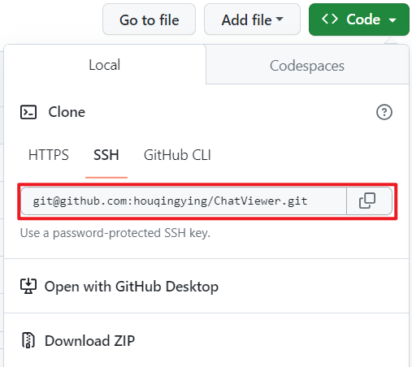
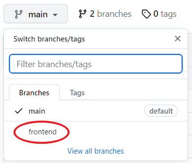
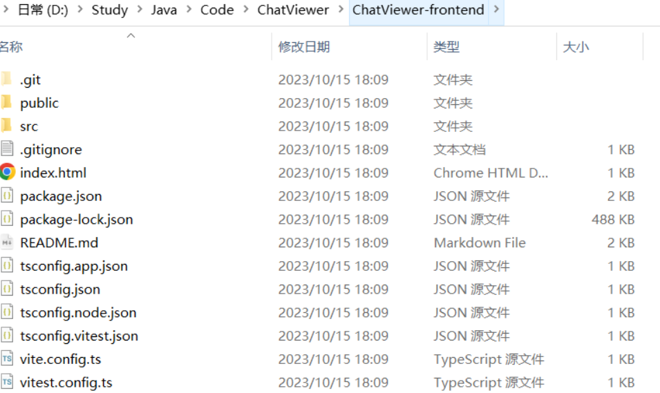

以`https://github.com/houqingying/ChatViewer/tree/main`该仓库为例，拉取`frontend`分支的代码到`ChatViewer-frontend`文件夹

步骤：

1、新建一个空文件，文件名为`ChatViewer-frontend`

2、初始化  **git init**

```bash
ehZyiL@DESKTOP-1H567GC MINGW64 /d/Study/Java/Code/ChatViewer/ChatViewer-frontend
$ git init
Initialized empty Git repository in D:/Study/Java/Code/ChatViewer/ChatViewer-frontend/.git/
```

3、自己要与origin master建立连接（下划线为远程仓库链接）

**git remote add origin git@github.com:XXXX/xxx.git**

远程仓库链接在这里，如下图红色框内所示的链接：



输入命令：

4、把远程分支拉到本地 git fetch origin frontend（frontend为远程仓库的分支名）

下图的Branches界面下的均为可使用的分支名



下面拉取远程的frontend分支，命令：

```bash
ehZyiL@DESKTOP-1H567GC MINGW64 /d/Study/Java/Code/ChatViewer/ChatViewer-frontend (master)
$ git remote add origin git@github.com:houqingying/ChatViewer.git

ehZyiL@DESKTOP-1H567GC MINGW64 /d/Study/Java/Code/ChatViewer/ChatViewer-frontend (master)
$ git fetch origin frontend
remote: Enumerating objects: 373, done.
remote: Counting objects: 100% (373/373), done.
remote: Compressing objects: 100% (331/331), done.
remote: Total 373 (delta 26), reused 358 (delta 21), pack-reused 0
Receiving objects: 100% (373/373), 2.66 MiB | 1.04 MiB/s, done.
Resolving deltas: 100% (26/26), done.
From github.com:houqingying/ChatViewer
 * branch            frontend   -> FETCH_HEAD
 * [new branch]      frontend   -> origin/frontend

```

5、切换到该分支 git checkout origin/frontend(远程分支名称)

命令：

```bash
ehZyiL@DESKTOP-1H567GC MINGW64 /d/Study/Java/Code/ChatViewer/ChatViewer-frontend (master)
$ git checkout  origin/frontend
Note: switching to 'origin/frontend'.

You are in 'detached HEAD' state. You can look around, make experimental
changes and commit them, and you can discard any commits you make in this
state without impacting any branches by switching back to a branch.

If you want to create a new branch to retain commits you create, you may
do so (now or later) by using -c with the switch command. Example:

  git switch -c <new-branch-name>

Or undo this operation with:

  git switch -

Turn off this advice by setting config variable advice.detachedHead to false

HEAD is now at f299acd Update README.md

ehZyiL@DESKTOP-1H567GC MINGW64 /d/Study/Java/Code/ChatViewer/ChatViewer-frontend ((f299acd...))
$

```

可以看到文件夹中已有frontend仓库的文件。



至此，git拉取远程分支到本地已完成。

若需要在本地创建分支并切换到该分支可以执行以下命令(以main分支为例)

**git checkout -b main(本地新建分支名称) origin/main(远程分支名称)**

```bash
ehZyiL@DESKTOP-1H567GC MINGW64 /d/Study/Java/Code/ChatViewer/ChatViewer-admin (master)
$ git fetch origin main
remote: Enumerating objects: 148, done.
remote: Counting objects: 100% (148/148), done.
remote: Compressing objects: 100% (121/121), done.
remote: Total 148 (delta 23), reused 132 (delta 17), pack-reused 0
Receiving objects: 100% (148/148), 91.02 KiB | 105.00 KiB/s, done.
Resolving deltas: 100% (23/23), done.
From github.com:houqingying/ChatViewer
 * branch            main       -> FETCH_HEAD
 * [new branch]      main       -> origin/main

ehZyiL@DESKTOP-1H567GC MINGW64 /d/Study/Java/Code/ChatViewer/ChatViewer-admin (master)
$ git checkout -b main origin/main
Switched to a new branch 'main'
branch 'main' set up to track 'origin/main'.

ehZyiL@DESKTOP-1H567GC MINGW64 /d/Study/Java/Code/ChatViewer/ChatViewer-admin (main)
$ git branch
* main

```


6、拉取远程分支上的最新内容到本地

从远程仓库（origin）的主分支（frontend）拉取最新的代码更新到本地仓库。

git pull origin frontend(远程分支名称)

命令：

``` 
git pull origin frontend
```


