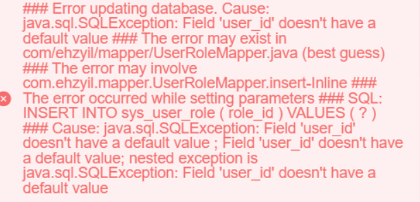

## MySQL报错Field 'user_id' doesn't have a default value


**一、问题**

执行sql语句时，报错Field 'user_id' doesn't have a default value；



**二、解决**

1、表结构

```sql
CREATE TABLE `sys_user_role` (
  `user_id` bigint NOT NULL COMMENT '用户ID',
  `role_id` bigint NOT NULL COMMENT '角色ID',
 )
) ENGINE=InnoDB DEFAULT CHARSET=utf8mb3 COMMENT='用户和角色关联表'
```

2、执行的sql

```sql
 INSERT INTO sys_user_role  ( role_id )  VALUES  ( ? )
```

在插入信息时只插入了'role_id'未插入'user_id',sql中没有字段且 PRIMARY KEY (`user_id`,`role_id`） 因此插入时报异常.

经查找实体类`user_role` 发现在`userId`上添加了如下注解

```java
@TableId("user_id")//相当于 @TableId("user_id")
```

导致无法获取User实体的userId字段。

**解决方案**

- 去掉@TableId注解

- 将注解改为：@TableId(value = "user_id", type = IdType.INPUT)

**三、延伸**

### [@TableId](https://github.com/baomidou/mybatis-plus/blob/3.0/mybatis-plus-annotation/src/main/java/com/baomidou/mybatisplus/annotation/TableId.java)注解

- 描述：主键注解
- 使用位置：实体类主键字段

```java
@TableName("sys_user")
public class User {
    @TableId
    private Long id;
    private String name;
    private Integer age;
    private String email;
}
```

| 属性  | 类型   | 必须指定 | 默认值      | 描述         |
| :---- | :----- | :------- | :---------- | :----------- |
| value | String | 否       | ""          | 主键字段名   |
| type  | Enum   | 否       | IdType.NONE | 指定主键类型 |

### [IdType](https://github.com/baomidou/mybatis-plus/blob/3.0/mybatis-plus-annotation/src/main/java/com/baomidou/mybatisplus/annotation/IdType.java)

| 值            | 描述                                                         |
| :------------ | :----------------------------------------------------------- |
| AUTO          | 数据库 ID 自增                                               |
| NONE          | 无状态，该类型为未设置主键类型（注解里等于跟随全局，全局里约等于 INPUT） |
| INPUT         | insert 前自行 set 主键值                                     |
| ASSIGN_ID     | 分配 ID(主键类型为 Number(Long 和 Integer)或 String)(since 3.3.0),使用接口`IdentifierGenerator`的方法`nextId`(默认实现类为`DefaultIdentifierGenerator`雪花算法) |
| ASSIGN_UUID   | 分配 UUID,主键类型为 String(since 3.3.0),使用接口`IdentifierGenerator`的方法`nextUUID`(默认 default 方法) |
| ID_WORKER     | 分布式全局唯一 ID 长整型类型(please use `ASSIGN_ID`)         |
| UUID          | 32 位 UUID 字符串(please use `ASSIGN_UUID`)                  |
| ID_WORKER_STR | 分布式全局唯一 ID 字符串类型(please use `ASSIGN_ID`)         |
