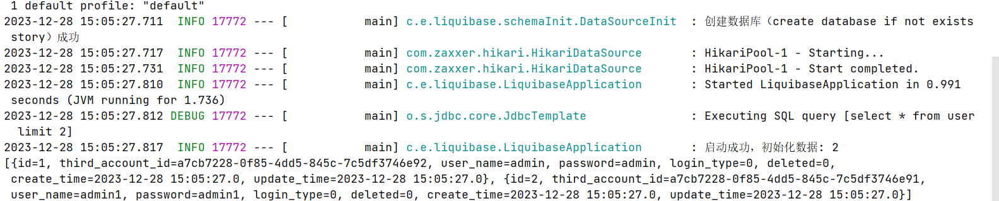

## **数据库表自动初始化**

### Liquibase数据库表版本管理

#### 依赖配置

在Maven的pom文件中添加`Liquibase`依赖

```xml
<dependency>
    <groupId>org.liquibase</groupId>
    <artifactId>liquibase-core</artifactId>
</dependency>
```

**配置数据源和Liquibase**

在application.yml文件中添加配置，`liquibase:  change-log: classpath:liquibase/master.xml`用于指定change-log的目录。

```yml
# 默认的数据库名
database:
  name: story

spring:
  liquibase:
    change-log: classpath:liquibase/master.xml
    enabled: true # 当实际使用的数据库不支持liquibase，如 mariadb 时，将这个参数设置为false

  datasource:
    url: jdbc:mysql://127.0.0.1:3306/${database.name}?useUnicode=true&characterEncoding=UTF-8&useSSL=false&serverTimezone=Asia/Shanghai
    username: root
    password: 666666

```

**说明：**
●对于不支持liquibase的数据库，如mariadb，请将上面的 spring.liquibase.enabled 设置为 false
●change-log: 对应的是核心的数据库版本变更配置

在rescources下创建以下的配置文件。


master.xml 文件中的内容如下

```
<?xml version="1.0" encoding="utf-8"?>
<databaseChangeLog
        xmlns="http://www.liquibase.org/xml/ns/dbchangelog"
        xmlns:xsi="http://www.w3.org/2001/XMLSchema-instance"
        xsi:schemaLocation="http://www.liquibase.org/xml/ns/dbchangelog
    http://www.liquibase.org/xml/ns/dbchangelog/dbchangelog-3.5.xsd">

    <include file="liquibase/changelog/000_initial_schema.xml" relativeToChangelogFile="false"/>

</databaseChangeLog>
```

**说明：**
●对于不支持liquibase的数据库，如mariadb，请将上面的 spring.liquibase.enabled 设置为 false
●change-log: 对应的是核心的数据库版本变更配置

> 注意上面这个 include， 这里就是告诉liquibase，所有的变更记录，都放在了  liquibase/changelog/000_initial_schema.xml 这个文件中

**changelog文件**

changelog文件，用于定义数据库的结构和初始数据。可以使用XML、YAML或者JSON格式来编写changelog文件，例如000_initial_schema.xml。

```
<?xml version="1.0" encoding="utf-8"?>
<databaseChangeLog
        xmlns="http://www.liquibase.org/xml/ns/dbchangelog"
        xmlns:xsi="http://www.w3.org/2001/XMLSchema-instance"
        xsi:schemaLocation="http://www.liquibase.org/xml/ns/dbchangelog http://www.liquibase.org/xml/ns/dbchangelog/dbchangelog-3.5.xsd">

    <property name="now" value="now()" dbms="mysql"/>
    <property name="autoIncrement" value="true"/>

    <changeSet id="00000000000001" author="ehzyil">
        <sqlFile dbms="mysql" endDelimiter=";" encoding="UTF-8" path="liquibase/data/init-schema.sql"/>
    </changeSet>
    <changeSet id="00000000000002" author="ehzyil">
        <sqlFile dbms="mysql" endDelimiter=";" encoding="UTF-8" path="liquibase/data/init-schema-1.sql"/>
    </changeSet>

    <changeSet id="00000000000003" author="ehzyil">
        <sqlFile dbms="mysql" endDelimiter=";" encoding="UTF-8" path="liquibase/data/init-data.sql"/>
    </changeSet>
    <!-- 可以添加更多的changeSet来定义其他表结构和初始数据 -->
</databaseChangeLog>
```

说明：
●changeSet 标签，id必须唯一，不能出现冲突
●sqlFile 里面的path，对应的可以是标准的sql文件，也可以是xml格式的数据库表定义、数据库操作文件
●一旦写上去，changeSet的顺序不要调整

`init-schema.sql`

```
CREATE TABLE `user`
(
    `id`               int unsigned NOT NULL AUTO_INCREMENT COMMENT '主键ID',
    `third_account_id` varchar(128) NOT NULL DEFAULT '' COMMENT '第三方用户ID',
    `user_name`        varchar(64)  NOT NULL DEFAULT '' COMMENT '用户名',
    `password`         varchar(128) NOT NULL DEFAULT '' COMMENT '密码',
    `login_type`       tinyint      NOT NULL DEFAULT '0' COMMENT '登录方式: 0-微信登录，1-账号密码登录',
    `deleted`          tinyint      NOT NULL DEFAULT '0' COMMENT '是否删除',
    `create_time`      timestamp    NOT NULL DEFAULT CURRENT_TIMESTAMP COMMENT '创建时间',
    `update_time`      timestamp    NOT NULL DEFAULT CURRENT_TIMESTAMP ON UPDATE CURRENT_TIMESTAMP COMMENT '最后更新时间',
    PRIMARY KEY (`id`),
    KEY                `key_third_account_id` (`third_account_id`),
    KEY                `user_name` (`user_name`)
) ENGINE=InnoDB AUTO_INCREMENT=1 DEFAULT CHARSET=utf8mb4  COMMENT='用户登录表';
```


#### 项目演示

项目启动之后，一切正常的话，直接连上数据库可以看到库表创建成功，数据也初始化完成，当然也可以直接观察控制台的输出


#### 注意事项

非常重要的一个点是，上面的每个ChangeSet只会执行一次，因此当执行完毕之后发现不对，要回滚怎么办？或者又需要修改怎么办？

liquibase 提供了回滚的机制，当ChangeSet执行完毕之后，对应的sql文件/xml文件（即path定义的文件）不允许再修改，因为db中会记录这个文件的md5，当修改这个文件之后，这个md5也会随之发生改变


- 因此两个解决方案：新增一个changeSet
- 删除 DATABASECHANGELOG 表中 changeSet id对应的记录，然后重新走一遍

### `DataSourcelnitializer`首次初始化方案

> 如何使用`DataSourceInitializer`来实现自主可控的数据初始化

#### 项目搭建

##### 依赖

首先搭建一个标准的SpringBoot项目工程，相关版本以及依赖如下

```
  <dependency>
            <groupId>mysql</groupId>
            <artifactId>mysql-connector-java</artifactId>
            <version>8.0.31</version>
        </dependency>
        <dependency>
            <groupId>org.springframework.boot</groupId>
            <artifactId>spring-boot-starter-jdbc</artifactId>
        </dependency>
```


##### 配置

注意实现初始化数据库表操作的核心配置就在下面，重点关注

配置文件： `resources/application.yml`

```
# 默认的数据库名
database:
  name: story

spring:
  datasource:
    url: jdbc:mysql://127.0.0.1:3306/${database.name}?useUnicode=true&characterEncoding=UTF-8&useSSL=false&serverTimezone=Asia/Shanghai
    username: root
    password: 666666

logging:
  level:
    root: info
    org:
      springframework:
        jdbc:
          core: debug
```

`resources/init_data/init-schema.sql` 对应的初始化ddl

```
CREATE TABLE `user`
(
    `id`               int unsigned NOT NULL AUTO_INCREMENT COMMENT '主键ID',
    `third_account_id` varchar(128) NOT NULL DEFAULT '' COMMENT '第三方用户ID',
    `user_name`        varchar(64)  NOT NULL DEFAULT '' COMMENT '用户名',
    `password`         varchar(128) NOT NULL DEFAULT '' COMMENT '密码',
    `login_type`       tinyint      NOT NULL DEFAULT '0' COMMENT '登录方式: 0-微信登录，1-账号密码登录',
    `deleted`          tinyint      NOT NULL DEFAULT '0' COMMENT '是否删除',
    `create_time`      timestamp    NOT NULL DEFAULT CURRENT_TIMESTAMP COMMENT '创建时间',
    `update_time`      timestamp    NOT NULL DEFAULT CURRENT_TIMESTAMP ON UPDATE CURRENT_TIMESTAMP COMMENT '最后更新时间',
    PRIMARY KEY (`id`),
    KEY                `key_third_account_id` (`third_account_id`),
    KEY                `user_name` (`user_name`)
) ENGINE=InnoDB AUTO_INCREMENT=1 DEFAULT CHARSET=utf8mb4  COMMENT='用户登录表';
```

`resources/init_data/init-data.sql` 对用的初始化dml

```
INSERT INTO `user` (id, third_account_id, `user_name`, `password`, login_type, deleted)
VALUES (1, 'a7cb7228-0f85-4dd5-845c-7c5df3746e92', 'admin', 'admin', 0, 0);
```

#### 初始化

**初始化配置**

```java
@Slf4j
@Configuration
public class DataSourceInit {
    //需要初始化的表结构
    @Value("classpath:init_data/init-schema.sql")
    private Resource initDataSource;
    //初始化数据
    @Value("classpath:init_data/init-data.sql")
    private Resource initData;
    //数据库名
    @Value("${database.name}")
    private String dataBaseName;

    @Bean
    public DataSourceInitializer dataSourceInitializer(final DataSource dataSource) {
        final DataSourceInitializer initializer = new DataSourceInitializer();
        // 设置数据源
        initializer.setDataSource(dataSource);
        // 设置数据库Populator
        initializer.setDatabasePopulator(databasePopulator());
        // true表示需要执行，false表示不需要初始化
        initializer.setEnabled(needInit(dataSource));
        return initializer;
    }

   
    /**
     * 设置数据源
     * <span>创建了一个ResourceDatabasePopulator对象，并添加了两个SQL脚本文件到其中，用分号作为分隔符。最后将这个populator对象返回。</span>
     *
     * @return
     */
    private DatabasePopulator databasePopulator() {
        final ResourceDatabasePopulator populator = new ResourceDatabasePopulator();
        populator.addScripts(initDataSource);
        populator.addScripts(initData);
        populator.setSeparator(";");
        return populator;
    }
}
```

我们这里主要是借助 DataSourceInitializer 来实现初始化，其核心有两个配置

- DatabasePopulator: 通过`addScripts`来指定对应的sql文件

- DataSourceInitializer#setEnabled: 判断是否需要执行初始化

  

接下来重点需要看的就是needInit方法，我们再这个方法里面，需要判断数据库是否存在，若不存在时，则创建数据库；然后再判断表是否存在，以此来决定是否需要执行初始化方法

```java
 /**
     * 判断是否需要初始化
     *
     * @param dataSource
     * @return
     */
    private boolean needInit(DataSource dataSource) {
        if (autoInitDatabase()) {
            return true;
        }
        // 根据是否存在表来判断是否需要执行sql操作
        JdbcTemplate jdbcTemplate = new JdbcTemplate(dataSource);
        List<Map<String, Object>> list = jdbcTemplate.queryForList("SELECT table_name FROM information_schema.TABLES where table_name = 'user' and table_schema = '" + dataBaseName + "'");
        boolean init = CollectionUtils.isEmpty(list);
        if (init) {
            log.info("库表不存在，执行建表及数据初始化");
        } else {
            log.info("表结构已存在，无需初始化");
        }
        return init;
    }

    /**
     * 数据库不存在时，尝试创建数据库
     *
     * @return
     */
    private boolean autoInitDatabase() {
        // 查询失败，可能是数据库不存在，尝试创建数据库之后再次测试
        //jdbc:mysql://127.0.0.1:3306/story?useUnicode=true&characterEncoding=UTF-8&useSSL=false&serverTimezone=Asia/Shanghai
        //mysql://127.0.0.1:3306/story?useUnicode=true&characterEncoding=UTF-8&useSSL=false&serverTimezone=Asia/Shanghai
        URI url = URI.create(SpringUtil.getConfig("spring.datasource.url").substring(5));
        String uname = SpringUtil.getConfig("spring.datasource.username");
        String pwd = SpringUtil.getConfig("spring.datasource.password");

        try (Connection connection = DriverManager.getConnection("jdbc:mysql://" + url.getHost() + ":" + url.getPort() +
                "?useUnicode=true&characterEncoding=UTF-8&useSSL=false", uname, pwd);
             Statement statement = connection.createStatement()) {

            ResultSet set = statement.executeQuery("select  schema_name from information_schema.schemata where schema_name='" + dataBaseName + "'");
            if (!set.next()) {
                String createDb = "create database if not exists " + dataBaseName;
                connection.setAutoCommit(false);
                statement.execute(createDb);
                connection.commit();
                log.info("创建数据库（{}）成功", createDb);
                if (set.isClosed()) {
                    set.close();
                }
                return true;
            }
            set.close();
            log.info("数据库已存在，无需初始化");
            return false;
        } catch (Exception e) {
            throw new RuntimeException(e);
        }
    }
```

上面的数据库判断是否存在以及初始化的过程相对基础，直接使用了基础的Connection进行操作；这里借助了SpringUtil来获取配置信息，对应的类源码如下

```java
@Component
public class SpringUtil implements ApplicationContextAware, EnvironmentAware {
    private static ApplicationContext context;
    private static Environment environment;

    /**
     * 获取bean
     *
     * @param bean
     * @param <T>
     * @return
     */
    public static <T> T getBean(Class<T> bean) {
        return context.getBean(bean);
    }

    public static Object getBean(String beanName) {
        return context.getBean(beanName);
    }

    /**
     * 获取配置
     *
     * @param key
     * @return
     */
    public static String getConfig(String key) {
        return environment.getProperty(key);
    }

    /**
     * 发布事件消息
     *
     * @param event
     */
    public static void publishEvent(ApplicationEvent event) {
        context.publishEvent(event);
    }

    @Override
    public void setApplicationContext(ApplicationContext applicationContext) throws BeansException {
        SpringUtil.context = applicationContext;
    }

    @Override
    public void setEnvironment(Environment environment) {
        SpringUtil.environment = environment;
    }
}
```

`Springboot`启动类配置如下：

```
@Slf4j
@SpringBootApplication
public class LiquibaseApplication implements ApplicationRunner {
    @Autowired
    private JdbcTemplate jdbcTemplate;

    public static void main(String[] args) {
        SpringApplication.run(LiquibaseApplication.class);
    }

    @Override
    public void run(ApplicationArguments args) throws Exception {
        List list = jdbcTemplate.queryForList("select * from user limit 2");
        log.info("启动成功，初始化数据: {}\n{}", list.size(), list);
    }
}

```

#### 项目演示

删除原有的story数据库，启动项目，成功执行结果如下




### 两种初始化方式结合的实践方案

> 第一次启动项目时选择未开启liquibase，第二次开启liquibase时会报错，因为 databasechangelog表未创建，因此请选准一种启动方式。

##### 库初始化

```java
 /**
     * 数据库不存在时，尝试创建数据库<br>
     * <span>
     * autoInitDatabase方法用于自动创建数据库。在方法内部，首先从配置文件中获取数据库连接URL、用户名和密码，并通过DriverManager创建数据库连接和Statement对象。
     * 然后通过执行查询语句判断数据库是否存在，如果不存在则执行创建数据库的sql语句，并打印相应日志。
     * </span>
     *
     * @return 是否成功创建数据库
     */
    private boolean autoInitDatabase() {
        // 查询失败，可能是数据库不存在，尝试创建数据库之后再次测试
        //jdbc:mysql://127.0.0.1:3306/story?useUnicode=true&characterEncoding=UTF-8&useSSL=false&serverTimezone=Asia/Shanghai
        //mysql://127.0.0.1:3306/story?useUnicode=true&characterEncoding=UTF-8&useSSL=false&serverTimezone=Asia/Shanghai
        URI url = URI.create(SpringUtil.getConfig("spring.datasource.url").substring(5));
        String uname = SpringUtil.getConfig("spring.datasource.username");
        String pwd = SpringUtil.getConfig("spring.datasource.password");

        try (Connection connection = DriverManager.getConnection("jdbc:mysql://" + url.getHost() + ":" + url.getPort() + "?useUnicode=true&characterEncoding=UTF-8&useSSL=false", uname, pwd); Statement statement = connection.createStatement()) {

            ResultSet set = statement.executeQuery("select  schema_name from information_schema.schemata where schema_name='" + database + "'");
            if (!set.next()) {
                String createDb = "create database if not exists " + database;
                connection.setAutoCommit(false);
                statement.execute(createDb);
                connection.commit();
                log.info("创建数据库（{}）成功", createDb);
                if (set.isClosed()) {
                    set.close();
                }
                return true;
            }
            set.close();
            log.info("数据库已存在，无需初始化");
            return false;
        } catch (Exception e) {
            throw new RuntimeException(e);
        }
    }
```

上面的实现比较清晰了，首先是判断库是否存在，autoInitDatabase方法用于自动创建数据库。在方法内部，首先从配置文件中获取数据库连接URL、用户名和密码，并通过DriverManager创建数据库连接和Statement对象。然后通过执行查询语句判断数据库是否存在，如果不存在则执行创建数据库的sql语句，并打印相应日志。

**为什么不直接使用 spring.datasource.url 来创建连接？**
因为库不存在时，直接使用下面这个url进行连接会抛连接异常

##### 表初始化

表的初始化，其实可以理解为项目启动之后执行一些sql，这时主要借助的就是 initializer.setDatabasePopulator
核心知识点
我们使用DbChangeSetLoader 类来实现初始化sql的加载，但实际上，若你完全抛开Liquibase，单纯的希望项目启动后执行某些sql，可以非常简单的实现，直接用`DataSourcelnitializer`首次初始化方案中写的**通过 @Value 来加载需要初始化的sql文件，直接通过 ResourceDatabasePoplulator 添加sql资源**就可以了


```java
    /**
     * 检测一下数据库中表是否存在，若存在则不初始化；
     *
     * @param dataSource
     * @return true 表示需要初始化； false 表示无需初始化
     */
    private boolean needInit(DataSource dataSource) {

        if (autoInitDatabase()) {
            return true; //不存在且已创建
        }

        //已存在的执行逻辑

        // 根据是否存在表来判断是否需要执行sql操作
        JdbcTemplate jdbcTemplate = new JdbcTemplate(dataSource);
        if (!liquibaseEnable) {
            // 非liquibase做数据库版本管理的，根据用户来判断是否有初始化
            List list = jdbcTemplate.queryForList("SELECT table_name FROM information_schema.TABLES where table_name = 'user_info' and table_schema = '" + database + "';");
            return CollectionUtils.isEmpty(list);
        }

        // 对于liquibase做数据版本管控的场景，若使用的不是默认的pai_coding，则需要进行修订
        List<Map<String, Object>> record = jdbcTemplate.queryForList("select * from DATABASECHANGELOG where ID='00000000000020' limit 1;");
        if (CollectionUtils.isEmpty(record)) {
            // 首次启动，需要初始化库表，直接返回
            return true;
        }

        // 非首次启动时，判断记录对应的md5是否准确
        if (Objects.equals(record.get(0).get("MD5SUM"), "8:a1a2d9943b746acf58476ae612c292fc")) {
           jdbcTemplate.update("update DATABASECHANGELOG set MD5SUM='8:bb81b67a5219be64eff22e2929fed540' where ID='00000000000020'");
        }
        return false;
    }
```

needInit方法用于判断是否需要初始化数据库。该方法的参数是一个DataSource对象，表示数据源。在方法内部，先判断是否需要自动创建数据库，如果需要则返回true。然后通过JdbcTemplate查询是否存在表，如果不存在则需要初始化数据库，并打印相应日志，否则不需要初始化并打印相应日志。


#### 核心知识点Liquibase兼容方案

`dataSourceInitializer(final DataSource dataSource)`用于初始化数据源，返回一个DataSourceInitializer的Bean。该方法的参数是一个DataSource对象，表示数据源。在方法内部，创建了一个DataSourceInitializer对象，设置数据源为传入的参数，并根据是否需要初始化数据库设置启用状态和数据库结构初始化的Populator。

databasePopulator方法用于创建DatabasePopulator对象，用于数据库结构初始化。该方法的参数是一个是否需要初始化的标志，根据该标志进行不同的操作。如果不需要初始化且不使用Liquibase管理数据库，则创建一个ResourceDatabasePopulator对象，并通过addScripts方法添加需要执行的sql脚本，通过setSeparator方法设置sql语句的分隔符。

```java

    @Value("${database.name}")
    private String database; // 从配置文件中读取数据库名称

    @Value("${spring.liquibase.enabled:true}")
    private Boolean liquibaseEnable; // 从配置文件中读取是否使用Liquibase管理数据库的配置

    @Value("${spring.liquibase.change-log}")
    private String liquibaseChangeLog; // 从配置文件中读取Liquibase的change-log配置

/**
     * 初始化数据源，返回DataSourceInitializer Bean<br>
     * 
     *
     * @param dataSource 数据源
     * @return DataSourceInitializer
     */
    @Bean
    public org.springframework.jdbc.datasource.init.DataSourceInitializer dataSourceInitializer(final DataSource dataSource) {
        final org.springframework.jdbc.datasource.init.DataSourceInitializer initializer = new org.springframework.jdbc.datasource.init.DataSourceInitializer();
        // 设置数据源
        initializer.setDataSource(dataSource);
        boolean enable = needInit(dataSource);
        initializer.setEnabled(enable);
        initializer.setDatabasePopulator(databasePopulator(enable));
        return initializer;
    }

        /**
     * 创建DatabasePopulator对象，用于数据库结构初始化<br>
     * @param initEnable 是否需要初始化
     * @return DatabasePopulator
     */
    private DatabasePopulator databasePopulator(boolean initEnable) {
        final ResourceDatabasePopulator populator = new ResourceDatabasePopulator();
        if (!liquibaseEnable && initEnable) {
            // fixme: 首次启动时, 对于不支持liquibase的数据库，如mariadb，采用主动初始化
            // fixme 这种方式不支持后续动态的数据表结构更新、数据变更
            populator.addScripts(XmlParserUtils.loadDbChangeSetResources(liquibaseChangeLog).toArray(new ClassPathResource[]{}));
            populator.setSeparator(";");
            log.info("非Liquibase管理数据库，请手动执行数据库表初始化!");
        }
        return populator;
    }
```

`XmlParserUtils.loadDbChangeSetResources(liquibaseChangeLog).toArray(new ClassPathResource[]{})`用于读取配置文件中的`change-log: classpath:liquibase/master.xml`来获取liquibase的ChangeLog从而获取到所有的sql脚本。


注意上面的实现：
我们依然借助了Liquibase 的xml文件来解析来加载对应的数据库表变更历史sql。
但是需要注意的是，采用DataSourceInitializer初始化方案，只会执行一次；当你从github上拉了代码本地执行之后，后续再拉新的代码，有新的变更时，这些新的变更都不会被执行，需要我们删除数据库或删除 DATABASECHANGELOG 表中 changeSet id对应的记录，然后重新走一遍。


执行结果

未创建数据库的情况


已创建数据库的情况


不启用liquibase 未建库

```
spring:
  liquibase:
    change-log: classpath:liquibase/master.xml
    enabled: false # 当实际使用的数据库不支持liquibase，如 mariadb 时，将这个参数设置为false
```


附上主要类的代码

```
@Slf4j
@Configuration
public class ForumDataSourceInitializer {

    @Value("${database.name}")
    private String database; // 从配置文件中读取数据库名称

    @Value("${spring.liquibase.enabled:true}")
    private Boolean liquibaseEnable; // 从配置文件中读取是否使用Liquibase管理数据库的配置

    @Value("${spring.liquibase.change-log}")
    private String liquibaseChangeLog; // 从配置文件中读取Liquibase的change-log配置

    /**
     * 初始化数据源，返回DataSourceInitializer Bean<br>
     * <span>用于初始化数据源，返回一个DataSourceInitializer的Bean。
     * 该方法的参数是一个DataSource对象，表示数据源。在方法内部，创建了一个DataSourceInitializer对象，
     * 设置数据源为传入的参数，并根据是否需要初始化数据库设置启用状态和数据库结构初始化的Populator。 </span>
     *
     * @param dataSource 数据源
     * @return DataSourceInitializer
     */
    @Bean
    public org.springframework.jdbc.datasource.init.DataSourceInitializer dataSourceInitializer(final DataSource dataSource) {
        final org.springframework.jdbc.datasource.init.DataSourceInitializer initializer = new org.springframework.jdbc.datasource.init.DataSourceInitializer();
        // 设置数据源
        initializer.setDataSource(dataSource);
        boolean enable = needInit(dataSource);
        initializer.setEnabled(enable);
        initializer.setDatabasePopulator(databasePopulator(enable));
        return initializer;
    }

    /**
     * 创建DatabasePopulator对象，用于数据库结构初始化<br>
     * <span>databasePopulator方法用于创建DatabasePopulator对象，用于数据库结构初始化。该方法的参数是一个是否需要初始化的标志，根据该标志进行不同的操作。
     * 如果不需要初始化且不使用Liquibase管理数据库，则创建一个ResourceDatabasePopulator对象，并通过addScripts方法添加需要执行的sql脚本，
     * 通过setSeparator方法设置sql语句的分隔符。</span>
     *
     * @param initEnable 是否需要初始化
     * @return DatabasePopulator
     */
    private DatabasePopulator databasePopulator(boolean initEnable) {
        final ResourceDatabasePopulator populator = new ResourceDatabasePopulator();
        if (!liquibaseEnable && initEnable) {
            // fixme: 首次启动时, 对于不支持liquibase的数据库，如mariadb，采用主动初始化
            // fixme 这种方式不支持后续动态的数据表结构更新、数据变更
            populator.addScripts(XmlParserUtils.loadDbChangeSetResources(liquibaseChangeLog).toArray(new ClassPathResource[]{}));
            populator.setSeparator(";");
            log.info("非Liquibase管理数据库，请手动执行数据库表初始化!");
        }
        return populator;
    }

    /**
     * 判断是否需要初始化数据库<br>
     * * <span>
     * needInit方法用于判断是否需要初始化数据库。该方法的参数是一个DataSource对象，表示数据源。在方法内部，先判断是否需要自动创建数据库，如果需要则返回true。
     * 然后通过JdbcTemplate查询是否存在表，如果不存在则需要初始化数据库，并打印相应日志，否则不需要初始化并打印相应日志。
     * </span>
     *
     * @param dataSource 数据源
     * @return 是否需要初始化
     */
    private boolean needInit(DataSource dataSource) {
        // 创建数据库
        if (autoInitDatabase()) {
            return true;
        }
        // 根据是否存在表来判断是否需要执行sql操作
        JdbcTemplate jdbcTemplate = new JdbcTemplate(dataSource);
        List<Map<String, Object>> list = jdbcTemplate.queryForList("SELECT table_name FROM information_schema.TABLES where table_name = 'user' and table_schema = '" + database + "'");
        boolean init = CollectionUtils.isEmpty(list);
        if (init) {
            log.info("库表不存在，即将执行建表及数据初始化");
        } else {
            log.info("表结构已存在，无需初始化");
        }
        return init;
    }

    /**
     * 数据库不存在时，尝试创建数据库<br>
     * <span>
     * autoInitDatabase方法用于自动创建数据库。在方法内部，首先从配置文件中获取数据库连接URL、用户名和密码，并通过DriverManager创建数据库连接和Statement对象。
     * 然后通过执行查询语句判断数据库是否存在，如果不存在则执行创建数据库的sql语句，并打印相应日志。
     * </span>
     *
     * @return 是否成功创建数据库
     */
    private boolean autoInitDatabase() {
        // 查询失败，可能是数据库不存在，尝试创建数据库之后再次测试
        //jdbc:mysql://127.0.0.1:3306/story?useUnicode=true&characterEncoding=UTF-8&useSSL=false&serverTimezone=Asia/Shanghai
        //mysql://127.0.0.1:3306/story?useUnicode=true&characterEncoding=UTF-8&useSSL=false&serverTimezone=Asia/Shanghai
        URI url = URI.create(SpringUtil.getConfig("spring.datasource.url").substring(5));
        String uname = SpringUtil.getConfig("spring.datasource.username");
        String pwd = SpringUtil.getConfig("spring.datasource.password");

        try (Connection connection = DriverManager.getConnection("jdbc:mysql://" + url.getHost() + ":" + url.getPort() + "?useUnicode=true&characterEncoding=UTF-8&useSSL=false", uname, pwd); Statement statement = connection.createStatement()) {

            ResultSet set = statement.executeQuery("select  schema_name from information_schema.schemata where schema_name='" + database + "'");
            if (!set.next()) {
                String createDb = "create database if not exists " + database;
                connection.setAutoCommit(false);
                statement.execute(createDb);
                connection.commit();
                log.info("创建数据库（{}）成功", createDb);
                if (set.isClosed()) {
                    set.close();
                }
                return true;
            }
            set.close();
            log.info("数据库已存在，无需初始化");
            return false;
        } catch (Exception e) {
            throw new RuntimeException(e);
        }
    }

}

```


```
public class XmlParserUtils {
    private static final Log logger = LogFactory.getLog(XmlParserUtils.class);

    // 私有化getInstance方法，用于获取XMLReader实例
    private static XMLReader xmlReader;

    private XmlParserUtils() {
        // 防止实例化
    }

    public static List<ClassPathResource> loadDbChangeSetResources(String source) {
        try {
            XMLReader reader = getXMLReader();
            ChangeHandler logHandler = new ChangeHandler("include", "file");
            reader.setContentHandler(logHandler);
            Path path = new ClassPathResource(source.replace("classpath:", "")).getFile().toPath();
            reader.parse(path.toString());

            List<String> changeSetFiles = logHandler.getSets();

            List<ClassPathResource> result = new ArrayList<>();
            ChangeHandler setHandler = new ChangeHandler("sqlFile", "path");
            for (String set : changeSetFiles) {
                reader.setContentHandler(setHandler);
                Path setPath = new ClassPathResource(set).getFile().toPath();
                reader.parse(setPath.toString());
                result.addAll(setHandler.getSets().stream().map(ClassPathResource::new).collect(Collectors.toList()));
                setHandler.reset();
            }
            return result;
        } catch (Exception e) {
            throw new IllegalStateException("加载初始化脚本异常!", e);
        }
    }

    private static XMLReader getXMLReader() throws ParserConfigurationException, SAXException {
        if (xmlReader == null) {
            SAXParserFactory factory = SAXParserFactory.newInstance();
            xmlReader = factory.newSAXParser().getXMLReader();
        }
        return xmlReader;
    }

    public static class ChangeHandler extends DefaultHandler {
        private final String tag;
        private final String attr;
        private List<String> sets = new ArrayList<>();

        /**
         * 构造函数
         *
         * @param tag  标签
         * @param attr 属性
         */
        public ChangeHandler(String tag, String attr) {
            this.tag = tag;
            this.attr = attr;
        }

        @Override
        public void startElement(String uri, String localName, String qName, Attributes attributes) throws SAXException {
            if (tag.equals(qName)) {
                sets.add(attributes.getValue(attr));
            }
        }

        /**
         * 获取变更脚本列表
         *
         * @return 变更脚本列表
         */
        public List<String> getSets() {
            return sets;
        }

        /**
         * 重置变更脚本列表
         */
        public void reset() {
            sets.clear();
        }
    }
}
```

