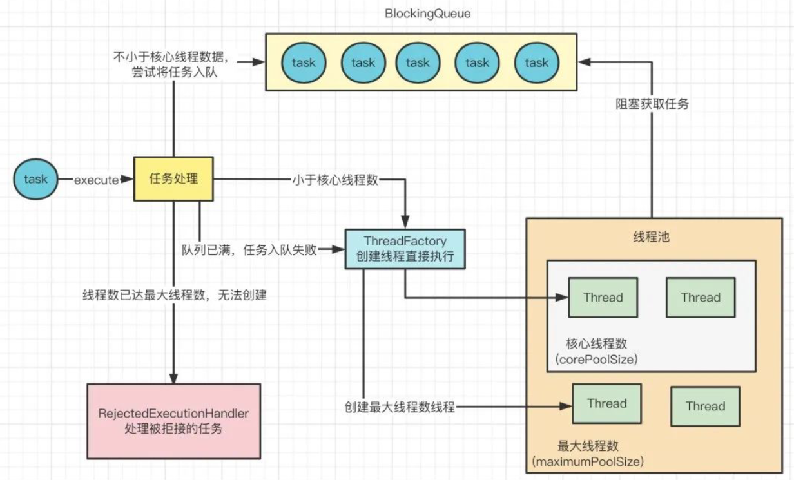
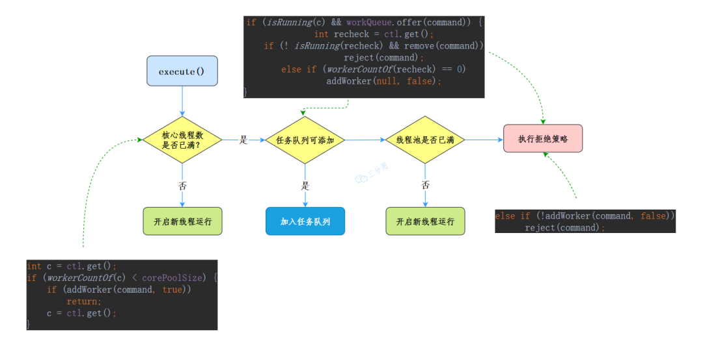
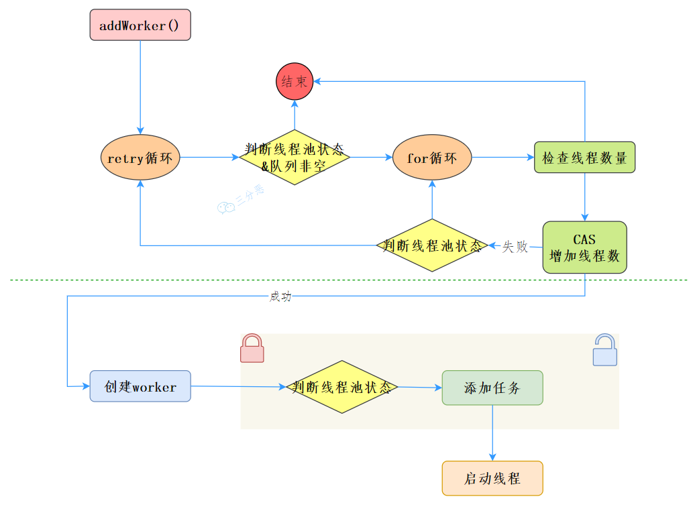
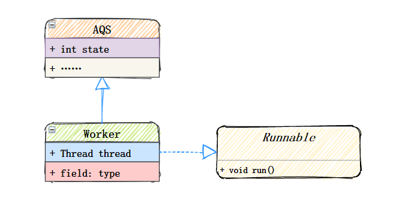
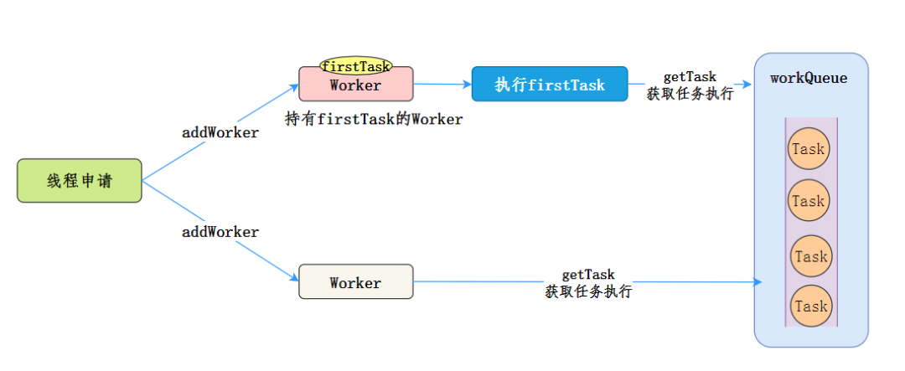
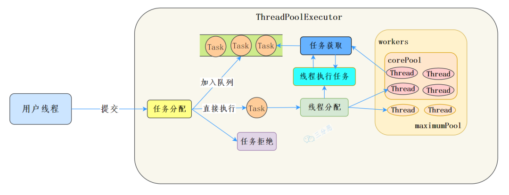
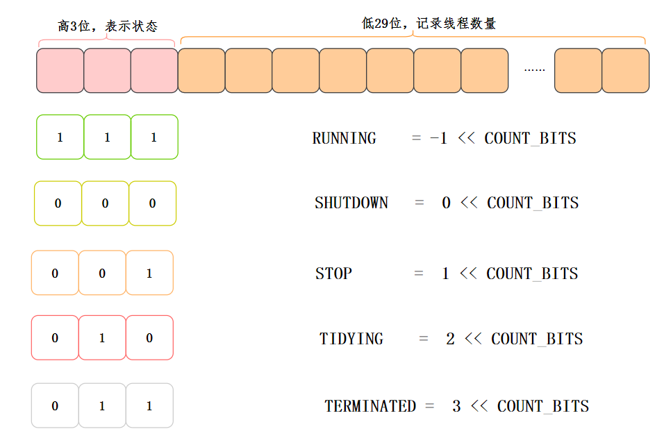
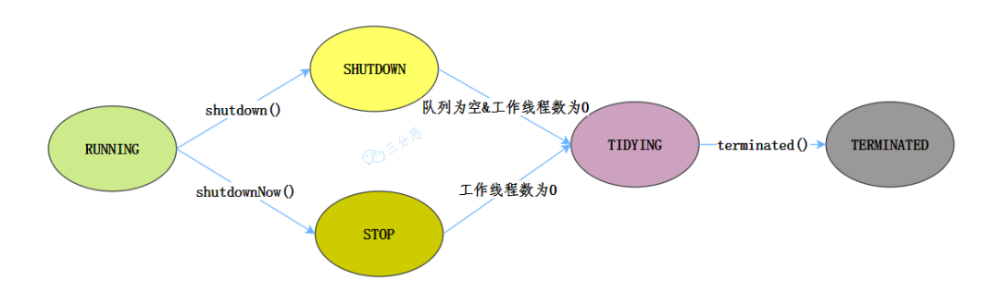

### 构造方法

我们在构造线程池的时候，使用了`ThreadPoolExecutor`的构造方法：

```java
    public ThreadPoolExecutor(int corePoolSize,
                              int maximumPoolSize,
                              long keepAliveTime,
                              TimeUnit unit,
                              BlockingQueue<Runnable> workQueue) {
        this(corePoolSize, maximumPoolSize, keepAliveTime, unit, workQueue,
             Executors.defaultThreadFactory(), defaultHandler);
    }
```

先来看看几个参数的含义：

`corePoolSize`: 核心线程数

`maximumPoolSize`:允许的最大线程数（核心线程数+非核心线程数）

`workQueue`:线程池任务队列

用来保存等待执行的任务的阻塞队列，常见阻塞队列有

- `ArrayBlockingQueue`：一个基于数组结构的有界阻塞队列
- `LinkedBlockingQueue`：基于链表结构的阻塞队列
- `SynchronousQueue`：不存储元素的阻塞队列
- `PriorityBlockingQueue`：具有优先级的无限阻塞队列

`handler`: 线程池饱和拒绝策略

- JDK线程池框架提供了四种策略：

  也可以根据自己的应用场景，实现`RejectedExecutionHandler`接口来自定义策略。

  1. `AbortPolicy`：直接抛出异常，默认策略。
  2. `CallerRunsPolicy`：用调用者所在线程来运行任务。
  3. `DiscardOldestPolicy`：丢弃任务队列里最老的任务
  4. `DiscardPolicy`:不处理，丢弃当前任务

上面四个是和线程池工作流程息息相关的参数，我们再来看看剩下三个参数。

- `keepAliveTime`:非核心线程闲置下来最多存活的时间
- `unit`：线程池中非核心线程保持存活的时间
- `threadFactory`:创建一个新线程时使用的工厂，可以用来设定线程名等(不指定使用默认线程工厂)

### 线程池工作流程



向线程池提交任务的时候：

- 如果当前运行的线程少于`核心线程数corePoolSize`，则创建新线程来执行任务
- 如果运行的线程等于或多于`核心线程数corePoolSize`，则将任务加入`任务队列workQueue`
- 如果`任务队列workQueue`已满，创建新的线程来处理任务
- 如果创建新线程使当前总线程数超过`最大线程数maximumPoolSize`，任务将被拒绝，`线程池拒绝策略handler`执行

### 线程池工作源码分析


#### 提交线程（execute）

线程池执行任务的方法如下：

```java
    public void execute(Runnable command) {
        if (command == null)
            throw new NullPointerException();
        //获取当前线程池的状态+线程个数变量的组合值
        int c = ctl.get();
        //1.如果正在运行线程数少于核心线程数
        if (workerCountOf(c) < corePoolSize) {
            //开启新线程运行
            if (addWorker(command, true))
                return;
            c = ctl.get();
        }
        //2. 判断线程池是否处于运行状态，是则添加任务到阻塞队列
        if (isRunning(c) && workQueue.offer(command)) {
            //二次检查
            int recheck = ctl.get();
            //如果当前线程池不是运行状态，则从队列中移除任务，并执行拒绝策略
            if (! isRunning(recheck) && remove(command))
                reject(command);
            //如若当前线程池为空，则添加一个新线程
            else if (workerCountOf(recheck) == 0)
                addWorker(null, false);
        }
        //最后尝试添加线程，如若添加失败，执行拒绝策略
        else if (!addWorker(command, false))
            reject(command);
    }
```

我们来看一下`execute()`的详细流程图：



#### 新增线程 (addWorker)

在`execute`方法代码里，有个关键的方法`private boolean addWorker(Runnable firstTask, boolean core)`，这个方法主要完成两部分工作：`增加线程数`、`添加任务，并执行`。

- **我们先来看第一部分增加线程数：**

```
        retry:
        for (;;) {
            int c = ctl.get();
            int rs = runStateOf(c);

            // 1.检查队列是否只在必要时为空（判断线程状态，且队列不为空）
            if (rs >= SHUTDOWN &&
                ! (rs == SHUTDOWN &&
                   firstTask == null &&
                   ! workQueue.isEmpty()))
                return false;
            //2.循环CAS增加线程个数
            for (;;) {
                int wc = workerCountOf(c);
                //2.1 如果线程个数超限则返回 false
                if (wc >= CAPACITY ||
                    wc >= (core ? corePoolSize : maximumPoolSize))
                    return false;
                //2.2 CAS方式增加线程个数，同时只有一个线程成功，成功跳出循环
                if (compareAndIncrementWorkerCount(c))
                    break retry;
                //2.3 CAS失败，看线程池状态是否变化，变化则跳到外层，尝试重新获取线程池状态，否则内层重新CAS
                c = ctl.get();  // Re-read ctl
                if (runStateOf(c) != rs)
                    continue retry;
            }
        }
        //3. 到这说明CAS成功了
        boolean workerStarted = false;
        boolean workerAdded = false;
```

- **接着来看第二部分添加任务，并执行**

```
       Worker w = null;
        try {
            //4.创建worker
            w = new Worker(firstTask);
            final Thread t = w.thread;
            if (t != null) {
                //4.1、加独占锁 ，为了实现workers同步，因为可能多个线程调用了线程池的excute方法
                final ReentrantLock mainLock = this.mainLock;
                mainLock.lock();
                try {
                    //4.2、重新检查线程池状态，以避免在获取锁前调用了shutdown接口
                    int rs = runStateOf(ctl.get());

                    if (rs < SHUTDOWN ||
                        (rs == SHUTDOWN && firstTask == null)) {
                        if (t.isAlive()) // precheck that t is startable
                            throw new IllegalThreadStateException();
                        //4.3添加任务
                        workers.add(w);
                        int s = workers.size();
                        if (s > largestPoolSize)
                            largestPoolSize = s;
                        workerAdded = true;
                    }
                } finally {
                    mainLock.unlock();
                }
                //4.4、添加成功之后启动任务
                if (workerAdded) {
                    t.start();
                    workerStarted = true;
                }
            }
        } finally {
            if (! workerStarted)
                addWorkerFailed(w);
        }
        return workerStarted;
```

我们来看一下整体的流程：



#### **执行线程(runWorker)**

用户线程提交到线程池之后，由`Worker`执行，`Worker`是线程池内部一个继承`AQS`、实现`Runnable`接口的自定义类，它是具体承载任务的对象。



先看一下它的构造方法：

```
        Worker(Runnable firstTask) {
            setState(-1); // 在调用runWorker之前禁止中断
            this.firstTask = firstTask;
            this.thread = getThreadFactory().newThread(this);  //创建一个线程
        }
```

- 在构造函数内 首先设置 state=-1,现了简单不可重入独占锁，state=0表示锁未被获取状态，state=1表示锁已被获取状态，设置状态大小为-1，是为了避免线程在运行runWorker()方法之前被中断
- firstTask记录该工作线程的第一个任务
- thread是具体执行任务的线程

它的`run`方法直接调用`runWorker`，真正地执行线程就是在我们的`runWorker` 方法里：

```
    final void runWorker(Worker w) {
        Thread wt = Thread.currentThread();
        Runnable task = w.firstTask;
        w.firstTask = null;
        w.unlock(); // 允许中断
        boolean completedAbruptly = true;
        try {
            //获取当前任务，从队列中获取任务
            while (task != null || (task = getTask()) != null) {
                w.lock();
                …………    
                try {
                    //执行任务前做一些类似统计之类的事情
                    beforeExecute(wt, task);
                    Throwable thrown = null;
                    try {
                        //执行任务
                        task.run();
                    } catch (RuntimeException x) {
                        thrown = x; throw x;
                    } catch (Error x) {
                        thrown = x; throw x;
                    } catch (Throwable x) {
                        thrown = x; throw new Error(x);
                    } finally {
                        // 执行任务完毕后干一些些事情
                        afterExecute(task, thrown);
                    }
                } finally {
                    task = null;
                    // 统计当前Worker 完成了多少个任务
                    w.completedTasks++;
                    w.unlock();
                }
            }
            completedAbruptly = false;
        } finally {
            //执行清理工作
            processWorkerExit(w, completedAbruptly);
        }
    }
```

代码看着多，其实砍掉枝蔓，最核心的点就是`task.run()`让线程跑起来。

#### 获取任务(getTask)

我们在上面的执行任务`runWorker`里看到，这么一句`while (task != null || (task = getTask()) != null)`,执行的任务是要么当前传入的`firstTask`，或者还可以通过`getTask()`获取，这个`getTask`的核心目的就是**从队列中获取任务**。

```
private Runnable getTask() {
        //poll()方法是否超时
        boolean timedOut = false; 
        //循环获取
        for (;;) {
            int c = ctl.get();
            int rs = runStateOf(c);

            // 1.线程池未终止，且队列为空，返回null
            if (rs >= SHUTDOWN && (rs >= STOP || workQueue.isEmpty())) {
                decrementWorkerCount();
                return null;
            }
            //工作线程数
            int wc = workerCountOf(c);

        
            boolean timed = allowCoreThreadTimeOut || wc > corePoolSize;

            //2.判断工作线程数是否超过最大线程数 && 超时判断 && 工作线程数大于0或队列为空
            if ((wc > maximumPoolSize || (timed && timedOut))
                && (wc > 1 || workQueue.isEmpty())) {
                if (compareAndDecrementWorkerCount(c))
                    return null;
                continue;
            }

            try {
                //从任务队列中获取线程
                Runnable r = timed ?
                    workQueue.poll(keepAliveTime, TimeUnit.NANOSECONDS) :
                    workQueue.take();
                //获取成功
                if (r != null)
                    return r;
                timedOut = true;
            } catch (InterruptedException retry) {
                timedOut = false;
            }
        }
    }
```

总结一下，Worker执行任务的模型如下：



#### 线程池的关闭

线程池提供了 shutdown 和 `shutdownNow `两个⽅法来关闭线程池。

**shutdown()**

```java
    /**
     * 启动⼀次顺序关闭，在这次关闭中，执⾏器不再接受新任务，但会继续处理队列中的已存在任务。
     * 当所有任务都完成后，线程池中的线程会逐渐退出。
     */
    public void shutdown() {
        final ReentrantLock mainLock = this.mainLock; // ThreadPoolExecutor的主锁
        mainLock.lock(); // 加锁以确保独占访问
        try {
            checkShutdownAccess(); // 检查是否有关闭的权限
            advanceRunState(SHUTDOWN); // 将执⾏器的状态更新为SHUTDOWN
            interruptIdleWorkers(); // 中断所有闲置的⼯作线程
            onShutdown(); // ScheduledThreadPoolExecutor中的挂钩⽅法，可供⼦类᯿写以进⾏额外操作
        } finally {
            mainLock.unlock(); // ⽆论try块如何退出都要释放锁
        }
        tryTerminate(); // 如果条件允许，尝试终⽌执⾏器
    }
```

就是将线程池的状态修改为 SHUTDOWN，然后**尝试打断空闲的线程**（如何判断空闲，上⾯在说 Worker 继承 AQS 的时候说过），也就是在阻塞等待任务的线程

 **`shutdownNow ()`**

```
 /**
     * 尝试停⽌所有正在执⾏的任务，停⽌处理等待的任务，
     * 并返回等待处理的任务列表。
     *
     * @return 从未开始执⾏的任务列表
     */
    public List<Runnable> shutdownNow() {
        List<Runnable> tasks; // ⽤于存储未执⾏的任务的列表
        final ReentrantLock mainLock = this.mainLock; // ThreadPoolExecutor的主锁
        mainLock.lock(); // 加锁以确保独占访问
        try {
            checkShutdownAccess(); // 检查是否有关闭的权限
            advanceRunState(STOP); // 将执⾏器的状态更新为STOP
            interruptWorkers(); // 中断所有⼯作线程
            tasks = drainQueue(); // 清空队列并将结果放⼊任务列表中
        } finally {
            mainLock.unlock(); // ⽆论try块如何退出都要释放锁
        }
        tryTerminate(); // 如果条件允许，尝试终⽌执⾏器
        return tasks; // 返回队列中未被执⾏的任务列表
    }
```

就是将线程池的状态修改为 STOP，然后尝试**打断所有的线程**，从阻塞队列中移除剩余的任务，这也是为什么 shutdownNow 不能执⾏剩余任务的原因。 

所以也可以看出 shutdown ⽅法和 shutdownNow ⽅法的主要区别就是，**shutdown 之后还能处理在队列中的任 务，shutdownNow 直接就将任务从队列中移除，线程池⾥的线程就不再处理了**。

#### 线程池的监控

如果在系统中大量使用线程池，则有必要对线程池进行监控，方便在出现问题时，可以根据线程池的使用状况快速定位问题。

**可以通过线程池提供的参数和方法来监控线程池：**

- getActiveCount() ：线程池中正在执行任务的线程数量
- getCompletedTaskCount() ：线程池已完成的任务数量，该值小于等于 taskCount
- getCorePoolSize() ：线程池的核心线程数量
- getLargestPoolSize()：线程池曾经创建过的最大线程数量。通过这个数据可以知道线程池是否满过，也就是达到了 maximumPoolSize
- getMaximumPoolSize()：线程池的最大线程数量
- getPoolSize() ：线程池当前的线程数量
- getTaskCount() ：线程池已经执行的和未执行的任务总数

**还可以通过扩展线程池来进行监控：**

- 通过继承线程池来自定义线程池，重写线程池的beforeExecute、afterExecute和terminated方法，
- 也可以在任务执行前、执行后和线程池关闭前执行一些代码来进行监控。例如，监控任务的平均执行时间、最大执行时间和最小执行时间等。

#### 小结

到这，了解了`execute`和`worker`的一些流程，可以说其实`ThreadPoolExecutor` 的实现就是一个生产消费模型。

当用户添加任务到线程池时相当于生产者生产元素，`workers` 线程工作集中的线程直接执行任务或者从任务队列里面获取任务时则相当于消费者消费元素。



### 线程池生命周期

#### 线程池状态表示

在`ThreadPoolExecutor`里定义了一些状态，同时利用高低位的方式，让`ctl`这个参数能够保存状态，又能保存线程数量，非常巧妙！[6]

```
    //记录线程池状态和线程数量
    private final AtomicInteger ctl = new AtomicInteger(ctlOf(RUNNING, 0));
    //29
    private static final int COUNT_BITS = Integer.SIZE - 3;
    private static final int CAPACITY   = (1 << COUNT_BITS) - 1;

    // 线程池状态
    private static final int RUNNING    = -1 << COUNT_BITS;
    private static final int SHUTDOWN   =  0 << COUNT_BITS;
    private static final int STOP       =  1 << COUNT_BITS;
    private static final int TIDYING    =  2 << COUNT_BITS;
    private static final int TERMINATED =  3 << COUNT_BITS;
```

高3位表示状态，低29位记录线程数量：



#### 线程池状态流转

线程池一共定义了五种状态，来看看这些状态是怎么流转的[6]：



- **RUNNING**：运行状态，接受新的任务并且处理队列中的任务。
- **SHUTDOWN**：关闭状态(调用了 shutdown 方法)。不接受新任务，,但是要处理队列中的任务。
- **STOP**：停止状态(调用了 shutdownNow 方法)。不接受新任务，也不处理队列中的任务，并且要中断正在处理的任务。
- **TIDYING**：所有的任务都已终止了，workerCount 为 0，线程池进入该状态后会调terminated() 方法进入 TERMINATED 状态。
- **TERMINATED**：终止状态，terminated() 方法调用结束后的状态。

### Executors 构建线程池

在上⾯的示例中，我们使⽤了 JDK 内部提供的 Executors ⼯具类来快速创建线程池。 

1）固定线程数量的线程池：核⼼线程数与最⼤线程数相等

```
    public static ExecutorService newFixedThreadPool(int nThreads) {
        return new ThreadPoolExecutor(nThreads, nThreads,
                0L, TimeUnit.MILLISECONDS,
                new LinkedBlockingQueue<Runnable>());
    }
```

 2）单个线程数量的线程池 

```
    public static ExecutorService newSingleThreadExecutor() {
        return new FinalizableDelegatedExecutorService
                (new ThreadPoolExecutor(1, 1,
                        0L, TimeUnit.MILLISECONDS,
                        new LinkedBlockingQueue<Runnable>()));
    }
```


3）接近⽆限⼤线程数量的线程池 

```
  public static ExecutorService newCachedThreadPool() {
        return new ThreadPoolExecutor(0, Integer.MAX_VALUE,
                60L, TimeUnit.SECONDS,
                new SynchronousQueue<Runnable>());
    }
```

4）带定时调度功能的线程池 

```
public static ScheduledExecutorService newScheduledThreadPool(int corePoolSize) {
 return new ScheduledThreadPoolExecutor(corePoolSize);
}
```


虽然JDK 提供了快速创建线程池的方法，但其实不推荐使用 Exeutors 来创建线程池，因为从上面构造线程池的代码可以看出，newFixedThreadPool 线程池由于使用了 LinkedBlockingOueue，**队列的容量默认无限大，实际使用中出现任务过多时会导致内存溢出;** newCachedThreadPool 线程池由于核心线程数无限大，当任务过多的时候会导致创建大量的线程，可能机器负载过高导致服务宕机。

### 如何合理的⾃定义线程池

**线程池大小**

关于线程池的大小，并没有一个需要严格遵守的“金规铁律”，按照任务性质，大概可以分为`CPU密集型任务`、`IO密集型任务`和`混合型任务`。

- CPU密集型任务：CPU密集型任务应配置尽可能小的线程，如配置Ncpu+1个线程的线程池。
- IO密集型任务：IO密集型任务线程并不是一直在执行任务，则应配置尽可能多的线程，如2*Ncpu。
- 混合型任务：混合型任务可以按需拆分成CPU密集型任务和IO密集型任务。

当然，这个只是建议，实际上具体怎么配置，还要结合`事前评估和测试`、`事中监控`来确定一个大致的线程线程池大小。线程池大小也可以不用写死，使用动态配置的方式，以便调整。

#### 线程工厂
一般建议自定义线程工厂，构建线程的时候设置线程的名称，这样在查日志的时候就方便知道是哪个线程执行的代码。

```java
import java.util.concurrent.ThreadFactory;
import java.util.concurrent.atomic.AtomicInteger;

/**
 * @author ehyzil
 * @Description
 * @create 2023-12-2023/12/26-19:05
 */
public class MyThreadFactory implements ThreadFactory {
    private static final AtomicInteger poolNumber = new AtomicInteger(1);
    private final ThreadGroup group;
    private final AtomicInteger threadNumber = new AtomicInteger(1);
    private final String namePrefix;

    /**
     * 构造函数传入我们想业务需要的线程名字threadName，方便发生异常是追溯
     * @param threadName
     */
    public MyThreadFactory(String threadName) {
        SecurityManager s = System.getSecurityManager();
        group = (s != null) ? s.getThreadGroup() :
                Thread.currentThread().getThreadGroup();
        if (threadName == null || threadName.isEmpty()){
            threadName = "pool";
        }
        namePrefix = threadName +
                poolNumber.getAndIncrement() +
                "-thread-";
    }

    @Override
    public Thread newThread(Runnable r) {
        Thread t = new Thread(group, r,
                namePrefix + threadNumber.getAndIncrement(),
                0);
        if (t.isDaemon())
            t.setDaemon(false);
        if (t.getPriority() != Thread.NORM_PRIORITY)
            t.setPriority(Thread.NORM_PRIORITY);
        return t;
    }

}

//测试类
import java.util.concurrent.ArrayBlockingQueue;
import java.util.concurrent.ThreadPoolExecutor;
import java.util.concurrent.TimeUnit;

/**
 * @author ehyzil
 * @Description
 * @create 2023-12-2023/12/26-19:06
 */
public class Test {
    public static void main(String[] args) {
        ThreadPoolExecutor executor = new ThreadPoolExecutor(3,
                5,
                5,
                TimeUnit.SECONDS,
                new ArrayBlockingQueue<>(100),
                new MyThreadFactory("测试自建线程工厂"));


        for (int i = 0; i < 100; i++) {
            executor.execute(new Runnable() {
                @Override
                public void run() {
                    try {
                        Thread.sleep(1000);
                    } catch (InterruptedException e) {
                        e.printStackTrace();
                    }
                    System.out.println(Thread.currentThread().getName());
                }
            });
        }

    }
}
```

执行结果

```
测试自建线程工厂1-thread-1
测试自建线程工厂1-thread-2
测试自建线程工厂1-thread-3
测试自建线程工厂1-thread-2
```


#### 有界队列

一般需要设置有界队列的大小，比如 LinkedBlockingOueue 在构造的时候可以传入参数来限制队列中任务数据的大小，这样就不会因为无限往队列中扔任务导致系统的 oom。