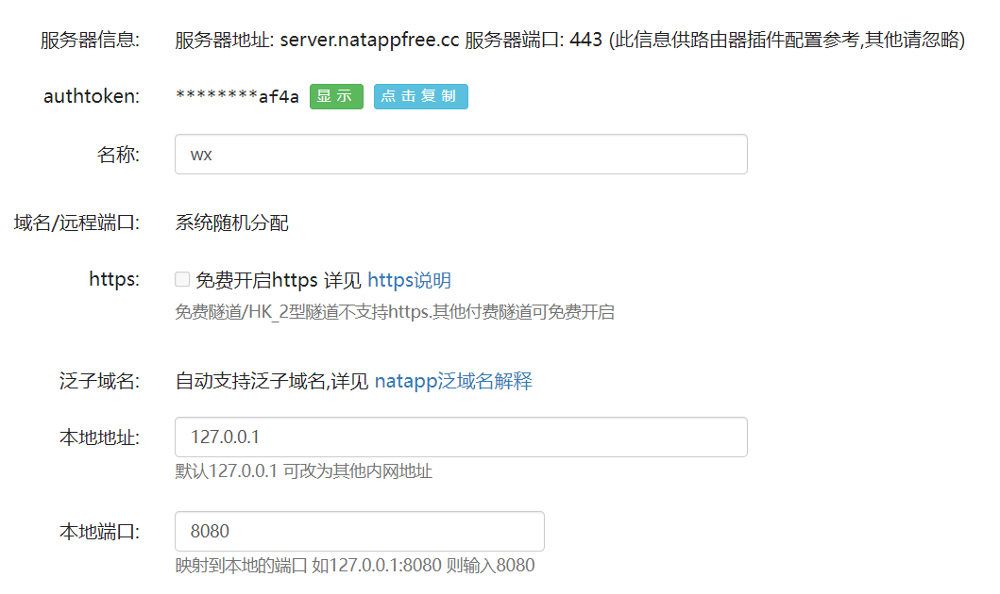
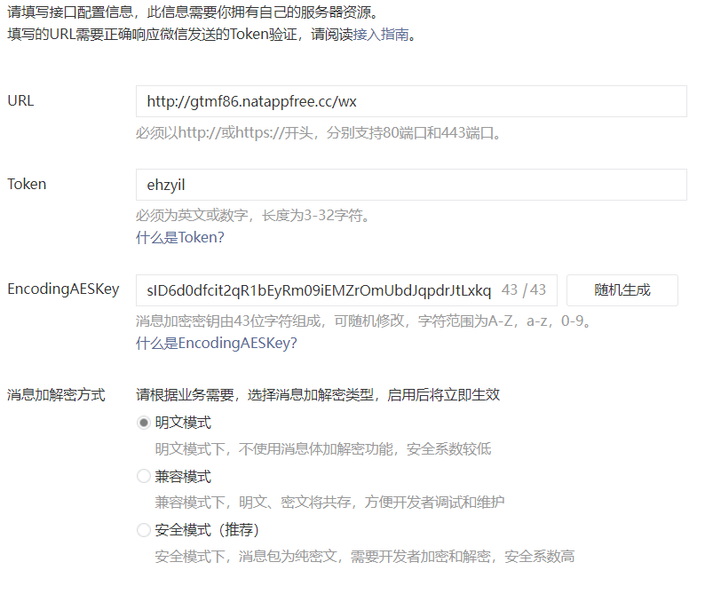
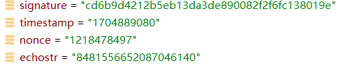
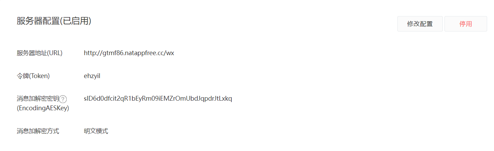
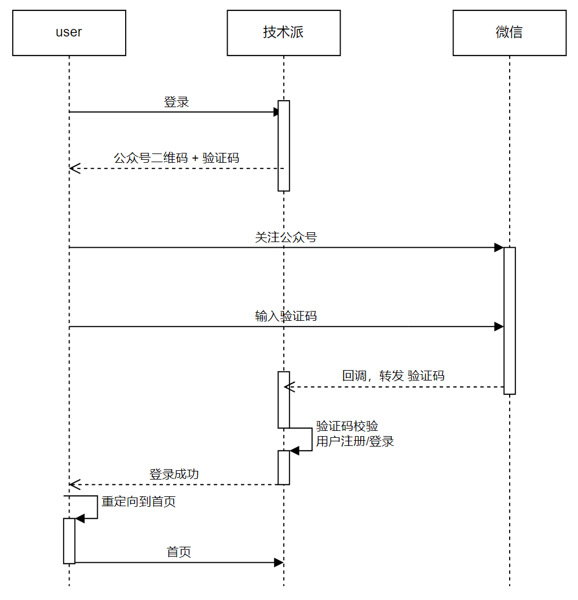
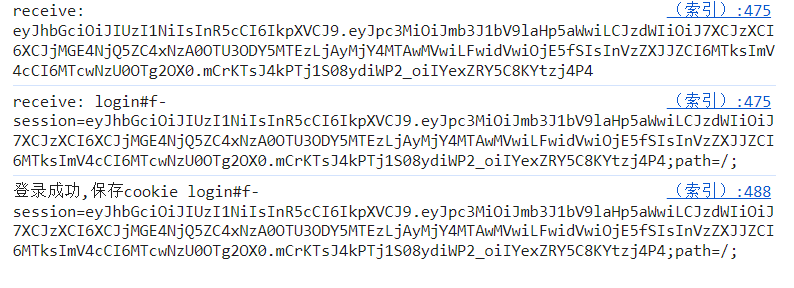

## 微信公众平台配置

### 使用`natapp`开启内网穿透

[使用教程](https://natapp.cn/article)

我的配置如下：



### 注册微信公众号并开启服务器配置


注册完公众号进入[基本配置](https://mp.weixin.qq.com/advanced/advanced?action=dev&t=advanced/dev&token=1785719919&lang=zh_CN)/ 填写服务器配置

填写内容示例




具体要求可以参考 [接入指南](https://mp.weixin.qq.com/wiki?token=1785719919&lang=zh_CN)

填写完点击提交的时候会发现报错，原因是WX要调用你填写的URL并传入这几个参数



将其进行加密后和`echostr`比对后并返回`echostr`才能通过验证，当然你直接返回`echostr`字段也可可以。

这个文档里有具体的内容但他是用python写的[具体看这里](https://developers.weixin.qq.com/doc/offiaccount/Getting_Started/Getting_Started_Guide.html#_1-4-%E5%BC%80%E5%8F%91%E8%80%85%E5%9F%BA%E6%9C%AC%E9%85%8D%E7%BD%AE)。

附上Java代码

```java
@Slf4j
@RestController
@RequestMapping(path = "wx")
public class WxCallbackRestController {

    private static final String TOKEN = "ehzyil"; // 请按照公众平台官网\基本配置中信息填写

    /**
     * 微信的公众号接入 token 验证，即返回echostr的参数值
     *
     * @param request
     * @return
     */
    @GetMapping
    public String check(HttpServletRequest request) {
        try {
            // 获取请求参数
            String signature = request.getParameter("signature");
            String timestamp = request.getParameter("timestamp");
            String nonce = request.getParameter("nonce");
            String echostr = request.getParameter("echostr");
            // 将token、timestamp、nonce进行字典序排序
            String[] list = {TOKEN, timestamp, nonce};
            Arrays.sort(list);

            // 将三个参数字符串拼接成一个字符串
            String str = list[0] + list[1] + list[2];

            // 将字符串进行SHA1加密
            MessageDigest sha1 = null;
            try {
                sha1 = MessageDigest.getInstance("SHA-1");
            } catch (Exception e) {
                e.printStackTrace();
                return null;
            }

            // Update the message digest with each element in the list
            for (String element : list) {
                sha1.update(element.getBytes());
            }

            // Generate the hash code
            byte[] hashcode = sha1.digest();

            // Convert the hash code to a hexadecimal string
            StringBuilder hexString = new StringBuilder();
            for (byte b : hashcode) {
                hexString.append(String.format("%02X", b));
            }
            // 比较加密后的字符串和signature是否一致
            if (hexString.toString().equalsIgnoreCase(signature)) {
                // 如果一致，则返回echostr
                return echostr;
            } else {
                // 如果不一致，则返回空字符串
                return "";
            }
        } catch (Exception e) {
            // 如果发生异常，则返回异常信息
            log.error("微信公众号登录token验证失败:", e.getMessage());
            return "";
        }

    }
}
```


成功并启用后显示如下：



下面正式开启实践。

### 实践策略



使用SSE建立前后端的半长连接,在前端生成验证码并展示二维码，用户扫描二维码并输入验证码，服务通过回调接口接收用户的验证码，让用户自动登录。

### 具体实践

#### SSE建立前后端的半长连接-前端

**前端代码**

```javascript
<div class="tabpane-container">
<h2 class="title">微信扫码/长按识别登录</h2>
<div class="first">

</div>

<div class="explain">
<bold>输入验证码</bold>
<span id="code"></span>
<div><span id="state">有效期五分钟 👉</span> <a id="refreshCode">手动刷新</a></div>
</div>
</div>
```

> 这段代码用于建立一个长连接。
>
> 首先，它检查是否存在一个名为`sseSource`的变量，如果存在，则尝试关闭它。然后，它检查是否存在一个名为`deviceId`的变量，如果没有，则从cookie中获取它。
>
> 接下来，它创建一个新的EventSource对象，并将其赋值给`sseSource`变量。这个对象用于建立与服务器的连接。
>
> 然后，它为`sseSource`对象添加一个`onmessage`事件监听器，当服务器发送消息时，这个事件监听器就会被触发。在事件监听器中，它将消息的数据部分替换所有双引号，并将其修剪。然后，它根据消息的内容执行不同的操作。
>
> 如果消息以`refresh#`开头，则表示服务器发送了一个新的验证码。它将新的验证码显示在页面上，并更新状态标签。
>
> 如果消息是`scan`，则表示用户已经扫描了二维码。它更新状态标签。
>
> 如果消息以`login#`开头，则表示用户已经成功登录。它将服务器发送的cookie保存到本地，并刷新页面。
>
> 如果消息以`init#`开头，则表示服务器发送了一个初始验证码。它将初始验证码显示在页面上，并更新状态标签。
>
> 如果消息不是以上任何一种，则它会将新的验证码显示在页面上，并更新状态标签。
>
> 最后，它为`sseSource`对象添加一个`onopen`事件监听器，当连接建立时，这个事件监听器就会被触发。在事件监听器中，它将设备ID打印到控制台。
>
> 它还为`sseSource`对象添加一个`onerror`事件监听器，当连接出错时，这个事件监听器就会被触发。在事件监听器中，它将错误信息打印到控制台，并更新状态标签。
>
> 最后，它创建一个名为`intHook`的变量，并将其赋值为一个每秒钟执行一次的setInterval函数。这个函数用于每秒钟向服务器请求一次验证码。
>
> 

```javascript
       let fetchCodeCnt = 0;

        function fetchCode() {
            if (deviceId) {
                if (++fetchCodeCnt > 5) {
                    // 为了避免不停的向后端发起请求，做一个最大的重试计数限制
                    try {
                        window.clearInterval(intHook);
                    } catch (e) {
                    }
                    return;
                }

                $.ajax({
                    url: "/login/fetch?deviceId=" + deviceId, type: "get", dataType: "text", success: function (data) {
                        console.log("data>>>>>>>>: ", data);
                        if (data != 'fail') {
                            codeTag.text(data);
                            try {
                                window.clearInterval(intHook);
                            } catch (e) {
                            }
                        }
                    },
                    error: function (e) {
                        console.log("some error! ", e);
                    }
                });
            } else {
                console.log("deviceId未获取，稍后再试!");
            }
        }
```

> 这段代码用于每秒钟向服务器请求一次验证码。
>
> 首先，它检查`deviceId`变量是否存在，如果存在，则继续执行。
>
> 然后，它检查`fetchCodeCnt`变量的值，如果`fetchCodeCnt`大于5，则表示已经重试了5次，它将清除`intHook`定时器，并返回。
>
> 如果`fetchCodeCnt`小于或等于5，则它将向服务器发送一个AJAX请求，请求验证码。
>
> 在AJAX请求的`success`回调函数中，它将服务器返回的验证码显示在页面上，并清除`intHook`定时器。
>
> 在AJAX请求的`error`回调函数中，它将错误信息打印到控制台。
>
> 最后，如果`deviceId`变量不存在，则它将打印一条消息到控制台，表示稍后再试。
>
> 这段代码的作用是每秒钟向服务器请求一次验证码，直到服务器返回一个有效的验证码，或者重试次数达到5次。


```
        function refreshCode() {
            $.ajax({
                url: "/login/refresh?deviceId=" + deviceId, dataType: "json", type: "get", success: function (data) {
                    const code = data['result']['code'];
                    const reconnect = data['result']['reconnect']
                    console.log("验证码刷新完成: ", data);

                    if (reconnect) {
                        // 重新建立连接
                        buildConnect();
                        $('#state').text("已刷新!");
                    } else if (code) {
                        if (codeTag.text() !== code) {
                            console.log("主动刷新验证码!");
                            codeTag.text(code);
                            stateTag.text("已刷新!");
                        } else {
                            console.log("验证码已刷新了!");
                        }
                    }
                }
            })
        }
```

> `refreshCode()`函数用于刷新验证码。
>
> 它首先向服务器发送一个AJAX请求，请求新的验证码。
>
> 在AJAX请求的`success`回调函数中，它将服务器返回的验证码数据解析出来，并存储在`code`和`reconnect`变量中。
>
> 然后，它将`code`和`reconnect`变量的值打印到控制台。
>
> 如果`reconnect`为真，则表示需要重新建立长连接，它将调用`buildConnect()`函数重新建立长连接，并更新状态标签的文本为“已刷新！”。
>
> 如果`reconnect`为假，则表示不需要重新建立长连接，它将检查`code`变量的值是否与当前验证码标签上的文本不同，如果不同，则表示验证码已刷新，它将更新验证码标签上的文本和状态标签的文本为“已刷新！”。
>
> 如果`code`变量的值与当前验证码标签上的文本相同，则表示验证码没有刷新，它将打印一条消息到控制台，表示验证码已刷新了。
>
> 这段代码的作用是刷新验证码，并根据服务器返回的数据更新验证码标签和状态标签的文本。
>
> 它可以用于在用户点击刷新验证码按钮时刷新验证码，也可以用于在长连接断开时重新建立长连接并刷新验证码。


#### SSE建立前后端的半长连接-后端

**初始化**

```java
  /**
     * key = 验证码, value = 长连接
     */
    private LoadingCache<String, SseEmitter> verifyCodeCache;
    /**
     * key = 设备 value = 验证码
     */
    private LoadingCache<String, String> deviceCodeCache;


    public WxLoginHelper(LoginService loginService) {
        // 注入登录服务
        this.sessionService = loginService;

        // 设定令牌验证码缓存，最大容量为300，过期时间为5分钟
        verifyCodeCache = CacheBuilder.newBuilder().maximumSize(300)
                .expireAfterWrite(5, TimeUnit.MINUTES).build(new CacheLoader<String, SseEmitter>() {
                    @Override
                    public SseEmitter load(String s) throws Exception {
                        // 在Guava库中抛出异常"No Vla In Guava Exception"，异常信息包含参数s
                        throw new NoVlaInGuavaException("no val: " + s);
                    }
                });

        // 设定验证码缓存，最大容量为300，过期时间为5分钟
        deviceCodeCache = CacheBuilder.newBuilder().maximumSize(300)
                .expireAfterWrite(5, TimeUnit.MINUTES).build(new CacheLoader<String, String>() {
                    @Override
                    public String load(String s) {
                        // 记录日志：load deviceCodeCache: {}
                        log.info("load deviceCodeCache: {}", s);
                        // 循环生成验证码
                        while (true) {
                            // 调用CodeGenerateUtil类的genCode()方法生成验证码
                            String code = CodeGenerateUtil.genCode();
                            // 判断缓存中是否已经存在该验证码
                            if (!verifyCodeCache.asMap().containsKey(code)) {
                                // 若缓存中不存在该验证码，则返回该验证码
                                return code;
                            }
                        }
                    }
                });
    }
```

在WxLoginHelper初始化的同时给`verifyCodeCache`和`deviceCodeCache`初始化。

> LoadingCache是Guava库中的一种缓存，它可以自动加载和过期缓存项。
>
> 在你的代码中，`verifyCodeCache`用于存储验证验证码和SSE Emitter对象的映射，`deviceCodeCache`用于存储设备ID和验证码的映射。
>
> 这两个缓存的最大容量都是300，过期时间都是5分钟。
>
> `verifyCodeCache`的加载器是一个匿名内部类，它实现了`CacheLoader`接口。
>
> `CacheLoader`接口定义了一个`load()`方法，该方法用于加载缓存项。
>
> 在`verifyCodeCache`的加载器中，`load()`方法会抛出一个`NoVlaInGuavaException`异常，该异常表示缓存中没有该验证码对应的值。
>
> `deviceCodeCache`的加载器也是一个匿名内部类，它也实现了`CacheLoader`接口。
>
> 在`deviceCodeCache`的加载器中，`load()`方法会循环生成验证码，直到生成一个不存在于缓存中的验证码。
>
> 这段代码的作用是初始化两个缓存，以便在后续的代码中使用它们来存储验证验证码和设备验证码。

**订阅方法获取订阅设备的SseEmitter**

```java
 /**
     * 订阅设备的SseEmitter
     * @param deviceId 设备ID
     * @return 订阅设备的SseEmitter对象
     * @throws IOException 输入输出异常
     */
    public SseEmitter subscribe(String deviceId) throws IOException {
        // 由于传来的deviceId并没有用，可以从前一个类ReqInfoContext中获取
        deviceId = ReqInfoContext.getReqInfo().getDeviceId();

        // get方法会在缓存中检查该值是否存在，如果不存在，则返回null。
        // getUnchecked方法不会检查该值是否存在，而是直接返回该值,如果不存在，则会抛出异常。
        String realCode = deviceCodeCache.getUnchecked(deviceId);

        // 创建SseEmitter对象
        SseEmitter sseEmitter = new SseEmitter(SSE_EXPIRE_TIME);

        // 检查并关闭旧的SSE Emitter
        SseEmitter oldSss = verifyCodeCache.getIfPresent(deviceId);
        if (oldSss != null) {
            oldSss.complete();
        }

        // 将新的SSE Emitter放入缓存
        verifyCodeCache.put(realCode, sseEmitter);

        // 设置SSE Emitter的超时和错误处理程序
        sseEmitter.onTimeout(() -> {
            log.info("sse 超时中断 --> {}", realCode);
            verifyCodeCache.invalidate(realCode);
            sseEmitter.complete();
        });

        sseEmitter.onError((e) -> {
            log.warn("sse 错误! --> {}", realCode, e);
            verifyCodeCache.invalidate(realCode);
            sseEmitter.complete();
        });

        // 向客户端发送初始化消息
        sseEmitter.send("initCode!");
        sseEmitter.send("init#" + realCode);

        // 返回SSE Emitter对象
        return sseEmitter;
    }
```

当前端调用`deviceCodeCache.getUnchecked(deviceId);`方法时生成并将验证码存在deviceCodeCache中。verifyCodeCache验证码和新创建的sseEmitter，完成之后向客户端发送初始化消息并返回SSE Emitter对象。


**获取验证码**

```
    public String resendCode() throws IOException {
        // 获取旧的验证码，注意不使用 getUnchecked, 避免重新生成一个验证码
        String deviceId = ReqInfoContext.getReqInfo().getDeviceId();
        String oldCode = deviceCodeCache.getIfPresent(deviceId);
        SseEmitter lastSse = oldCode == null ? null : verifyCodeCache.getIfPresent(oldCode);
        if (lastSse != null) {
            lastSse.send("resend!");
            lastSse.send("init#" + oldCode);
            return oldCode;
        }
        return "fail";
    }
```

根据deviceId从verifyCodeCache中获取SseEmitter，如果为空返回"fail"。否则重新发送验证码。


**重新获取验证码**

```
    public String refreshCode() throws IOException {
        ReqInfoContext.ReqInfo reqInfo = ReqInfoContext.getReqInfo();
        //获取设备ID和旧的验证码。
        String deviceId = ReqInfoContext.getReqInfo().getDeviceId();
        //检查旧的验证码是否有效。
        String oldCode = deviceCodeCache.getIfPresent(deviceId);
        //如果旧的验证码无效，则返回null。

        SseEmitter lastSse = (oldCode == null ? null : verifyCodeCache.getIfPresent(oldCode));
        if (lastSse == null) {
            log.info("last deviceId:{}, code:{}, sse closed!", deviceId, oldCode);
            deviceCodeCache.invalidate(deviceId);
            return null;
        }
        //生成一个新的验证码。
        deviceCodeCache.invalidate(deviceId);
        String newCode = deviceCodeCache.getUnchecked(deviceId);
        log.info("generate new loginCode! deviceId:{}, oldCode:{}, code:{}", deviceId, oldCode, newCode);

        //向客户端发送一条消息，通知客户端更新验证码。
        lastSse.send("updateCode!");
        lastSse.send("refresh#" + newCode);
        //将新的验证码放入缓存。
        verifyCodeCache.invalidate(oldCode);
        verifyCodeCache.put(newCode, lastSse);

        //返回新的验证码。
        return newCode;
    }
```

根据deviceId去deviceCodeCache中获取旧的验证码，如果旧的验证码无效就返回null，否则说明之前获取过验证码，就将验证码和设备码在deviceId中移除并重新生成，返回验证码，将验证码和ssemitter的缓存进verifyCodeCache，最后返回验证码。


#### 关注公众号并发送验证码

通过公众号的WEB接口和公众号发送信息发现两个的请求路径并不相同，为了都能接受到，在请求上做了兼容。

```
//Request URL: http://gtmf86.natappfree.cc/wx/callback
//Request URL: http://gtmf86.natappfree.cc/wx
```


回调接口代码如下：

```
@PostMapping(path = {"", "callback"},
            consumes = {"application/xml", "text/xml"},
            produces = "application/xml;charset=utf-8")
    public BaseWxMsgResVo callBack(@RequestBody WxTxtMsgReqVo msg) {
        String content = msg.getContent();
        if ("subscribe".equals(msg.getEvent()) || "scan".equalsIgnoreCase(msg.getEvent())) {
            String key = msg.getEventKey();
            if (StringUtils.isNotBlank(key) || key.startsWith("qrscene_")) {
                // 带参数的二维码，扫描、关注事件拿到之后，直接登录，省却输入验证码这一步
            }
        }
        BaseWxMsgResVo res = wxHelper.buildResponseBody(msg.getEvent(), content, msg.getFromUserName());
        fillResVo(res, msg);
        return res;
    }
```


`buildResponseBody()`:

```
    /**
     * 返回自动响应的文本
     *
     * @return
     */
    public BaseWxMsgResVo buildResponseBody(String eventType, String content, String fromUser) {
        // 返回的文本消息
        String textRes = null;
        // 返回的是图文消息
        List<WxImgTxtItemVo> imgTxtList = null;
        if ("subscribe".equalsIgnoreCase(eventType)) {
            // 订阅
            textRes = "欢迎订阅！";
        }
        // 微信公众号登录
        else if (CodeGenerateUtil.isVerifyCode(content)) {
            sessionService.autoRegisterWxUserInfo(fromUser);
            if (qrLoginHelper.login(content)) {
                textRes = "登录成功，开始愉快的玩耍技术派吧！";
                log.info("用户:登录成功", fromUser);
            } else {
                textRes = "验证码过期了，刷新登录页面重试一下吧";
                log.info("用户:登录失败，验证码过期了！", fromUser);
            }
        } else {
            textRes = content;
        }
        if (textRes != null) {
            WxTxtMsgResVo vo = new WxTxtMsgResVo();
            vo.setContent(textRes);
            return vo;
        } else {
            WxImgTxtMsgResVo vo = new WxImgTxtMsgResVo();
            vo.setArticles(imgTxtList);
            vo.setArticleCount(imgTxtList.size());
            return vo;
        }
    }
```


#### 用户登录逻辑

**用户注册/登录**

```
    sessionService.autoRegisterWxUserInfo(fromUser);
```

实现方法如下

```
    @Override
    public Long autoRegisterWxUserInfo(String uuid) {
        UserSaveReq req = new UserSaveReq().setLoginType(0).setThirdAccountId(uuid);
        Long userId = registerOrGetUserInfo(req);
        ReqInfoContext.getReqInfo().setUserId(userId);
        return userId;
    }
    
    /**
     * 没有注册时，先注册一个用户；若已经有，则登录
     *
     * @param req
     */
    private Long registerOrGetUserInfo(UserSaveReq req) {
        //查询用户是否存在
        UserDO user = userDao.getByThirdAccountId(req.getThirdAccountId());
        if (user == null) {
            //不存在就注册
            return registerService.registerByWechat(req.getThirdAccountId());
        }
        return user.getId();
    }
```

这个方法返回用户的userId.


下面就是重点内容，先判断用户是否登录成功

```
 if (qrLoginHelper.login(content)) {
                textRes = "登录成功，开始愉快的玩耍技术派吧！";
                log.info("用户:登录成功", fromUser);
            } else {
                textRes = "验证码过期了，刷新登录页面重试一下吧";
                log.info("用户:登录失败，验证码过期了！", fromUser);
            }
```

用户登的逻辑如下

```
    public boolean login(String verifyCode) {
        //通过验证码找到对应的SSE Emitter。
        SseEmitter sseEmitter = verifyCodeCache.getIfPresent(verifyCode);
        if (sseEmitter == null) {
            return false;
        }
        //登录微信，并获取用户的session。
        String session = sessionService.loginByWx(ReqInfoContext.getReqInfo().getUserId());
        try {
            // 登录成功，写入session
            sseEmitter.send(session);
            // 设置cookie的路径
            sseEmitter.send("login#" + LoginService.SESSION_KEY + "=" + session + ";path=/;");
            return true;
        } catch (Exception e) {
            log.error("登录异常: {}", verifyCode, e);
        } finally {
            //关闭SSE Emitter，并从缓存中移除验证码。
            sseEmitter.complete();
            verifyCodeCache.invalidate(verifyCode);
        }
        return false;
    }
```

上述代码的关键地方在于

`  String session = sessionService.loginByWx(ReqInfoContext.getReqInfo().getUserId());`

根据uderId去生成session，并写回前端`sseEmitter.send("login#" + LoginService.SESSION_KEY + "=" + session + ";path=/;");`

```
    /**
     * 生成会话字符串
     *
     * @param userId 用户ID
     * @return 生成的会话字符串
     */
    public String genSession(Long userId) {

        // 创建一个包含SelfTraceIdGenerator生成的会话ID和用户ID的Map对象
        String session = JsonUtil.toStr(MapUtils.create("s", SelfTraceIdGenerator.generate(), "u", userId));

        // 使用JWT创建一个令牌
        String token = JWT.create()
                .withIssuer(jwtProperties.getIssuer()) // 设置令牌发布者
                .withSubject(session) // 设置令牌主题为会话字符串
                .withClaim("userId", userId) // 添加用户ID作为声明
                .withExpiresAt(new Date(System.currentTimeMillis() + jwtProperties.getExpire())) // 设置令牌过期时间
                .sign(algorithm);// 签署令牌
        //TODO 存redis
        return token;
    }
```

在前端收到session后写入cookie

```
 else if (text.startsWith('login#')) {
                    // 登录格式为 login#cookie
                    console.log("登录成功,保存cookie", text)
                    document.cookie = text.substring(6);
                    source.close();
                    refreshPage();
                }
```

如图写入的session格式如下



至此整个登录实现完成，这个项目是后续登录逻辑是登录完成后重定向到首页，后端实现filter进行拦截，拦截时获取cookie并对其进行解析从而获取用户的信息，写入请求上下文。
