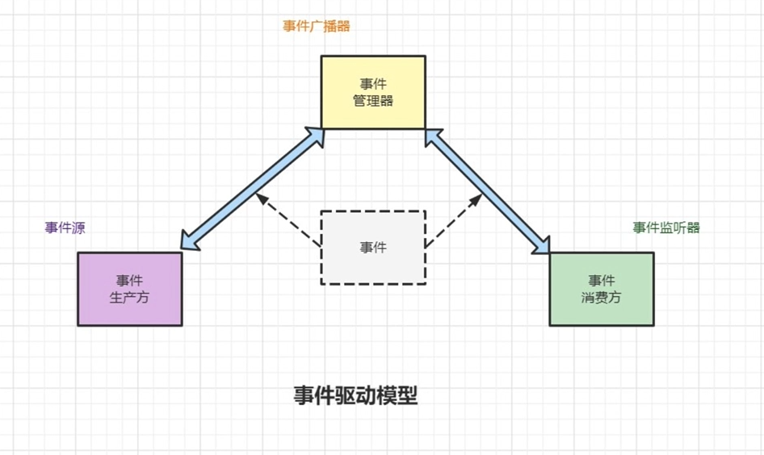
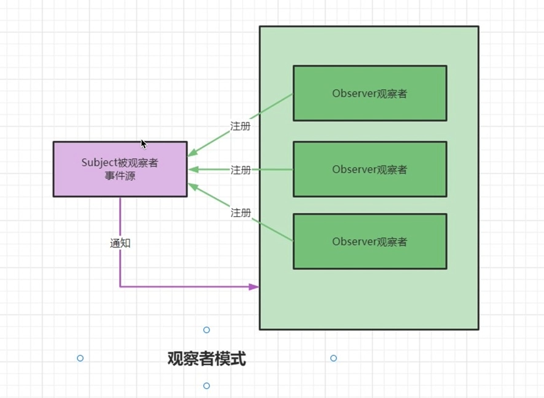
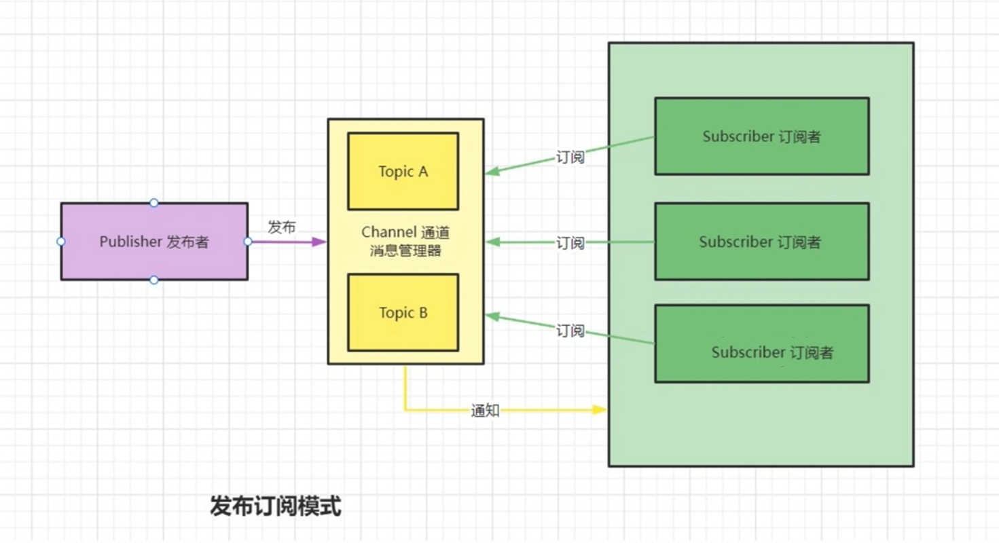

## Spring、SpringBoot常用扩展特性之事件驱动


> 事件驱动:即跟随当前时间点上出现的事件，调动可用资源，执行相关任务，使不断出现的问题得以解决，防止事务堆积。
>
> 如:注册账户时会收到短信验证码，火车发车前收到提醒、预定酒店后收到短信通知等。
>
> 如:浏览器中点击按钮请求后台，鼠标点击变化内容，键盘输入显示数据、服务接收请求后分发请求等在解决上述问题时，应用程序是由“事件”驱动运行的，这类程序在编写时往往可以采用相同的模型实现，我们可以将这种编程模型称为事件驱动模型。
>
> (PS:事件驱动模型其实是一种抽象模型，用于对由外部事件驱动系统业务逻辑这类应用程序进行建模。)


### 一.事件驱动模型

1.**实现的思路**

事件驱动模型有很多种体现形式，如简单的事件触发机制、单线程异步任务、多线程异步任务等，但是各种技术中实现事件驱动模型的基本思路相同。

事件驱动模型包括四个(三个)基本要寨:事件、事件消费方、事件生产方、[事件管理器]



事件: 描述发生的事情。比如说浏览器页面点击事件，鼠标、键盘输入事件，spring 请求处理完成、Spring容器刷新完毕等。

事件生产方(事件源):事件的产生者，任何一个事件都必须有一个事件源。比如input、button，Spring中请求处理完成的事件源就是 DispatcherServlet、Spring容器刷新完毕的事件源就是 AppicaionContext。

事件管理器(事件广播器): 派发事件。事件和事件监听器的桥梁、负责把事件通知给事件监听器(可在事件源中实现)。

事件消费方(事件监听器): 处理事件。监听事件的发生、可以在监听器中做一些处理。

2.**解决的问题**

> 基于事件驱动的应用程序可以实时响应所关心的事件，实现实时检测、响应外部动作，这是事件驱动模型的基本功能和作用。在一些复杂的系统中，事件驱动模型还可很好地发挥以下作用

- 实现组件之间的松耦合、解耦
- 实现异步任务
- 跟踪状态变化
- 限流、消峰等

### 二.观察者模式、发布订阅模式

1.**观察者模式**

> 观察者模式是一种对象行为模式。它定义对象间的一种一对多的依赖关系(被观察者维护观察者列表)
>
> 当一个对象的状态发生改变时，列表中所有观察者都会接收到状态改变的通知
>
> 观察者把自己注册到被观察者持有的列表中
>
> 当被观察者发布通知，也就是有事件触发时，由被观察者轮询调用观察者的处理代码




(PS:1.目标需要知道观察者存在;2.目标和观察者之间是依赖关系

**2.发布、订阅模式**

> 发布订阅模式其实是对象间的一对多的依赖关系(利用消息管理器)
>
> 当一个对象的状态发生改变时，所有依赖于它的对象都得到状态改变的通知
>
> 订阅者通过调度中心订阅自己关注的事件
>
> 当发布者发布事件到调度中心，也就是该事件触发时，由调度中统一调度订阅者的处理代码



(PS:1.发布者不知道订阅者的存在;2.存在消息管理器,彼此之间不知道对方的存在)


3.**使用场景区别**

| 观察者模式                                                   | 发布、订阅模式                                               |
| ------------------------------------------------------------ | ------------------------------------------------------------ |
| 目标和观察者之间存在依赖关系                                 | 发布者和订阅者之间无依赖关系                                 |
| 关注的是事件发生后观察者能够获取到足够的数据                 | 关注的是事件发生后能够准确地触发相应的动作。                 |
| vent种类单一，但是Event会被多个EventListener关注，Event中携带的信息更多的是观察者需要的数据 | Event种类多，每类Event只有单个EventListener关注，Event中携带的多是事件自身的一些信息(例如EventlD之类)，而很少携带其他数据。 |
| 要求事件发生后EventSource能够通知所有EventListener，此时调度Event的逻辑很简单，不必设置独立的调度器执行调度任务。 | Event更像一个触发信号，不同的Event会触发不同的EventListener执行动作，此时调度Event的逻辑复杂，需要设置独立的调度器执行调度任务。 |


### 三、Spring中事件驱动应用

#### 1.事件驱动最基础的使用

```JAVA
@Slf4j
@SpringBootApplication
public class Demo1App implements ApplicationRunner {
    /**
     * Spring事件驱动最基础的使用  ApplicationEventPublisher、ApplicationEvent、ApplicationListener
     * ApplicationEventPublisher 子类ApplicationContext
     * 事件源、监听器 需要被spring管理
     * 监听器 需要实现 ApplicationListener<ApplicationEvent>
     * 可体现事件源和监听器之间的松耦合 仅依赖spring、ApplicationEvent
     */

//    @Autowired
//    ApplicationEventPublisher appEventPublisher;

    @Autowired
    ApplicationContext applicationContext;
    //因为ApplicationContext实现了ApplicationEventPublisher接口因此常用它来发布事件

    @Override
    public void run(ApplicationArguments args) throws Exception {
        //1.发布事件
        applicationContext.publishEvent(new ApplicationEvent(this) {

        });

    }

    public static void main(String[] args) {
        SpringApplication.run(Demo1App.class, args);
    }
}
```

```JAVA
@Component
@Slf4j
public class Demo1Listener implements ApplicationListener<ApplicationEvent> {
    //2.监听事件
    @Override
    public void onApplicationEvent(ApplicationEvent event) {
        log.info("[onApplicationEvent]监听到事件：{}", event.toString());
    }
}

```

#### 2.自定义事件

```JAVA
@Slf4j
@SpringBootApplication
public class Demo2App implements ApplicationRunner {
    /**
     * 自定义事件 Demo2Event
     * 继承 ApplicationEvent实现对指定类型事件进行监听
     */

    @Autowired
    ApplicationContext applicationContext;

    @Override
    public void run(ApplicationArguments args) throws Exception {
        //1.发布自定义事件
        applicationContext.publishEvent(new Demo2Event(this) {

        });

    }

    public static void main(String[] args) {
        SpringApplication.run(Demo2App.class, args);
    }
}

```

```JAVA
public class Demo2Event extends ApplicationEvent {
    public Demo2Event(Object source) {
        super(source);
    }

}
```

```JAVA
@Component
@Slf4j
public class Demo2Listener implements ApplicationListener<Demo2Event> {
    //2.监听事件
    @Override
    public void onApplicationEvent(Demo2Event event) {
        log.info("[onApplicationEvent]监听到事件：{}", event.toString());
        //[onApplicationEvent]监听到事件：com.example.applicationeventstudy.event.demo2.Demo2App$xxxxxx
    }
}
```

#### 3.自定义事件添加参数

```JAVA
@Slf4j
@SpringBootApplication
public class Demo3App implements ApplicationRunner {
    /**
     * 1.自定义事件 Demo3Event 添加业务参数
     * 2.忽略事件源 根据实际业务情况而定 减少参数
     * 3.使用 @EventListener 替换 implements ApplicationListener<Demo2Event> 增加监听者的可扩展性
     */


    @Autowired
    ApplicationContext applicationContext;

    public static void main(String[] args) {
        SpringApplication.run(Demo3App.class, args);
    }

    @Override
    public void run(ApplicationArguments args) throws Exception {
        //1.发布自定义事件
        applicationContext.publishEvent(new Demo3Event(this, "自定义参数") {

        });

    }
}
```

```JAVA
@ToString
public class Demo3Event extends ApplicationEvent {
    private String id;

    public Demo3Event(Object source) {
        super(source);
    }

    public Demo3Event(Object source, String id) {
        super(source);
        this.id = id;
    }
}
```

```JAVA
@Component
@Slf4j
public class Demo3Listener {
    //2.监听事件
    //使用注解可以不用实现ApplicationListener<>
    @EventListener()
    public void onApplicationEvent001(ApplicationEvent event) {
        log.info("[onApplicationEvent](001)监听到事件：{}", event.toString());
    }

    @EventListener()
    public void onApplicationEvent002(Demo3Event event) {
        log.info("[onApplicationEvent](002)监听到事件：{}", event.toString());
        //[onApplicationEvent]监听到事件：Demo3Event(id=自定义参数)
    }

/**
 *  [onApplicationEvent](001)监听到事件：org.springframework.boot.context.event.***
 *  [onApplicationEvent](001)监听到事件：org.springframework.boot.availability.***
 *  [onApplicationEvent](001)监听到事件：Demo3Event(id=自定义参数)
 *  [onApplicationEvent](002)监听到事件：Demo3Event(id=自定义参数)
 *  [onApplicationEvent](001)监听到事件：org.springframework.boot.context.event.***
 *  [onApplicationEvent](001)监听到事件：org.springframework
 */
}
```

#### 4.@EventListener

```JAVA
@Slf4j
@SpringBootApplication
public class Demo4App implements ApplicationRunner {
    /**
     * @EventListener用法讲解
     * 1.监听自定义事件
     * 2. 注解中指定监听事件类型，可指定多个监听事件类型
     * 3.注解中使用condition 根据特定条件进行监听 event的属性需要提供getter方法来访问它
     * 4.根据特定条件进行监听 对事件进行修改后返回
     */

    @Autowired
    ApplicationContext applicationContext;

    public static void main(String[] args) {
        SpringApplication.run(Demo4App.class, args);
    }

    @Override
    public void run(ApplicationArguments args) throws Exception {
        //1.发布自定义事件
        applicationContext.publishEvent(new Demo4Event(this, "001") {

        });
        applicationContext.publishEvent(new Demo4Event(this, "002") {

        });

    }
}
```

```JAVA
@ToString
public class Demo4Event extends ApplicationEvent {
    private String id;

    public Demo4Event(Object source) {
        super(source);
    }

    public Demo4Event(Object source, String id) {
        super(source);
        this.id = id;
    }

    public String getId() {
        return id;
    }

    public void setId(String id) {
        this.id = id;
    }
}
```

```JAVA
@Component
@Slf4j
public class Demo4Listener {
    //2.监听事件
    @EventListener(condition = "#event.id == '001'")
    public void onApplicationEvent001(Demo4Event event) {
        log.info("[onApplicationEvent](001)监听到事件：{}", event.toString());
    }

    @EventListener(condition = "#event.id == '002'")
    public void onApplicationEvent002(Demo4Event event) {
        log.info("[onApplicationEvent](002)监听到事件：{}", event.toString());
    }
    /**
     * [onApplicationEvent](001)监听到事件：Demo4Event(id=001)
     * [onApplicationEvent](002)监听到事件：Demo4Event(id=002)
     */
    @EventListener({Demo4Event.class, ApplicationEvent.class}) //在注解中也可以使用event来置顶监听的事件类
    public void onApplicationEvent003(Object event) {
        log.info("[onApplicationEvent](003)监听到事件：{}", event.toString());
    }

/**
 * 2024-03-11T20:58:55.022+08:00  : [onApplicationEvent](003)监听到事件：org.springframework.boot.availability.AvailabilityChangeEvent[source=org.springframework.boot.web.servlet.context.AnnotationConfigServletWebServerApplicationContext@dbd8e44, started on Mon Mar 11 20:58:54 CST 2024]
 * 2024-03-11T20:58:55.039+08:00  : [onApplicationEvent](001)监听到事件：Demo4Event(id=001)
 * 2024-03-11T20:58:55.039+08:00  : [onApplicationEvent](003)监听到事件：Demo4Event(id=001)
 * 2024-03-11T20:58:55.040+08:00  : [onApplicationEvent](003)监听到事件：Demo4Event(id=002)
 * 2024-03-11T20:58:55.040+08:00  : [onApplicationEvent](002)监听到事件：Demo4Event(id=002)
 * 2024-03-11T20:58:55.040+08:00  : [onApplicationEvent](003)监听到事件：org.springframework.boot.context.event.ApplicationReadyEvent[source=org.springframework.boot.SpringApplication@43bdaa1b]
 * 2024-03-11T20:58:55.040+08:00  : [onApplicationEvent](003)监听到事件：org.springframework.boot.availability.AvailabilityChangeEvent[source=org.springframework.boot.web.servlet.context.AnnotationConfigServletWebServerApplicationContext@dbd8e44, started on Mon Mar 11 20:58:54 CST 2024]
 */

}
```

#### 5.异步监听、自定义事件

```JAVA
@Slf4j
@SpringBootApplication
@EnableAsync
public class Demo5App implements ApplicationRunner {
    /**
     * 异步监听
     * 1.@0rder 指定执行顺序 在同步的情况下生效
     * 2.@Async 异步执行 需要@EnableAsync 开启异步
     * 自定义事件 不继承 ApplicationEvent[根据特定情况自行设计，由仅依赖 ApplicationEvent 转变为 依赖自定义事件类]
     */

    @Autowired
    ApplicationContext applicationContext;

    public static void main(String[] args) {
        SpringApplication.run(Demo5App.class, args);
    }

    @Override
    public void run(ApplicationArguments args) throws Exception {
        //1.发布自定义事件
        applicationContext.publishEvent(new Demo5Event(this, "001") {

        });
        applicationContext.publishEvent(new Demo5Event(this, "002") {

        });
        applicationContext.publishEvent(new Demo6Event("666") {

        });

    }

    @EventListener()
    public void onApplicationEvent002(Demo6Event event) {
        log.info("[onApplicationEvent](666)监听到事件：{}", event.toString());
    }
/**
 * public interface ApplicationEventPublisher {
 *     default void publishEvent(ApplicationEvent event) {
 *         this.publishEvent((Object)event);
 *     }
 *
 *     void publishEvent(Object event);
 * }
 *
 * log：[onApplicationEvent](666)监听到事件：Demo6Event(id=666)
 */
}
```

```JAVA
@ToString
@Getter
public class Demo5Event extends ApplicationEvent {
    private String id;

    public Demo5Event(Object source) {
        super(source);
    }

    public Demo5Event(Object source, String id) {
        super(source);
        this.id = id;
    }
}
```

```JAVA
@Component
@Slf4j
public class Demo5Listener {
    //2.监听事件
//    @Order(1000)
    @Async
    @EventListener()
    public void onApplicationEvent001(Demo5Event event) throws Exception {
        log.info("[onApplicationEvent](001)监听到事件：{}", event.toString());
        Thread.sleep(1000);
    }

    //    @Order(100)
    @Async
    @EventListener()
    public void onApplicationEvent002(Demo5Event event) throws Exception {
        log.info("[onApplicationEvent](002)监听到事件：{}", event.toString());

    }

    /** 使用Order()
     * 2024-03-11T21:06:25.694+08:00   c.e.a.event.demo5.Demo5Listener          : [onApplicationEvent](002)监听到事件：Demo5Event(id=001)
     * 2024-03-11T21:06:25.696+08:00   c.e.a.event.demo5.Demo5Listener          : [onApplicationEvent](001)监听到事件：Demo5Event(id=001)
     * 2024-03-11T21:06:25.696+08:00   c.e.a.event.demo5.Demo5Listener          : [onApplicationEvent](002)监听到事件：Demo5Event(id=002)
     * 2024-03-11T21:06:25.696+08:00   c.e.a.event.demo5.Demo5Listener          : [onApplicationEvent](001)监听到事件：Demo5Event(id=002)
     */

    /** 使用Async()
     * 2024-03-11T21:16:41.516+08:00             main] c.e.a.event.demo5.Demo5App               : [onApplicationEvent](666)监听到事件：Demo6Event(id=666)
     * 2024-03-11T21:16:41.515+08:00           task-1] c.e.a.event.demo5.Demo5Listener          : [onApplicationEvent](002)监听到事件：Demo5Event(id=001)
     * 2024-03-11T21:16:41.515+08:00           task-3] c.e.a.event.demo5.Demo5Listener          : [onApplicationEvent](002)监听到事件：Demo5Event(id=002)
     * 2024-03-11T21:16:41.515+08:00           task-2] c.e.a.event.demo5.Demo5Listener          : [onApplicationEvent](001)监听到事件：Demo5Event(id=001)
     * 2024-03-11T21:16:41.516+08:00           task-4] c.e.a.event.demo5.Demo5Listener          : [onApplicationEvent](001)监听到事件：Demo5Event(id=002)
     */
}
```

```JAVA
@ToString
@Getter
/**
 * 不继承ApplicationEvent
 */
public class Demo6Event {
    private String id;

    public Demo6Event(String id) {
        this.id = id;
    }
}
```

### 四.提升

 [Java 事件驱动模型实现 :: Rectcircle Blog](https://www.rectcircle.cn/posts/java-event-driver-model-impl/#%e4%bd%bf%e7%94%a8%e6%96%b9%e5%bc%8f) 

### 五.应用


