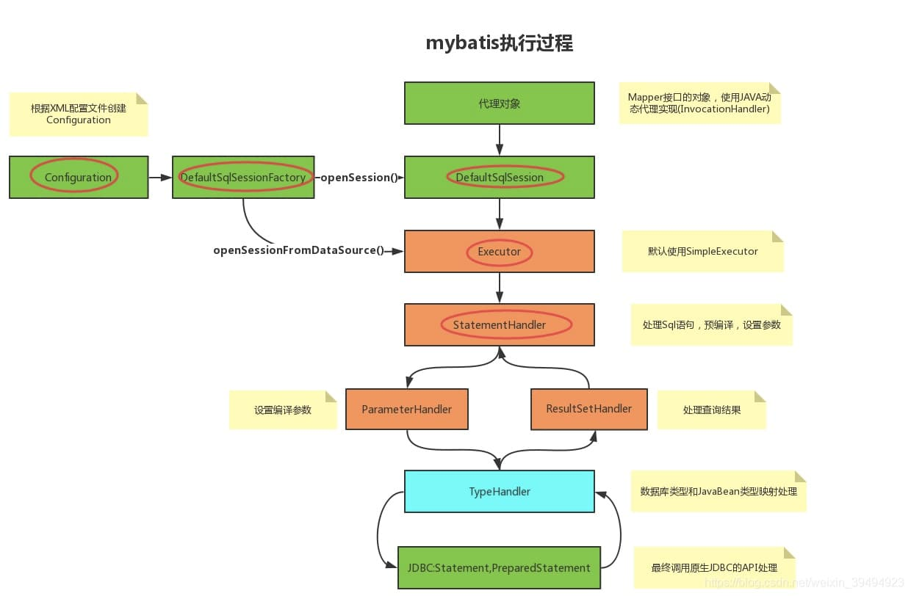

## 记录SQL执行日志


## MybaitPlus执行日志

因为技术派使用MybatisPlus作为ORM框架进行数据源的CURD，因此我们可以直接使用mybatis提供的日志输出

如开启控制台输出

```
mybatis:
  configuration:
    log-impl: org.apache.ibatis.logging.stdout.StdOutImpl
    map-underscore-to-camel-case: true
```


日志结果：

```
JDBC Connection [com.mysql.cj.jdbc.ConnectionImpl@62f94ee2] will not be managed by Spring
==>  Preparing: select * from user where id =? 
==> Parameters: 1(Integer)
<==    Columns: id, third_account_id, user_name, password, login_type, deleted, create_time, update_time
<==        Row: 1, master, admin, admin, 0, 0, 2023-12-28 15:53:47, 2023-12-29 11:23:18
<==      Total: 1
```


## 使用Mybatis插件

### Mybatis插件机制

在Mybatis中，插件机制提供了非常强大的扩展能力，在sql最终执行之前，提供了四个拦截点，支持不同场景的功能扩展

- Executor (update, query, flushStatements, commit, rollback, getTransaction, close, isClosed)
- ParameterHandler (getParameterObject, setParameters)
- ResultSetHandler (handleResultSets, handleOutputParameters)
- StatementHandler (prepare, parameterize, batch, update, query)


### Mybatis插件实现流程

#### 1.实现接口Interceptor


```
public class SqlStateInterceptor implements Interceptor {}
```

#### 2.添加注解

```
@Intercepts(value = {@Signature(type = Executor.class, method = "query", args = {MappedStatement.class, Object.class, RowBounds.class, ResultHandler.class}),
        @Signature(type = Executor.class, method = "update", args = {MappedStatement.class, Object.class}),
})
```

类上的@Intercepts注解，它表明这个类是一个mybatis的插件类，通过@Signature来指定切点

其中的type, method, args用来精确命中切点的具体方法

首先从切点为Executor，然后两个方法的执行会被拦截；这两个方法的方法名分别是query, update，参数类型也一并定义了，通过这些信息，可以精确匹配Executor接口上定义的类，如下

```
// org.apache.ibatis.executor.Executor

// 对应第一个@Signature
<E> List<E> query(MappedStatement var1, Object var2, RowBounds var3, ResultHandler var4) throws SQLException;

// 对应第二个@Signature
int update(MappedStatement var1, Object var2) throws SQLException;
```


**mybatis提供了四个切点，那么他们之间有什么区别，什么样的场景选择什么样的切点呢？**

一般来讲，拦截ParameterHandler是最常见的，虽然上面的实例是拦截Executor，切点的选择，主要与它的功能强相关，想要更好的理解它，需要从mybatis的工作原理出发，这里将只做最基本的介绍，待后续源码进行详细分析

- Executor：代表执行器，由它调度StatementHandler、ParameterHandler、ResultSetHandler等来执行对应的SQL，其中StatementHandler是最重要的。

- StatementHandler：作用是使用数据库的Statement（PreparedStatement）执行操作，它是四大对象的核心，起到承上启下的作用，许多重要的插件都是通过拦截它来实现的。

- ParameterHandler：是用来处理SQL参数的。

- ResultSetHandler：是进行数据集（ResultSet）的封装返回处理的，它非常的复杂，好在不常用。

  

  借用网上的一张mybatis执行过程来辅助说明
  
  




#### 3.重载方法

```
public class SqlStateInterceptor implements Interceptor {
    @Override
    public Object intercept(Invocation invocation) throws Throwable {
        return null;
    }

    @Override
    public Object plugin(Object target) {
        return null;
    }

    @Override
    public void setProperties(Properties properties) {

    }
}
```

#### 4.拦截器注册

自定义的拦截器实现，还需要注册到应用中让它生效，一般有下面几种姿势

**1.spring bean对象**

```
    @Bean
    public SqlStateInterceptor sqlStateInterceptor() {
        return new SqlStateInterceptor();
    }
```

**2.SqlSessionFactory**

除了上面的姿势之外还可以直接再sql会话工厂中指定

``` Java
@Bean(name = "sqlSessionFactory")
public SqlSessionFactory sqlSessionFactory(DataSource dataSource) throws Exception {
    SqlSessionFactoryBean bean = new SqlSessionFactoryBean();
    bean.setDataSource(dataSource);
    bean.setMapperLocations(
            // 设置mybatis的xml所在位置，这里使用mybatis注解方式，没有配置xml文件
            new PathMatchingResourcePatternResolver().getResources("classpath*:mapping/*.xml"));
    // 注册typehandler，供全局使用
    bean.setTypeHandlers(new Timestamp2LongHandler());
    bean.setPlugins(new SqlStatInterceptor());
    return bean.getObject();
}
```

**3.xml配置**

对于习惯使用myabtis的同学而言，这一种方式不少见，直接再myabtis-config.xml中进行定义

```
@Bean
public SqlStateInterceptor sqlStateInterceptor() {
    return new SqlStateInterceptor();
}
```


### 实现

```java
package com.example.senstive.senstive;

import com.alibaba.druid.pool.DruidPooledPreparedStatement;
import com.baomidou.mybatisplus.core.MybatisParameterHandler;
import com.example.senstive.util.DateUtil;
import com.example.senstive.util.DruidCheckUtil;
import com.mysql.cj.MysqlConnection;
import com.zaxxer.hikari.pool.HikariProxyConnection;
import com.zaxxer.hikari.pool.HikariProxyPreparedStatement;
import lombok.extern.slf4j.Slf4j;
import nonapi.io.github.classgraph.reflection.ReflectionUtils;
import org.apache.ibatis.executor.statement.StatementHandler;
import org.apache.ibatis.mapping.BoundSql;
import org.apache.ibatis.mapping.MappedStatement;
import org.apache.ibatis.mapping.ParameterMapping;
import org.apache.ibatis.mapping.ParameterMode;
import org.apache.ibatis.plugin.*;
import org.apache.ibatis.reflection.MetaObject;
import org.apache.ibatis.scripting.defaults.DefaultParameterHandler;
import org.apache.ibatis.session.Configuration;
import org.apache.ibatis.session.ResultHandler;
import org.springframework.util.CollectionUtils;

import java.sql.Connection;
import java.sql.Statement;
import java.util.Date;
import java.util.List;
import java.util.Properties;
import java.util.regex.Matcher;

// Define a custom MyBatis plugin to handle data masking.

/**
 * SQL状态拦截器
 */
@Intercepts({
        @Signature(type = StatementHandler.class, method = "query", args = {Statement.class, ResultHandler.class}),
        @Signature(type = StatementHandler.class, method = "update", args = {Statement.class})
})
@Slf4j
public class SqlStateInterceptor implements Interceptor {

    /**
     * 拦截方法
     *
     * @param invocation 调用的Invocation对象
     * @return Object
     * @throws Throwable 异常
     */
    @Override
    public Object intercept(Invocation invocation) throws Throwable {
        long time = System.currentTimeMillis();
        final List<Object> results = (List<Object>) invocation.proceed();
        if (results.isEmpty()) {
            return results;
        }

        StatementHandler statementHandler = (StatementHandler) invocation.getTarget();
        String sql = buildSql(statementHandler);
        //判断数据库连接池类型

        Object[] args = invocation.getArgs();
        String uname = "";
        if (args[0] instanceof HikariProxyPreparedStatement) {
            HikariProxyConnection connection = (HikariProxyConnection) ((HikariProxyPreparedStatement) invocation.getArgs()[0]).getConnection();
            uname = connection.getMetaData().getUserName();
        } else if (DruidCheckUtil.hasDuridPkg()) {
            if (args[0] instanceof DruidPooledPreparedStatement) {
                Connection connection = ((DruidPooledPreparedStatement) args[0]).getStatement().getConnection();
                if (connection instanceof MysqlConnection) {
                    Properties properties = ((MysqlConnection) connection).getProperties();
                    uname = properties.getProperty("user");
                }
            }
        }

        Object rs = null;
        try {
            rs = invocation.proceed();
        } catch (Throwable e) {
            log.error("error sql: " + sql, e);
            throw e;
        } finally {
            long cost = System.currentTimeMillis() - time;
            sql = this.replaceContinueSpace(sql);
            // 这个方法的总耗时
            log.info("\n\n ============= \nsql ----> {}\n{}\nuser ----> {}\ncost ----> {}\n ============= \n", sql, getResult(rs.toString()), uname, cost);
        }

        return rs;
    }

    /**
     * 获取结果
     *
     * @param input 输入
     * @return 结果
     */
    private String getResult(String input) {
        return input.substring(input.indexOf("(") + 1, input.lastIndexOf(")"));
    }

    /**
     * 替换连续的空白
     *
     * @param str 字符串
     * @return 替换后的字符串
     */
    private String replaceContinueSpace(String str) {
        StringBuilder builder = new StringBuilder(str.length());
        boolean preSpace = false;
        for (int i = 0, len = str.length(); i < len; i++) {
            char ch = str.charAt(i);
            boolean isSpace = Character.isWhitespace(ch);
            if (preSpace && isSpace) {
                continue;
            }

            if (preSpace) {
                // 前面的是空白字符，当前的不是的
                preSpace = false;
                builder.append(ch);
            } else if (isSpace) {
                // 当前字符为空白字符，前面的那个不是的
                preSpace = true;
                builder.append(" ");
            } else {
                // 前一个和当前字符都非空白字符
                builder.append(ch);
            }
        }
        return builder.toString();
    }

    /**
     * 构建SQL
     *
     * @param statementHandler StatementHandler对象
     * @return SQL语句
     */
    private String buildSql(StatementHandler statementHandler) {
        BoundSql boundSql = statementHandler.getBoundSql();
        Configuration configuration = null;
        if (statementHandler.getParameterHandler() instanceof DefaultParameterHandler) {
            DefaultParameterHandler handler = (DefaultParameterHandler) statementHandler.getParameterHandler();
            configuration = (Configuration) new ReflectionUtils().getFieldVal(false, handler, "configuration");
        } else if (statementHandler.getParameterHandler() instanceof MybatisParameterHandler) {
            MybatisParameterHandler paramHandler = (MybatisParameterHandler) statementHandler.getParameterHandler();
            configuration = ((MappedStatement) new ReflectionUtils().getFieldVal(false, paramHandler, "mappedStatement")).getConfiguration();
        }

        if (configuration == null) {
            return boundSql.getSql();
        }
        return buildSql(boundSql, configuration);
    }

    /**
     * 构建SQL
     *
     * @param boundSql      BoundSql对象
     * @param configuration Configuration对象
     * @return SQL语句
     */
    private String buildSql(BoundSql boundSql, Configuration configuration) {
        String sql = boundSql.getSql();
        //获取参数
        Object parameterObject = boundSql.getParameterObject();
        List<ParameterMapping> parameterMappings = boundSql.getParameterMappings();
        //没有参数直接返回
        if (CollectionUtils.isEmpty(parameterMappings) || parameterObject == null) {
            return sql;
        }

        MetaObject mo = configuration.newMetaObject(boundSql.getParameterObject());
        for (ParameterMapping parameterMapping : parameterMappings) {
            //只拦截 输出参数
            if (parameterMapping.getMode() == ParameterMode.OUT) {
                continue;
            }
            //参数值
            Object value;
            //获取参数名称
            String propertyName = parameterMapping.getProperty();
            if (boundSql.hasAdditionalParameter(propertyName)) {
                value = boundSql.getAdditionalParameter(propertyName);
            } else if (configuration.getTypeHandlerRegistry().hasTypeHandler(parameterObject.getClass())) {
                //如果是单个值则直接赋值
                value = parameterObject;
            } else {
                value = mo.getValue(propertyName);
            }
            String param = Matcher.quoteReplacement(getParameter(value));
            sql = sql.replaceFirst("\\?", param);
        }
        sql += ";";
        return sql;
    }

    /**
     * 获取参数值
     *
     * @param parameter 参数
     * @return 参数值
     */
    private String getParameter(Object parameter) {
        if (parameter instanceof String) {
            return "'" + parameter + "'";
        } else if (parameter instanceof Date) {
            return "'" + DateUtil.format(DateUtil.DB_FORMAT, ((Date) parameter).getTime()) + "'";
        } else if (parameter instanceof java.util.Date) {
            return "'" + DateUtil.format(DateUtil.DB_FORMAT, ((java.util.Date) parameter).getTime()) + "'";
        }
        return parameter.toString();
    }

    /**
     * 插件方法
     *
     * @param o 对象
     * @return 插件后的对象
     */
    @Override
    public Object plugin(Object o) {
        return Plugin.wrap(o, this);
    }

    /**
     * 设置属性
     *
     * @param properties 属性
     */
    @Override
    public void setProperties(Properties properties) {

    }
}

```

> 当插件的intercept()方法被调用时，它会执行拦截的SQL语句。在这个方法中，会首先获取拦截的SQL语句并根据数据库连接池的类型获取登录用户的用户名。然后，会执行原始的SQL语句，并在执行过程中捕获任何异常并记录日志。最后，会返回原始SQL语句的结果。插件的plugin()方法用于将插件应用到目标对象上。它使用MyBatis提供的Plugin类对目标对象进行包装，从而实现插件的功能。setProperties()方法用于设置插件的属性。


#### 为什么 buildSql()要获取Configuration

获取 `Configuration` 对象是为了能够访问 `MyBatis` 的配置信息，例如：

* 类型处理器注册表 (`TypeHandlerRegistry`)
* 对象工厂 (`ObjectFactory`)
* 对象包装工厂 (`ObjectWrapperFactory`)
* 插件列表 (`InterceptorChain`)
* 映射语句注册表 (`MappedStatementRegistry`)
* 环境 (`Environment`)

在 `buildSql()` 方法中，需要使用 `Configuration` 对象来获取类型处理器注册表，以便能够将参数值转换为数据库可识别的格式。

例如，在以下代码中，使用 `Configuration` 对象来获取类型处理器注册表，并使用类型处理器注册表来获取字符串类型参数的类型处理器：

```java
Configuration configuration = ...;
TypeHandlerRegistry typeHandlerRegistry = configuration.getTypeHandlerRegistry();
TypeHandler<String> stringTypeHandler = typeHandlerRegistry.getTypeHandler(String.class);
```

然后，可以使用 `stringTypeHandler` 来将字符串类型参数值转换为数据库可识别的格式。

```java
String parameterValue = ...;
String databaseValue = stringTypeHandler.setParameter(parameterValue, null);
```

获取 `Configuration` 对象还可以用于访问其他 `MyBatis` 配置信息，例如：

* 允许自动映射的别名列表 (`typeAliases`)
* 允许自动映射的结果映射列表 (`resultMaps`)
* 允许自动映射的缓存列表 (`caches`)

这些信息可以用于构建更复杂的 SQL 语句或执行其他操作。


#### 下列代码的作用

```
MetaObject mo = configuration.newMetaObject(boundSql.getParameterObject());
for (ParameterMapping parameterMapping : parameterMappings) {
    //只拦截 输出参数
    if (parameterMapping.getMode() == ParameterMode.OUT) {
        continue;
    }
    //参数值
    Object value;
    //获取参数名称
    String propertyName = parameterMapping.getProperty();
    if (boundSql.hasAdditionalParameter(propertyName)) {
        value = boundSql.getAdditionalParameter(propertyName);
    } else if (configuration.getTypeHandlerRegistry().hasTypeHandler(parameterObject.getClass())) {
        //如果是单个值则直接赋值
        value = parameterObject;
    } else {
        value = mo.getValue(propertyName);
    }
    String param = Matcher.quoteReplacement(getParameter(value));
    sql = sql.replaceFirst("\\?", param);
}
```

这段代码用于将 `MyBatis` 查询语句中的参数值替换为实际值。

首先，使用 `configuration.newMetaObject(boundSql.getParameterObject())` 创建一个 `MetaObject` 对象，该对象封装了查询语句的参数对象。

然后，遍历查询语句中的参数映射列表 (`parameterMappings`)。对于每个参数映射，如果参数模式为 `ParameterMode.OUT`，则跳过该参数，因为输出参数不需要替换。

对于其他参数，根据参数映射的属性名称 (`propertyName`) 获取参数值。参数值可能来自以下几个地方：

- 如果查询语句中包含附加参数，则从附加参数中获取。
- 如果 `MyBatis` 配置中注册了参数对象的类型处理器，则直接使用参数对象作为参数值。
- 否则，从参数对象中获取参数值。

最后，使用 `Matcher.quoteReplacement(getParameter(value))` 将参数值转换为字符串，并用该字符串替换查询语句中的第一个问号 (`?`)。


#### 工具类

```
package com.example.senstive.util;

import java.sql.Timestamp;
import java.time.Instant;
import java.time.LocalDateTime;
import java.time.ZoneId;
import java.time.format.DateTimeFormatter;

public class DateUtil {
    public static final DateTimeFormatter UTC_FORMAT = DateTimeFormatter.ofPattern("yyyy-MM-dd'T'HH:mm:ss.SSS'Z'");

    public static final DateTimeFormatter DB_FORMAT = DateTimeFormatter.ofPattern("yyyy-MM-dd HH:mm:ss.SSS");
    public static final DateTimeFormatter BLOG_TIME_FORMAT = DateTimeFormatter.ofPattern("yyyy年MM月dd日 HH:mm");

    public static final DateTimeFormatter BLOG_DATE_FORMAT = DateTimeFormatter.ofPattern("yyyy年MM月dd日");

    /**
     * 一天对应的毫秒数
     */
    public static final Long ONE_DAY_MILL = 86400_000L;
    public static final Long ONE_DAY_SECONDS = 86400L;
    public static final Long ONE_MONTH_SECONDS = 31 * 86400L;


    public static final Long THREE_DAY_MILL = 3 * ONE_DAY_MILL;

    /**
     * 毫秒转日期
     *
     * @param timestamp
     * @return
     */
    public static String time2day(long timestamp) {
        return format(BLOG_TIME_FORMAT, timestamp);
    }

    public static String time2day(Timestamp timestamp) {
        return time2day(timestamp.getTime());
    }

    public static LocalDateTime time2LocalTime(long timestamp) {
        return LocalDateTime.ofInstant(Instant.ofEpochMilli(timestamp), ZoneId.systemDefault());
    }

    public static String time2utc(long timestamp) {
        return format(UTC_FORMAT, timestamp);
    }

    public static String time2date(long timestamp) {
        return format(BLOG_DATE_FORMAT, timestamp);
    }

    public static String time2date(Timestamp timestamp) {
        return time2date(timestamp.getTime());
    }


    public static String format(DateTimeFormatter format, long timestamp) {
        LocalDateTime time = time2LocalTime(timestamp);
        return format.format(time);
    }
}
```


```
import org.springframework.util.ClassUtils

public class DruidCheckUtil {

    /**
     * 判断是否包含durid相关的数据包
     *
     * @return
     */
    public static boolean hasDuridPkg() {
        return ClassUtils.isPresent("com.alibaba.druid.pool.DruidDataSource", DataSourceConfig.class.getClassLoader());
    }

}
```


