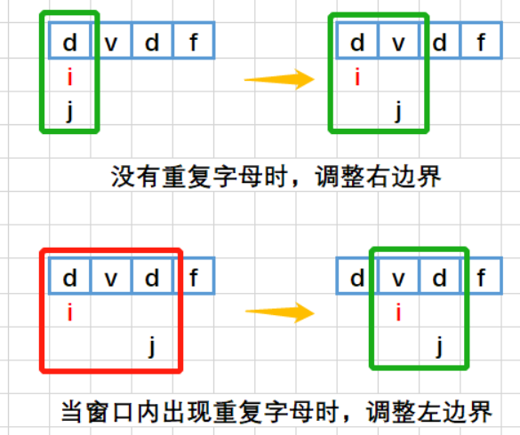

---

title: 'LeetCode刷题笔记'
author: ehzyil
tags:
 - Leetcode
categories:
 - 数据结构与算法
date: 2023-10-19

---

## 1、两数之和

给定一个整数数组 `nums` 和一个整数目标值 `target`，请你在该数组中找出 **和为目标值** *`target`* 的那 **两个** 整数，并返回它们的数组下标。

你可以假设每种输入只会对应一个答案。但是，数组中同一个元素在答案里不能重复出现。

你可以按任意顺序返回答案。

**示例 1：**

```
输入：nums = [2,7,11,15], target = 9
输出：[0,1]
解释：因为 nums[0] + nums[1] == 9 ，返回 [0, 1] 。
```

**示例 2：**

```
输入：nums = [3,2,4], target = 6
输出：[1,2]
```

**示例 3：**

```
输入：nums = [3,3], target = 6
输出：[0,1]
```

**提示：**

- `2 <= nums.length <= 104`
- `-109 <= nums[i] <= 109`
- `-109 <= target <= 109`
- **只会存在一个有效答案**


**解法一**

​	双重for循环遍历获取两个元素判断两个元素相加是否满足目标值，返回索引值。

```java
class Solution {
    public int[] twoSum(int[] nums, int target) {
        // 创建一个长度为2的整型数组，用于存储结果
        int[] arr = new int[2];

        // 遍历给定的nums数组
        for (int i = 0; i < nums.length; i++) {
            // 内层循环遍历索引范围为0到i之间的元素
            for (int j = 0; j < i; j++) {
                // 如果当前元素nums[i]和nums[j]的和等于目标值target
                if (nums[i] + nums[j] == target) {
                    // 将当前的i和j作为结果存入数组arr中
                    arr[0] = i;
                    arr[1] = j;
                }
            }
        }
        return arr;
    }
}
```

时间复杂度为O($n^{2}$)

**解法二**


循环遍历数组元素，计算出target减去arr[i]的值另一个数的值将其存入map，每次循环判断map中是否有可以满足条件的值，若有就返回，否则继续循环。

如何构建map？   map常用于存储键值对，就本题而言，我们可以把数组元素的值当做键，索引当做值。

```java
class Solution {
    public int[] twoSum(int[] nums, int target) {
        //map用与存储值-索引 若target-nums[i]的值(map的键在存在说明错在另一个值可以凑成target)
        // 这样只需要一个for循环
        HashMap<Integer, Integer> map = new HashMap<Integer, Integer>();
        int[] arr = new int[2];
        for (int i = 0; i < nums.length; i++) {

            // 判断HashMap中是否存在键为target - nums[i]的元素
            if (map.containsKey(target - nums[i])) {
                // 如果存在，则将当前索引i和HashMap中对应的值作为结果存入数组arr中
                arr[0] = i;
                arr[1] = map.get(target - nums[i]);
                // 跳出循环，结束查找
                break;
            }
            // 将当前元素nums[i]作为键，将当前索引i作为值，存入HashMap中
            map.put(nums[i], i);
        }


        return arr;
    }
}
```


**解法三**

​	现将数组排序,使用二分法思想寻找两边界指向元素值的和于target比较，通过不断缩小边界来寻找目标值，

```java
class Solution {
    public int[] twoSum(int[] nums, int target) {
        Arrays.sort(nums);
        int left = 0, right = nums.length - 1;
        int[] arr = new int[2];
        while (left < right) {
            int sum = nums[left] + nums[right];
            if (sum < target) {
                left++;
            } else if (sum > target) {
                right--;
            } else if (sum == target) {
                arr[0] = left;
                arr[1] = right;
                return arr;
            }
        }
        return new int[]{};
    }
}
```


## 2、两数相加

给你两个 **非空** 的链表，表示两个非负的整数。它们每位数字都是按照 **逆序** 的方式存储的，并且每个节点只能存储 **一位** 数字。

请你将两个数相加，并以相同形式返回一个表示和的链表。

你可以假设除了数字 0 之外，这两个数都不会以 0 开头。


**示例 1：**


```
输入：l1 = [2,4,3], l2 = [5,6,4]
输出：[7,0,8]
解释：342 + 465 = 807.
```

**示例 2：**

```
输入：l1 = [0], l2 = [0]
输出：[0]
```

**示例 3：**

```
输入：l1 = [9,9,9,9,9,9,9], l2 = [9,9,9,9]
输出：[8,9,9,9,0,0,0,1]
```


**提示：**

- 每个链表中的节点数在范围 `[1, 100]` 内
- `0 <= Node.val <= 9`
- 题目数据保证列表表示的数字不含前导零

**解法一**


```java
class Solution {
    public ListNode addTwoNumbers(ListNode l1, ListNode l2) {
        ListNode p1 = l1, p2 = l2;
        //创建一个头结点来作为头节点 可以避免处理初始的空指针情况
        ListNode dummy = new ListNode(-1);
        //p作为指针移动 用来添加元素
        ListNode p = dummy;
        //存放进位的数
        int carry = 0;
        //当有链表不为空或者有进位的数位加入链表
        while (p1 != null || p2 != null || carry > 0) {
            int sum = carry;
            //加上p1的值并让p1指针后移
            if (p1 != null) {
                sum += p1.val;
                p1 = p1.next;
            }
            //加上p2的值并让p1指针后移
            if (p2 != null) {
                sum += p2.val;
                p2 = p2.next;
            }
            //模10 得到进位的数
            carry = sum / 10;
            //除10 得到余数
            sum = sum % 10;
            //将余数加入链表 链表指针后移
            p.next = new ListNode(sum);
            p = p.next;

        }
        
        return dummy.next;
    }
}
```


## 3、无重复字符的最长子串

给定一个字符串 `s` ，请你找出其中不含有重复字符的 **最长子串** 的长度。

**示例 1:**

```
输入: s = "abcabcbb"
输出: 3 
解释: 因为无重复字符的最长子串是 "abc"，所以其长度为 3。
```

**示例 2:**

```
输入: s = "bbbbb"
输出: 1
解释: 因为无重复字符的最长子串是 "b"，所以其长度为 1。
```

**示例 3:**

```
输入: s = "pwwkew"
输出: 3
解释: 因为无重复字符的最长子串是 "wke"，所以其长度为 3。
     请注意，你的答案必须是 子串 的长度，"pwke" 是一个子序列，不是子串。
```

**提示：**

- `0 <= s.length <= 5 * 104`

- `s` 由英文字母、数字、符号和空格组成

  

**解法一**


```java
public static int lengthOfLongestSubstring(String s) {
    int res = 0; // 用于存储最大长度
    for (int i = 0; i < s.length(); i++) { // 外层循环，遍历字符串的每个字符
        boolean[] book = new boolean[300]; // 用于记录字符是否出现过的数组
        for (int j = i; j > 0; j--) { // 内层循环，从当前字符开始向前遍历
            if (book[s.charAt(j)]) { // 如果当前字符已经出现过，说明已经找到以当前字符为结尾的最长子串
                break; // 结束内层循环
            }
            book[s.charAt(j)] = true; // 将当前字符标记为已出现

            res = Math.max(res, i - j + 1); 

        }
    }
    return res; // 返回最大长度
}
```

**内层for循环递减的原因:**

为了找到以当前字符为结尾的最长子串。如果内层for循环递增，那么每次循环都是从字符串的开头开始，这样就无法找到以当前字符为结尾的最长子串。而递减的话，每次循环都是从当前字符开始，逐渐向前遍历，可以找到以当前字符为结尾的最长子串。

下列代码的意思是获取字符串j索引位置的值，因为是char类型当将其放入数组是会转换层int型比如 `a(char)->99(int)`

```
book[s.charAt(j)] = true;
```


**解法二** 

我们知道，题目要我们求解的是一个区间，我们可以考虑设置两个指针，一个指向这个区间的开头，另外一个则指向这个区间的结尾。
我们让头指针不动，向后扩展尾指针，直到遇见重复元素 (见下图)




```java
    public static int lengthOfLongestSubstring(String s) {
        int res = 0; // 用于存储最大长度
        Map<Character, Integer> window = new HashMap<>();
        //i是左指针，j是右指针
        for (int i = 0, j = 0; j < s.length(); j++) {
            //若s.charAt(j)已在window中则移动i的值到第一次出现位置的右侧
            if (window.containsKey(s.charAt(j))) {
                i = Math.max(i, window.get(s.charAt(j)) + 1);
            }
            res = Math.max(res, j - i + 1);
            window.put(s.charAt(j), j);
        }

        return res; // 返回最大长度
    }
```
