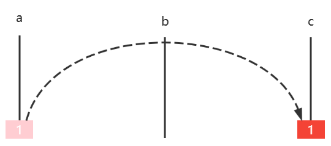
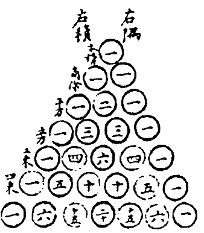

## 二分查找

* [69. x 的平方根 - 力扣（LeetCode）](https://leetcode.cn/problems/sqrtx/)

### 69. x 的平方根 - 力扣（LeetCode）

给你一个非负整数 `x` ，计算并返回 `x` 的 **算术平方根** 。

由于返回类型是整数，结果只保留 **整数部分** ，小数部分将被 **舍去 。**

**注意：**不允许使用任何内置指数函数和算符，例如 `pow(x, 0.5)` 或者 `x ** 0.5` 。


**示例 1：**

```
输入：x = 4
输出：2
```

**示例 2：**

```
输入：x = 8
输出：2
解释：8 的算术平方根是 2.82842..., 由于返回类型是整数，小数部分将被舍去。
```


**提示：**

- `0 <= x <= 231 - 1`

答案：

```java
    public int mySqrt(int x) {
        //处理特殊情况
        if (x == 0) {
            return 0;
        }
        if (x == 1) {
            return 1;
        }

        int i = 0, j = x / 2 + 1;
        //使用平衡版二分法寻找比 中间数平方小的
        while (1 < j - i) {
            int mid = (i + j) >>> 1;
            //求m的平方时会出现大于int值的情况，此时需要转为long进行计算
            if ((long) mid * mid > x) {
                j = mid;
            } else {
                i = mid;
            }
        }
        return i;
    }
```


### E01. 二分查找-力扣 704 题

**要点**：减而治之，可以用递归或非递归实现

给定一个 n 个元素有序的（升序）整型数组 nums 和一个目标值 target  ，写一个函数搜索 nums 中的 target，如果目标值存在返回下标，否则返回 -1

例如

```java
输入: nums = [-1,0,3,5,9,12], target = 9
输出: 4
解释: 9 出现在 nums 中并且下标为 4
    
输入: nums = [-1,0,3,5,9,12], target = 2
输出: -1
解释: 2 不存在 nums 中因此返回 -1    
```

**参考答案**：可以用讲过的任意一种二分求解

```java
    static int binarySearch(int[] a, int target) {
        int i = 0, j = a.length;
        while (1 < j - i) {
            int mid = (i + j) >>> 1;

            if (a[mid] < target) {
                i = mid + 1;
            } else {
                j = mid - 1;
            }

        }
        return a[i] == target ? i : -1;
    }
```


### E02. 搜索插入位置-力扣 35 题

**要点**：理解谁代表插入位置

给定一个排序数组和一个目标值

* 在数组中找到目标值，并返回其索引
* 如果目标值不存在于数组中，返回它将会被按顺序插入的位置

例如

```
输入: nums = [1,3,5,6], target = 5
输出: 2

输入: nums = [1,3,5,6], target = 2
输出: 1

输入: nums = [1,3,5,6], target = 7
输出: 4
```


**参考答案1**：用二分查找基础版代码改写，基础版中，找到返回 m，没找到 i 代表插入点，因此有

```java
public int searchInsert(int[] a, int target) {
    int i = 0, j = a.length - 1;
    while (i <= j) {
        int m = (i + j) >>> 1;
        if (target < a[m]) {
            j = m - 1;
        } else if (a[m] < target) {
            i = m + 1;
        } else {
            return m;
        }
    }
    return i; // 原始 return -1
}
```


**参考答案2**：用二分查找平衡版改写，平衡版中

* 如果 target == a[i] 返回 i 表示找到
* 如果 target < a[i]，例如 target = 2，a[i] = 3，这时就应该在 i 位置插入 2
* 如果 a[i] < target，例如 a[i] = 3，target = 4，这时就应该在 i+1 位置插入 4

```java
public static int searchInsert(int[] a, int target) {
    int i = 0, j = a.length;
    while (1 < j - i) {
        int m = (i + j) >>> 1;
        if (target < a[m]) {
            j = m;
        } else {
            i = m;
        }
    }
    return (target <= a[i]) ? i : i + 1;
    // 原始 (target == a[i]) ? i : -1;
}
```


**参考答案3**：用 leftmost 版本解，返回值即为插入位置（并能处理元素重复的情况）

```java
public int searchInsert(int[] a, int target) {
    int i = 0, j = a.length - 1;
    while(i <= j) {
        int m = (i + j) >>> 1;
        if(target <= a[m]) {
            j = m - 1;
        } else {
            i = m + 1;
        } 
    }
    return i;
}
```


### E03. 搜索开始结束位置-力扣 34 题

给你一个按照非递减顺序排列的整数数组 nums，和一个目标值 target。请你找出给定目标值在数组中的开始位置和结束位置。

如果数组中不存在目标值 target，返回 [-1, -1]。

你必须设计并实现时间复杂度为 O(log n) 的算法解决此问题


例如

```
输入：nums = [5,7,7,8,8,10], target = 8
输出：[3,4]

输入：nums = [5,7,7,8,8,10], target = 6
输出：[-1,-1]

输入：nums = [], target = 0
输出：[-1,-1]
```




```java
public static int left(int[] a, int target) {
    int i = 0, j = a.length - 1;
    int candidate = -1;
    while (i <= j) {
        int m = (i + j) >>> 1;
        if (target < a[m]) {
            j = m - 1;
        } else if (a[m] < target) {
            i = m + 1;
        } else {
            candidate = m;
            j = m - 1;
        }
    }
    return candidate;
}

public static int right(int[] a, int target) {
    int i = 0, j = a.length - 1;
    int candidate = -1;
    while (i <= j) {
        int m = (i + j) >>> 1;
        if (target < a[m]) {
            j = m - 1;
        } else if (a[m] < target) {
            i = m + 1;
        } else {
            candidate = m;
            i = m + 1;
        }
    }
    return candidate;
}

public static int[] searchRange(int[] nums, int target) {
    int x = left(nums, target);
    if(x == -1) {
        return new int[] {-1, -1};
    } else {
        return new int[] {x, right(nums, target)};
    }
}
```



##  递归 - single recursion


### E03. 二分查找

```java
class Solution {
    public static int recursion(int[] a, int target, int i, int j) {
        //跳出递归条件
        if (i > j) {
            return -1;
        }

        int m = (i + j) >>> 1;
        if (target < a[m]) {
            return recursion(a, target, i, m - 1);
        } else if (a[m] < target) {
            return recursion(a, target, m + 1, j);
        } else {
            return m;
        }

    }

    public int search(int[] nums, int target) {
        return recursion(nums, target, 0, nums.length - 1);

    }
}
```


### E04. 冒泡排序

```java
public static void main(String[] args) {
        int[] a = {3, 2, 6, 1, 5, 4, 7};
        bubble(a, 0, a.length - 1);
        System.out.println(Arrays.toString(a));
    }
    /**
     * 递归冒泡排序
     * <ul>
     *     <li>将数组划分成两部分 [0 .. j] [j+1 .. a.length-1]</li>
     *     <li>左边 [0 .. j] 是未排序部分</li>
     *     <li>右边 [j+1 .. a.length-1] 是已排序部分</li>
     *     <li>未排序区间内, 相邻的两个元素比较, 如果前一个大于后一个, 则交换位置</li>
     * </ul>
     */
    private static void bubble(int[] a, int low, int high) {
        //终止条件 左右边界相等
        if (low == high) {
            return;
        }
        //每一轮排序 重置j的值
        int j = low;
        //for循环用来排序
        for (int i = low; i < high; i++) {
            if (a[i] > a[i + 1]) {
                //满足左比右大 交换顺序
                int temp=a[i];
                a[i]=a[i+1];
                a[i+1]=temp;
                //j用来记录已排序的右边届 j右边的已排序完成
                j=i;
            }
        }
        //递归进入下一轮
        bubble(a,low,j);
    }
```

* low 与 high 为排序范围
* j 表示的是未排序的边界，下一次递归时的 high
  * 发生交换，意味着有无序情况
  * 最后一次交换（以后没有无序）时，左侧 i 仍是无序，右侧 i+1 已然有序

### E05. 插入排序

版本v1

```java
public static void main(String[] args) {
        int[] a = {3, 2, 6, 1, 5, 7, 4};
        insertion(a, 1);
        System.out.println(Arrays.toString(a));
    }

    private static void insertion(int[] a, int low) {
        // 结束条件 low 是已排序和未排序的边界，当low等于数组长度的时候说明全部排序完成
        if (low == a.length) return;
        // low所指下向的值
        int t = a[low];
        // 已排序区域指针
        int i = low - 1;
        // 通过循环将符合条件的值右移 i>=0来处理只有一张牌的情况 即i=-1
        while (i >= 0 && a[i] > t) {
            a[i + 1] = a[i]; // 空出插入位置
            i--;
        }
        // 找到了插入的位置
        // 若i+1==low 说明没有移动
        if (i + 1 != low) {
            a[i + 1] = t;
        }

        // 递归
        insertion(a, low + 1);
    }
```

* 已排序区域：[0 .. i .. low-1]

* 未排序区域：[low .. high]

  版本v2

```java
public static void main(String[] args) {
    int[] a = {3, 2, 6, 1, 5, 7, 4};
    insertion(a, 1, a.length - 1);
    System.out.println(Arrays.toString(a));
}

private static void insertion(int[] a, int low, int high) {
    if (low > high) {
        return;
    }
    int t = a[low];
    int i = low - 1;
  
    while (i >= 0 && a[i] > t) {
        a[i + 1] = a[i];
        i--;
    }
    if(i + 1 != low) {
        a[i + 1] = t;
    }    
    insertion(a, low + 1, high);
}
```

* 第一块代码是只考虑 low 边界的情况，参考以上代码，理解 low-1 ..  high 范围内的处理方法
* 扩展：利用二分查找 leftmost 版本，改进寻找插入位置的代码




另一种插入排序的实现,缺点: 赋值次数较多

```java
private static void insertion2(int[] a, int low) {
    if (low == a.length) {
        return;
    }

    int i = low - 1;
    while (i >= 0 && a[i] > a[i + 1]) {
        int t = a[i];
        a[i] = a[i + 1];
        a[i + 1] = t;

        i--;
    }

    insertion(a, low + 1);
}
```



### E06. 约瑟夫问题[^16]

待完成！！！

## 递归 - multi recursion


### E02. 汉诺塔[^13]

Tower of Hanoi，是一个源于印度古老传说：大梵天创建世界时做了三根金刚石柱，在一根柱子从下往上按大小顺序摞着 64 片黄金圆盘，大梵天命令婆罗门把圆盘重新摆放在另一根柱子上，并且规定

* 一次只能移动一个圆盘
* 小圆盘上不能放大圆盘

下面的动图演示了4片圆盘的移动方法


使用程序代码模拟圆盘的移动过程，并估算出时间复杂度


**思路**

* 假设每根柱子标号 a，b，c，每个圆盘用 1，2，3 ... 表示其大小，圆盘初始在 a，要移动到的目标是 c

* 如果只有一个圆盘，此时是最小问题，可以直接求解

  * 移动圆盘1 $a \mapsto c$  

  

* 如果有两个圆盘，那么

  * 圆盘1 $a \mapsto b$ 
  * 圆盘2 $a \mapsto c$
  * 圆盘1 $b \mapsto c$

  

* 如果有三个圆盘，那么

  * 圆盘12 $a \mapsto b$
  * 圆盘3 $a \mapsto c$
  * 圆盘12 $b \mapsto c$

  

* 如果有四个圆盘，那么

  * 圆盘 123 $a \mapsto b$
  * 圆盘4 $a \mapsto c$
  * 圆盘 123 $b \mapsto c$


****



```java
public class E02HanoiTower {

    static LinkedList<Integer> a = new LinkedList<>();
    static LinkedList<Integer> b = new LinkedList<>();
    static LinkedList<Integer> c = new LinkedList<>();

    public static void main(String[] args) {
        StopWatch sw = new StopWatch();
        int n = 4;
        init(n);
        sw.start("n="+n);
        move(n,a,b,c);
        sw.stop();
        print();
        System.out.println(sw.prettyPrint());
    }
    /**
     * <h3>移动圆盘</h3>
     *
     * @param n 圆盘个数
     * @param a 由
     * @param b 借
     * @param c 至
     */
    static void move(int n, LinkedList<Integer> a, LinkedList<Integer> b, LinkedList<Integer> c) {
        //终止条件 n==0
        if (n == 0) return;

        //将n-1个从a借助c移动到b
        move(n - 1, a, c, b);

        //将最后一个在a的盘子移动到c
        c.addLast(a.removeLast());
//        print();
        //将n-1个从b借助a移动到c
        move(n - 1, b,a, c);
    }

    static void init(int n) {
        for (int i = 1; i <= n; i++) {
            a.add(i);
        }
    }
    //打印列表
    private static void print() {
        System.out.println("******************************");
        System.out.println(a);
        System.out.println(b);
        System.out.println(c);
    }
}

```





### E03. 杨辉三角[^6]



**分析**

把它斜着看

```
        1
      1   1
    1   2   1
  1   3   3   1
1   4   6   4   1
```


    1							8						
    1   1						 6					(n-i-1)*2
    1   2   1					  4
    1   3   3   1				   2
    1   4   6   4   1			    0


* 行 $i$，列 $j$，那么 $[i][j]$ 的取值应为 $[i-1][j-1] + [i-1][j]$
* 当 $j=0$ 或 $i=j$ 时，$[i][j]$ 取值为 $1$


**题解**

```java
public static void print(int n) {
    for (int i = 0; i < n; i++) {
        //打印字符串
        if (i < n - 1) {
            System.out.printf("%" + 2 * (n - 1 - i) + "s", " ");
        }
        //printSpace((n - i - 1) * 4);

        for (int j = 0; j < i + 1; j++) {
            System.out.printf("%-4d", element(i, j));
        }
        //换行
        System.out.println();
    }
}
//递归函数
public static int element(int i, int j) {
    if (j == 0 || i == j) {
        return 1;
    }
    return element(i - 1, j - 1) + element(i - 1, j);
}
    public static void printSpace(int n) {
        for (int i = 0; i < n; i++) {
            System.out.print(" ");
        }
    }
```



**优化1**

是 multiple recursion，因此很多递归调用是重复的，例如

* recursion(3, 1) 分解为
  * recursion(2, 0) + recursion(2, 1) 
* 而 recursion(3, 2) 分解为
  * recursion(2, 1) + recursion(2, 2)

这里 recursion(2, 1) 就重复调用了，事实上它会重复很多次，可以用 static AtomicInteger counter = new AtomicInteger(0) 来查看递归函数的调用总次数

事实上，可以用 **memoization** 来进行优化：

```java
public static void print1(int n) {
    int[][] triangle = new int[n][];
    for (int i = 0; i < n; i++) {
        // 打印空格
        triangle[i] = new int[i + 1];
        for (int j = 0; j <= i; j++) {
            System.out.printf("%-4d", element1(triangle, i, j));
        }
        System.out.println();
    }
}

public static int element1(int[][] triangle, int i, int j) {
    if (triangle[i][j] > 0) {
        return triangle[i][j];
    }

    if (j == 0 || i == j) {
        triangle[i][j] = 1;
        return triangle[i][j];
    }
    triangle[i][j] = element1(triangle, i - 1, j - 1) + element1(triangle, i - 1, j);
    return triangle[i][j];
}
```

* 将数组作为递归函数内可以访问的遍历，如果 $triangle[i][j]$ 已经有值，说明该元素已经被之前的递归函数计算过，就不必重复计算了


**优化2**

```java
public static void print2(int n) {
    int[] row = new int[n];
    for (int i = 0; i < n; i++) {
        // 打印空格
        createRow(row, i);
        for (int j = 0; j <= i; j++) {
            System.out.printf("%-4d", row[j]);
        }
        System.out.println();
    }
}

private static void createRow(int[] row, int i) {
    if (i == 0) {
        row[0] = 1;
        return;
    }
    for (int j = i; j > 0; j--) {
        row[j] = row[j - 1] + row[j];
    }
}
```

> 注意：还可以通过每一行的前一项计算出下一项，不必借助上一行，这与杨辉三角的另一个特性有关，暂不展开了



##  链表


### E01. 反转单向链表-力扣 206 题

对应力扣题目 [206. 反转链表 - 力扣（LeetCode）](https://leetcode.cn/problems/reverse-linked-list/)

```
输入：head = [1,2,3,4,5]
输出：[5,4,3,2,1]

输入：[1,2]
输出：[2,1]

输入：[]
输出：[]
```


**方法1**

构造一个新链表，从**旧链表**依次拿到每个节点，创建新节点添加至**新链表**头部，完成后新链表即是倒序的

```java
public ListNode reverseList(ListNode o1) {
    ListNode n1 = null;
    ListNode p = o1;
    while (p != null) {
        //null-> 1->null -> 2,1->null
        n1 = new ListNode(p.val, n1);
        p = p.next;
    }
    return n1;
}
```

评价：简单直白，就是得新创建节点对象


**方法2**

与方法1 类似，构造一个新链表，从**旧链表头部**移除节点，添加到**新链表头部**，完成后新链表即是倒序的，区别在于原题目未提供节点外层的容器类，这里提供一个，另外一个区别是并不去构造新节点

```java
static class List {
    ListNode head;

    public List(ListNode head) {
        this.head = head;
    }

    public ListNode removeFirst(){
        ListNode first = head;
        if (first != null) {
            head = first.next;
        }
        return first;
    }

    public void addFirst(ListNode first) {
        first.next = head;
        head = first;
    }
}
```

代码

```java
public ListNode reverseList(ListNode head) {
    List list1 = new List(head);
    List list2 = new List(null);
    ListNode first;
    while ((first = list1.removeFirst()) != null) {
        list2.addFirst(first);
    }
    return list2.head;
}
```

评价：更加面向对象，如果实际写代码而非刷题，更多会这么做


**方法3**

递归，在**归**时让 $5 \rightarrow 4$，$4 \rightarrow 3$ ...

首先，写一个递归方法，返回值用来拿到最后一个节点

```java
public ListNode reverseList(ListNode p) {
    if (p == null || p.next == null) { // 不足两个节点
        return p; // 最后一个节点
    }
    ListNode last = reverseList(p.next);
    return last;
}
```

* 注意1：递归终止条件是 curr.next == null，目的是到最后一个节点就结束递归，与之前递归遍历不一样
* 注意2：需要考虑空链表即 p == null 的情况

可以先测试一下

```java
ListNode o5 = new ListNode(5, null);
ListNode o4 = new ListNode(4, o5);
ListNode o3 = new ListNode(3, o4);
ListNode o2 = new ListNode(2, o3);
ListNode o1 = new ListNode(1, o2);
ListNode n1 = new E01Leetcode206().reverseList(o1);
System.out.println(n1);
```

会打印

```
[5]
```

下面为**伪码**调用过程，假设节点分别是 $1 \rightarrow 2 \rightarrow 3 \rightarrow 4 \rightarrow 5 \rightarrow null$，先忽略返回值

```java
reverseList(ListNode p = 1) {
    reverseList(ListNode p = 2) {
    	reverseList(ListNode p = 3) {
    		reverseList(ListNode p = 4) {
    			reverseList(ListNode p = 5) {
    				if (p == null || p.next == null) {
                        return p; // 返回5
                    }
				}
                // 此时p是4, p.next是5
			}
            // 此时p是3, p.next是4
		}
        // 此时p是2, p.next是3
	}
    // 此时p是1, p.next是2
}
```

接下来，从 p = 4 开始，要让 $5 \rightarrow 4$，$4 \rightarrow 3$ ...

```java
reverseList(ListNode p = 1) {
    reverseList(ListNode p = 2) {
    	reverseList(ListNode p = 3) {
    		reverseList(ListNode p = 4) {
    			reverseList(ListNode p = 5) {
    				if (p == null || p.next == null) {
                        return p; // 返回5
                    }
				}
                // 此时p是4, p.next是5, 此时p.next.next=null,要让5指向4,代码写成 p.next.next=p
                // 还要注意4要指向 null, 否则就死链了（4<==>5即4.next=5，5.next=4） 
               
			}
            // 此时p是3, p.next是4,p.next.next=p 4->3
		}
        // 此时p是2, p.next是3
	}
    // 此时p是1, p.next是2
}
```

最终代码为：

```java
 ListNode reverseList(ListNode head) {
        // 如果链表为空或只有一个节点，则直接返回原链表
        if (head == null || head.next == null) {
            return head;
        }
        // 递归调用反转链表方法，将当前节点的下一个节点作为参数传入
        ListNode last = reverse(head.next);

        // 将当前节点的下一个节点的下一个节点指向当前节点，实现反转
        head.next.next = head;

        // 将当前节点的下一个节点设为null，断开原链表与反转后链表的连接
        head.next = null;

        // 返回反转后的链表头节点
        return last;
    }
```

Q：为啥不能在**递**的过程中倒序？

A：比如

* $ 1 \rightarrow 2 \rightarrow 3 $ 如果递的过程中让 $2 \rightarrow 1$ 那么此时 $2 \rightarrow 3$ 就被覆盖，不知道接下来递给谁
* 而归的时候让 $3 \rightarrow 2$ 不会影响上一层的 $1 \rightarrow 2$

评价：单向链表没有 prev 指针，但利用递归的特性【记住了】链表每次调用时相邻两个节点是谁



**方法4**

从链表每次拿到第二个节点，将其从链表断开，插入头部，直至它为 null 结束

1. 设置指针 o1(旧头)、n1(新头)、o2(旧老二)，分别指向第一，第一，第二节点

$\frac{n1 \ o1}{1} \rightarrow \frac{o2}{2} \rightarrow 3 \rightarrow 4 \rightarrow 5 \rightarrow null$

2. 将 o2 节点从链表断开，即 o1 节点指向第三节点

$ \frac{n1 \ o1}{1} \rightarrow 3 \rightarrow 4 \rightarrow 5 \rightarrow null$ ，$\frac{o2}{2}$

3. o2 节点链入链表头部，即

$\frac{o2}{2} \rightarrow \frac{n1 \ o1}{1} \rightarrow 3 \rightarrow 4 \rightarrow 5 \rightarrow null$

4. n1 指向 o2

$\frac{n1 \ o2}{2} \rightarrow \frac{o1}{1} \rightarrow 3 \rightarrow 4 \rightarrow 5 \rightarrow null$

5. o2 指向 o1 的下一个节点，即

$\frac{n1}{2} \rightarrow \frac{o1}{1} \rightarrow \frac{o2}{3} \rightarrow 4 \rightarrow 5 \rightarrow null$

6. 重复以上 $2\sim5$ 步，直到 o2 指向 null

7. 还应当考虑边界条件，即链表中不满两个元素时，无需走以上逻辑


参考答案

```java
public ListNode reverseList(ListNode o1) {    
    if (o1 == null || o1.next == null) { // 不足两个节点
        return o1;
    }
    ListNode o2 = o1.next;
    ListNode n1 = o1;
    while (o2 != null) {
        o1.next = o2.next; 
        o2.next = n1;
        n1 = o2;
        o2 = o1.next;
    }
    return n1;
}
```


**方法5**

要点：把链表分成两部分，思路就是不断从链表2的头，往链表1的头搬移

1. n1 指向 null，代表**新链表**一开始没有元素，o1 指向**原链表**的首节点

$\frac{n1}{null}$，$\frac{o1}{1} \rightarrow 2 \rightarrow 3 \rightarrow 4 \rightarrow 5 \rightarrow null$

2. 开始循环，o2 指向**原链表**次节点

$\frac{n1}{null}$，$\frac{o1}{1} \rightarrow \frac{o2}{2} \rightarrow 3 \rightarrow 4 \rightarrow 5 \rightarrow null$

3. 搬移

$\frac{o1}{1} \rightarrow \frac{n1}{null}$  ， $\frac{o2}{2} \rightarrow 3 \rightarrow 4 \rightarrow 5 \rightarrow null$

4. 指针复位

$\frac{n1}{1} \rightarrow null$ ， $\frac{o1 \ o2}{2} \rightarrow 3 \rightarrow 4 \rightarrow 5 \rightarrow null$

5. 重复 $2\sim4$ 步
6. 当 o1 = null 时退出循环


**参考答案**

```java
public ListNode reverseList(ListNode o1) {
    if (o1 == null || o1.next == null) {
        return o1;
    }
    ListNode n1 = null;
    while (o1 != null) {
        ListNode o2 = o1.next;
        o1.next = n1;
        n1 = o1;
        o1 = o2;
    }
    return n1;
}
```

评价：本质上与方法2 相同，只是方法2更为面向对象题

例如

```
输入：head = [1,2,6,3,6], val = 6
输出：[1,2,3]

输入：head = [], val = 1
输出：[]

输入：head = [7,7,7,7], val = 7
输出：[]
```



### E03.  删除倒数节点-力扣 19 题

例如

```
输入：head = [1,2,3,4,5], n = 2
输出：[1,2,3,5]

输入：head = [1], n = 1
输出：[]

输入：head = [1,2], n = 1
输出：[1]
```

另外题目提示

* 链表至少一个节点
* n 只会在合理范围

**解法一**

​	写一个递归方法，得到倒数的次序。

```java
static int recursion(ListNode p, int n) {
    if (p == null) {
        return 0;
    }
    int nth = recursion(p.next, n);
    System.out.println("nth:"+nth+"\t p:"+p.toString());
    if (nth == n) {
        p.next = p.next.next;
    }
    return nth + 1;
}
```


````

nth是倒数的次序  p为当前节点
nth:0	p:[5]
nth:1	p:[4,5]
nth:2	p:[3,4,5]
nth:3	p:[2,3,4,5]
nth:4	p:[1,2,4,5]
````

当nth==n时 p为要删除节点的上一个，删除节点即可。

但上述代码有一个问题，就是若删除的是第一个节点，它没有上一个节点，因此可以加一个哨兵来解决

```java
public ListNode removeNthFromEnd(ListNode head, int n) {
    ListNode sentinel = new ListNode(-1, head);
    recursion(sentinel, n);
    return sentinel.next;
}

public int recursion(ListNode p, int n) {
    if (p == null) {
        return 0;
    }
    int nth = recursion(p.next, n);
    if (nth == n) {
        p.next = p.next.next;
    }
    return nth + 1;
}
```

**解法二**


快慢指针，p1 指向待删节点的上一个，p2 先走 n + 1 步

```java
i=0
p2
s -> 1 -> 2 -> 3 -> 4 -> 5 -> null

     i=1
     p2
s -> 1 -> 2 -> 3 -> 4 -> 5 -> null

          i=2
          p2
s -> 1 -> 2 -> 3 -> 4 -> 5 -> null

               i=3 从此开始 p1 p2 依次向右平移, 直到 p2 移动到末尾
p1             p2
s -> 1 -> 2 -> 3 -> 4 -> 5 -> null

               p1             p2
s -> 1 -> 2 -> 3 -> 4 -> 5 -> null
```

代码：

```java
 public static ListNode removeNthFromEnd(ListNode head, int n) {
        ListNode s = new ListNode(-1, head);
        ListNode p1 = s;
        ListNode p2 = s;
        for (int i = 0; i < n + 1; i++) {
            p2 = p2.next;
        }

        while (p2 != null) {
            p1 = p1.next;
            p2 = p2.next;
        }

        p1.next = p1.next.next;
        return s.next;
    }
```


这个方法中，使用了两个指针p1和p2来定位要删除的节点。首先，p2指针先向后移动n+1步，使得p1和p2之间的距离为n+1。然后，同时移动p1和p2指针，直到p2指针到达链表末尾。这样，p1指针就指向了要删除节点的前一个节点。

接下来，将p1的next指针指向要删除节点的下一个节点，即完成了删除操作。最后，返回头节点的next指针，即为删除节点后的链表。

由于p2指针先向后移动了n+1步，所以p1指针和p2指针之间的距离为n+1。因此，当p2指针到达链表末尾时，p1指针正好指向要删除节点的前一个节点。这样，通过移动p1指针的next指针，就可以删除要删除的节点。


### E04. 有序链表去重-力扣 83 题

例如

```
输入：head = [1,1,2]
输出：[1,2]

输入：head = [1,1,2,3,3]
输出：[1,2,3]
```

注意：**重复元素保留一个**


### E05. 有序链表去重-力扣 82 题

例如

```
输入：head = [1,2,3,3,4,4,5]
输出：[1,2,5]

输入：head = [1,1,1,2,3]
输出：[2,3]
```

注意：**重复元素一个不留**


### E06. 合并有序链表-力扣 21 题

例

```
输入：l1 = [1,2,4], l2 = [1,3,4]
输出：[1,1,2,3,4,4]
    
输入：l1 = [], l2 = []
输出：[]

输入：l1 = [], l2 = [0]
输出：[0]
```


### E07. 合并多个有序链表-力扣 23 题

例

```
输入：lists = [[1,4,5],[1,3,4],[2,6]]
输出：[1,1,2,3,4,4,5,6]
解释：链表数组如下：
[
  1->4->5,
  1->3->4,
  2->6
]
将它们合并到一个有序链表中得到。
1->1->2->3->4->4->5->6
```

### E08. 查找链表中间节点-力扣 876 题

例如

```
输入：[1,2,3,4,5]
输出：此列表中的结点 3 (序列化形式：[3,4,5])

输入：[1,2,3,4,5,6]
输出：此列表中的结点 4 (序列化形式：[4,5,6])
```

* **偶数**节点时，中间点是靠右的那个

##  数组


### E01. 合并有序数组

将数组内两个区间内的有序元素合并

例

```
[1, 5, 6, 2, 4, 10, 11]
```

可以视作两个有序区间

```
[1, 5, 6] 和 [2, 4, 10, 11]
```

合并后，结果仍存储于原有空间

```
[1, 2, 4, 5, 6, 10, 11]
```


## 队列


## 栈

## 双端队列 


## 优先级队列


## 堆


##  二叉树